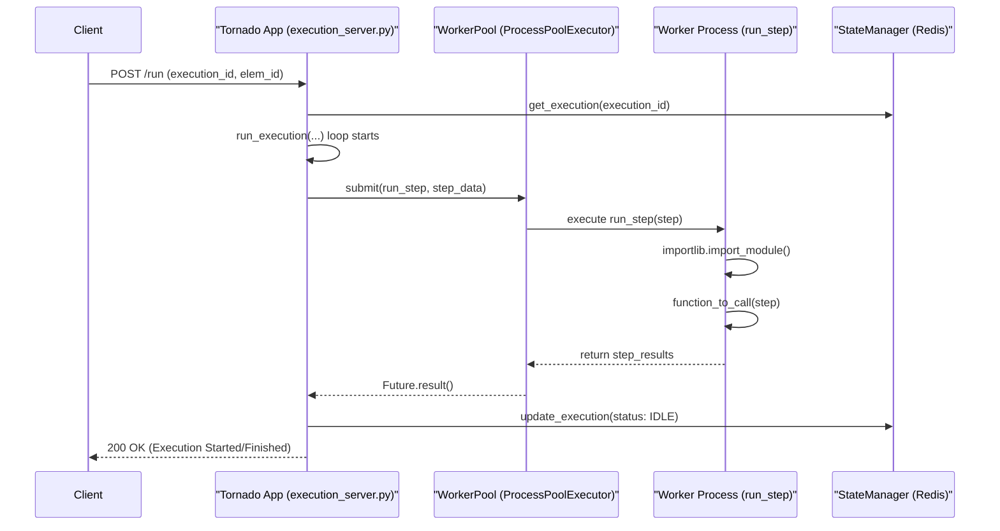
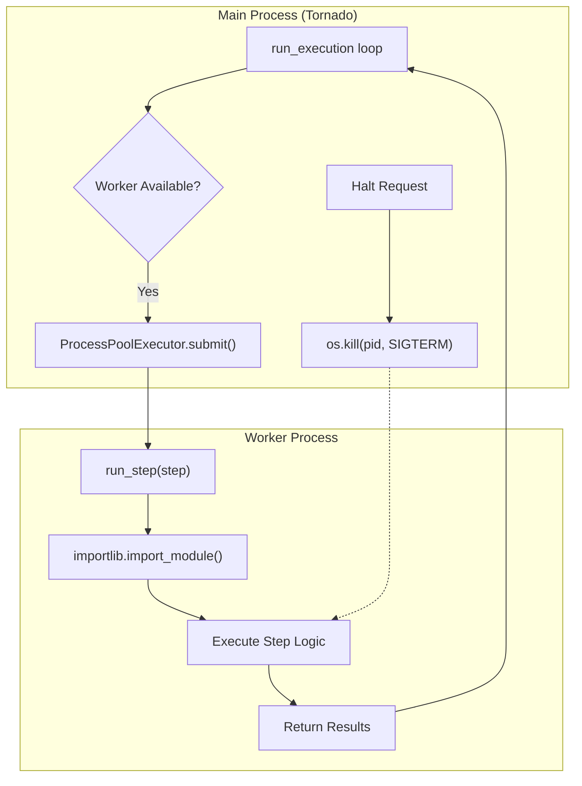

# Page: Execution Server and Worker Pool

# Execution Server and Worker Pool

Relevant source files

The following files were used as context for generating this wiki page:

- [image/execution_server.py](image/execution_server.py)
- [image/run_step.py](image/run_step.py)

The Execution Server is the central orchestration component of the Ingenium ecosystem. It provides a RESTful interface for managing test procedures, maintains the lifecycle of execution runs, and manages a pool of worker processes to perform the actual step logic.

## Tornado Application and Request Handlers

The server is built on the **Tornado** web framework, utilizing its asynchronous capabilities to handle multiple concurrent API requests while managing long-running background execution tasks `[image/execution_server.py:1-5]()`.

### Core Handlers
The server defines several key endpoints for controlling executions:
*   **`RegistrationHandler`**: Handles the registration of new execution sequences.
*   **`RunHandler`**: Initiates or resumes an execution. It determines whether to run in `AUTO`, `SYNC`, or `ASYNC` mode based on the request `[image/execution_server.py:91-146]()`.
*   **`HaltHandler`**: Terminates a running execution by interacting with the `WorkerPool` to send signals to the specific worker process `[image/execution_server.py:19-20]()`.
*   **`SwitchHandler`**: Manages the transition between different execution contexts, particularly useful for parent-child procedure nesting `[image/execution_server.py:40]()`.

### Execution Flow Overview
The following diagram illustrates the flow from a REST request to the invocation of a step within a worker process.

**Diagram: Request to Worker Mapping**

Sources: `[image/execution_server.py:65-90]()`, `[image/execution_server.py:91-151]()`, `[image/execution_server.py:181-190]()`.

---

## Run Modes and Orchestration

The `run_execution` function is the primary orchestration loop. It manages how steps are sequenced and handled based on the `run_mode` `[image/execution_server.py:91]()`.

### Run Modes
| Mode | Description |
| :--- | :--- |
| **`SYNC`** | The server executes a single step and returns the result immediately. Used primarily for testing or manual single-step advancement `[image/execution_server.py:99-134]()`. |
| **`ASYNC`** | The server acknowledges the run request and executes the sequence in the background. |
| **`AUTO`** | The server automatically advances through steps until a "pause" condition (breakpoint, error, or manual input) is met `[image/execution_server.py:181-200]()`. |

### Pause Conditions
The orchestration loop in `run_execution` evaluates `get_next_step_idx` to determine if it should stop `[image/execution_server.py:175]()`. Pauses occur when:
1.  A step is marked with a **breakpoint**.
2.  A step results in a `FAIL` status (depending on configuration).
3.  The `run_mode` is not `AUTO` and the current step completes.
4.  A `MANUAL_INPUT` step is encountered, requiring operator intervention.

Sources: `[image/execution_server.py:99-102]()`, `[image/execution_server.py:173-181]()`.

---

## WorkerPool and Process Management

The `WorkerPool` leverages `concurrent.futures.ProcessPoolExecutor` to isolate execution logic from the main web server thread `[image/execution_server.py:7-9]()`.

### Step Execution (`run_step`)
When a step is dispatched to a worker, the `run_step` function performs the following:
1.  **Dynamic Import**: Uses `importlib` to load the specific step module (e.g., `ingenium_embedded.cmd_step`) based on the `code.name` field in the step definition `[image/execution_server.py:77-87]()`.
2.  **Function Invocation**: Locates the function within the module and executes it with the step data as the argument `[image/execution_server.py:88-89]()`.
3.  **Token Refresh**: Calls `refresh_venue_tokens()` to ensure the worker maintains valid authentication with external gateways during long runs `[image/execution_server.py:68]()`.

### Halting and Signals
The server maintains a mapping of `execution_id` to the worker's Process ID (PID). When a halt is requested:
1.  **SIGTERM**: The server first sends a `SIGTERM` to the worker process to allow for graceful cleanup `[image/execution_server.py:19]()`.
2.  **SIGKILL**: If the process does not terminate within a timeout, a `SIGKILL` is issued to force closure `[image/execution_server.py:19]()`.
3.  **State Cleanup**: The `StateManager` is updated to reflect the `HALTED` status, and the `WorkerPool` is refreshed if a `BrokenProcessPool` exception occurs `[image/execution_server.py:9]()`.

**Diagram: Worker Process Lifecycle**

Sources: `[image/execution_server.py:7-9]()`, `[image/execution_server.py:65-89]()`, `[image/run_step.py:29-41]()`.

---

## Parent-Child Execution Nesting

The Execution Server supports hierarchical execution through procedure nesting. This is managed via `ingenium_library` helpers integrated into the server loop:

1.  **`create_new_run`**: Triggered when a step references a sub-procedure, creating a child execution context `[image/execution_server.py:39]()`.
2.  **`switch_execution`**: The server pauses the parent execution and switches focus to the child `[image/execution_server.py:40]()`.
3.  **`wait_execution_switch`**: The parent process waits for the child to reach a terminal state (Success/Failure/Halt) before resuming `[image/execution_server.py:40]()`.

This nesting allows for complex, modular test sequences where common routines (e.g., power-on cycles) are defined once and called by multiple parent procedures.

Sources: `[image/execution_server.py:34-40]()`.
