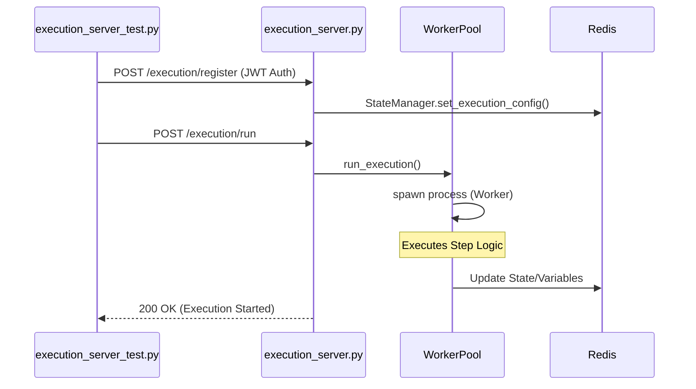

# Page: Getting Started

# Getting Started

<details>
<summary>Relevant source files</summary>

The following files were used as context for generating this wiki page:

- [Dockerfile](Dockerfile)
- [Makefile](Makefile)
- [README.md](README.md)
- [image/config.ini](image/config.ini)
- [image/requirements.txt](image/requirements.txt)

</details>


The **Ingenium Execution Server** is a high-performance step execution service designed to orchestrate complex sequences within the Ingenium ecosystem. It utilizes a pool of Python worker processes to handle step logic, ensuring isolation and scalability [README.md:1-5](). This guide provides the technical details necessary to set up, configure, and develop for the server in a local environment.

## Environment Configuration

The server relies on a combination of environment variables and a configuration file (`config.ini`) to manage connectivity and security.

### Environment Variables
The following variables must be defined for the server to function, particularly for state persistence and authentication [README.md:10-14]().

| Variable | Description | Default/Example |
| :--- | :--- | :--- |
| `REDIS_HOST` | Hostname of the Redis instance used for state management. | `execution_redis` |
| `REDIS_PORT` | Port for the Redis instance. | `6379` |
| `JWT_SECRET` | Secret key used for RS256 token validation. | `${JWT_SECRET}` |

### Configuration File (`config.ini`)
The server uses `image/config.ini` to define internal operational parameters, such as kernel management and gateway URLs [image/config.ini:1-20]().

*   **Server Settings**: Defines the `HTTP_PORT` (default `9999`) and kernel recycling logic. The server restarts the Python kernel after `RUN_COUNT_TO_RESTART_KERNEL` (default `1000`) or every `CHECK_KERNEL_INTERVAL_SECS` (default `600`) [image/config.ini:4-10]().
*   **Gateway Connectivity**: Points to the `exec_gateway` for command dispatch via `GATEWAY_URL` and `GATEWAY_WS_URL` [image/config.ini:12-14]().

**Sources:** [README.md:10-14](), [image/config.ini:1-20]()

## Dependency Management

The project is built on Python 3.7.2 [Dockerfile:1](). Core dependencies are managed via `image/requirements.txt`.

### Key Libraries
*   **Tornado (5.1.1)**: The primary web framework and asynchronous networking library [image/requirements.txt:2]().
*   **Redis (2.10.6)**: Used for execution state and variable persistence [image/requirements.txt:6]().
*   **PyJWT (1.7.0) & Cryptography (2.4.2)**: Handles secure authentication and token verification [image/requirements.txt:5,9]().
*   **JSON-Logging (1.2.0)**: Provides structured logging for integration with ELK/Splunk stacks [image/requirements.txt:12]().

**Sources:** [Dockerfile:1](), [image/requirements.txt:1-15]()

## Development Workflow

### Local Docker Setup
The recommended way to run the execution server locally is using `docker-compose` alongside its dependencies [README.md:16-18]().

1.  **Repository Layout**: Ensure `Ingenium/execution_server` and `Ingenium/execution-dep` are checked out at the same directory level [README.md:18-21]().
2.  **Execution**: Navigate to the deployment directory and use the provided script:
    ```bash
    cd execution-dep/compose_single_node
    sudo -E ./run_compose.sh up execution_server
    ```
    [README.md:27-30]()

### Makefile Automation
For standalone container management, a `Makefile` is provided to build and run the server with a link to the `exec_gateway` [Makefile:1-17]().

| Command | Action |
| :--- | :--- |
| `make build` | Builds the Docker image `lmestar/ingenium-exec-server` [Makefile:8-9](). |
| `make run` | Runs the container, mapping port `9999` and linking to `exec_gateway` [Makefile:11-12](). |
| `make stop` | Stops the `exec_server` container [Makefile:15-16](). |

**Sources:** [README.md:16-30](), [Makefile:1-17]()

## System Component Interaction

The following diagram illustrates the relationship between the local development environment, the Dockerized components, and the code entities that manage the lifecycle.

### Component Relationship Diagram
"Bridging Local Environment to Code Entities"

```mermaid
graph TD
    subgraph "Local Environment"
        [Makefile] -- "builds" --> [Dockerfile]
        [run_compose.sh] -- "orchestrates" --> [docker-compose.yml]
    end

    subgraph "Docker Container (exec_server)"
        [Dockerfile] -- "copies" --> [image_dir]
        [image_dir] -- "contains" --> [execution_server.py]
        [image_dir] -- "contains" --> [config.ini]
        [execution_server.py] -- "reads" --> [config.ini]
        [execution_server.py] -- "uses" --> [requirements.txt]
    end

    subgraph "External Services"
        [execution_server.py] -- "State" --> [Redis_6379]
        [execution_server.py] -- "Commands" --> [exec_gateway_8888]
    end

    [execution_server.py] -- "Listens on" --> [Port_9999]
```
**Sources:** [Dockerfile:4-10](), [Makefile:11-13](), [image/config.ini:4-20](), [README.md:12-14]()

## Running the Test Suite

The test suite requires a local virtual environment with all dependencies installed.

### Setup and Execution
1.  Install dependencies and activate a virtual environment [README.md:41-43]().
2.  Navigate to the `tests` directory and execute the primary server test [README.md:44-45]().

```bash
pip install -r image/requirements.txt
virtualenv ve
source ve/bin/activate
cd tests
python execution_server_test.py
```

### Execution Flow
The following diagram maps the flow from a test invocation to the internal server logic.

### Test Execution Data Flow
"Bridging Test Logic to Server Implementation"


**Sources:** [README.md:41-45](), [image/requirements.txt:1-15](), [image/config.ini:4-5]()

## Deployment Summary

The server is packaged as a Docker image based on a JPL-hosted Python 3.7.2 image [Dockerfile:1](). The `WORKDIR` is set to `/app`, where the contents of the `./image` directory are copied [Dockerfile:4-5](). The server exposes port `9999` and starts by executing `python execution_server.py` [Dockerfile:9-10]().

**Sources:** [Dockerfile:1-11]()
