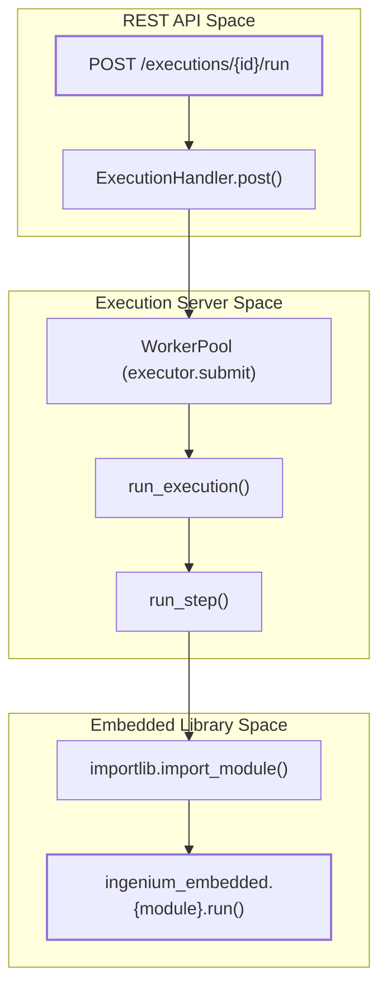
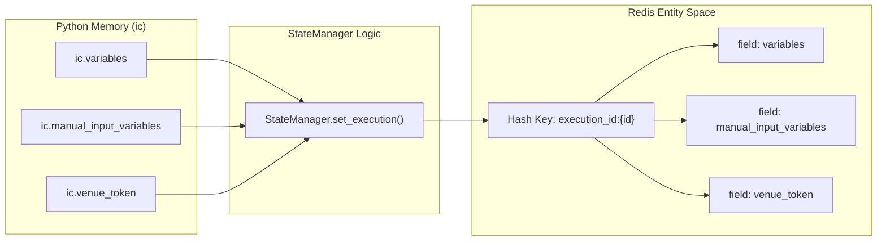

# Page: Glossary

# Glossary

Relevant source files

The following files were used as context for generating this wiki page:

- [Dockerfile](Dockerfile)
- [Jenkinsfile](Jenkinsfile)
- [README.md](README.md)
- [execution.yaml](execution.yaml)
- [image/execution_server.py](image/execution_server.py)
- [image/ingenium_embedded/bus_1553_step.py](image/ingenium_embedded/bus_1553_step.py)
- [image/ingenium_embedded/ingenium_config.py](image/ingenium_embedded/ingenium_config.py)
- [image/ingenium_embedded/ingenium_library.py](image/ingenium_embedded/ingenium_library.py)
- [image/ingenium_embedded/verification_lib.py](image/ingenium_embedded/verification_lib.py)

This page provides technical definitions for domain-specific terms, acronyms, and core code entities used within the Ingenium Execution Server. It serves as a bridge between high-level operational concepts and the underlying Python implementation.

## System Architecture Concepts

### Execution Server
The central Tornado-based web application responsible for managing the lifecycle of procedure steps. It orchestrates execution via a `WorkerPool` and maintains state in Redis.
*   **Implementation**: `image/execution_server.py`
*   **Key Class**: `ExecutionHandler` [image/execution_server.py:1260-1271]() (inherits from `RequestHandler`).
*   **Key Function**: `run_execution` [image/execution_server.py:91-156]() which serves as the primary entry point for a worker process to start processing steps.

### Worker Pool
A `ProcessPoolExecutor` used to run execution steps in separate Python processes. This prevents long-running steps from blocking the main Tornado I/O loop.
*   **Implementation**: `image/execution_server.py`
*   **Entity**: `executor = ProcessPoolExecutor(max_workers=MAX_WORKERS)` [image/execution_server.py:1210-1215]().

### State Manager
The interface for persisting and retrieving execution-specific data (variables, venue info, tokens) using Redis.
*   **Implementation**: `image/state_manager.py`
*   **Key Class**: `StateManager` [image/state_manager.py:8-15]().
*   **Data Flow**: Uses `redis_client.hmset` to store execution details under the key `execution_id:{id}` [image/state_manager.py:25-45]().

---

## Execution Modes

| Mode | Description | Code Reference |
| :--- | :--- | :--- |
| **SYNC** | The HTTP request blocks until the step completes. Returns the updated step object. | [image/execution_server.py:99-135]() |
| **ASYNC** | The server returns an immediate `202 Accepted`. The step runs in the background. | [image/execution_server.py:147-156]() |
| **AUTO** | Automatic execution where the worker iterates through all steps in an execution until a pause condition is met. | [image/execution_server.py:181-220]() |

---

## Domain Terms & Entities

### Step
The atomic unit of execution. A JSON object containing metadata (`elem_id`, `number`), the code to execute (`code.name`), and user inputs (`execution_user_input`).
*   **Execution Logic**: `run_step(step)` [image/execution_server.py:65-89]() imports the module and calls the function specified in the step's code name.

### Venue
A specific test environment (e.g., a hardware testbed or a simulator). The execution server receives `VenueInfo` during registration to configure connectivity.
*   **Implementation**: `ic.venue_id`, `ic.venue_service_address` in `image/ingenium_embedded/ingenium_config.py` [image/ingenium_embedded/ingenium_config.py:63-68]().

### Verification Condition
Logic used to determine if a step (like a telemetry query) passed or failed.
*   **Implementation**: `image/ingenium_embedded/verification_lib.py`
*   **Types**: `EQUAL`, `RANGE`, `CONTAINS`, `NOT_PRESENT`, etc. [image/ingenium_embedded/verification_lib.py:14-26]().
*   **Logic**: Handled by the `Verify` factory and subclasses like `VerifyInteger` or `VerifyString` [image/ingenium_embedded/verification_lib.py:30-113]().

---

## Code Mapping Diagrams

### Execution Dispatch Flow
The following diagram maps the transition from a REST API call to the execution of embedded library code.

Title: API to Embedded Code Flow

**Sources**: [image/execution_server.py:65-89](), [image/execution_server.py:91-156](), [image/execution_server.py:1260-1271]()

### State Persistence Model
This diagram shows how system variables are mapped to Redis storage via the `StateManager`.

Title: State Persistence Mapping

**Sources**: [image/state_manager.py:25-45](), [image/ingenium_embedded/ingenium_config.py:21-34](), [image/ingenium_embedded/ingenium_library.py:171-200]()

---

## Technical Acronyms

| Acronym | Full Name | Definition |
| :--- | :--- | :--- |
| **EHA** | Engineering History Archive | Telemetry channel data (scalars/integers). [image/ingenium_embedded/ingenium_library.py:67]() |
| **EVR** | Event Report | Discrete log events emitted by Flight Software. [image/ingenium_embedded/ingenium_library.py:72]() |
| **SCET** | Spacecraft Event Time | Time format used for spacecraft operations. [image/ingenium_embedded/bus_1553_step.py:94]() |
| **SCLK** | Spacecraft Clock | Raw counter-based time from the spacecraft. [image/ingenium_embedded/bus_1553_step.py:115]() |
| **SSE** | Special Support Equipment | Hardware/Software used to support the spacecraft during testing. [image/ingenium_embedded/ingenium_config.py:48]() |
| **1553** | MIL-STD-1553 | A military standard for a serial data bus. [image/ingenium_embedded/bus_1553_step.py:1]() |

**Sources**:
*   `image/execution_server.py`
*   `image/state_manager.py`
*   `image/ingenium_embedded/ingenium_config.py`
*   `image/ingenium_embedded/ingenium_library.py`
*   `image/ingenium_embedded/verification_lib.py`
*   `image/ingenium_embedded/bus_1553_step.py`