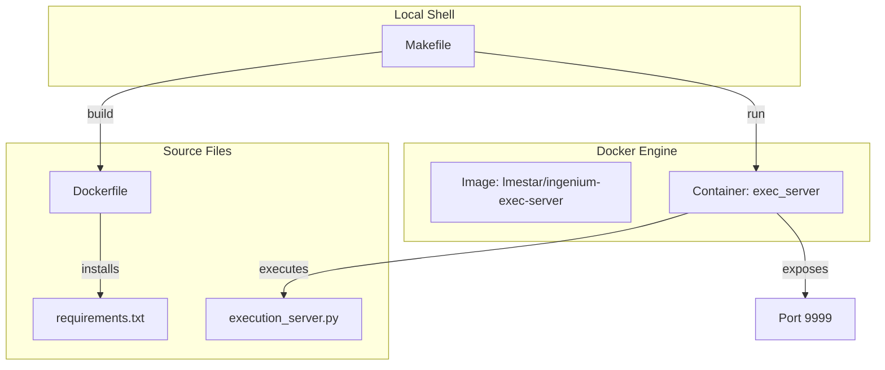
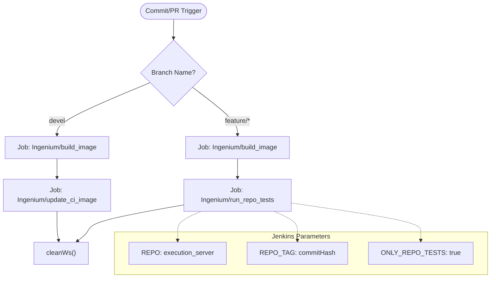

# Page: Infrastructure and CI/CD

# Infrastructure and CI/CD

Relevant source files

The following files were used as context for generating this wiki page:

- [Dockerfile](Dockerfile)
- [Jenkinsfile](Jenkinsfile)
- [Makefile](Makefile)

The Ingenium Execution Server utilizes a containerized deployment strategy and an automated Jenkins-based CI/CD pipeline to ensure consistent environments across development, testing, and production. The infrastructure is managed via a `Makefile` for local operations and a declarative `Jenkinsfile` for remote automation.

## Containerization Strategy

The execution server is packaged as a Docker container, ensuring that all dependencies, including the Python 3.7 runtime and specific library requirements, are bundled together. 

### Docker Environment
The server uses a base image sourced from the JPL Artifactory [Dockerfile:1-1](). The build process copies the application source code from the `./image` directory into the container's `/app` workspace [Dockerfile:4-5](). 

### Service Configuration
*   **Port Exposure**: The container exposes port `9999` for REST API traffic [Dockerfile:9-9]().
*   **Entrypoint**: The container starts by executing `execution_server.py` [Dockerfile:10-10]().
*   **Networking**: When running, the container typically links to `exec_gateway` to facilitate inter-service communication within the Ingenium cluster [Makefile:12-12]().

For details on image layers and local management, see [Docker Containerization](#5.1).

### Infrastructure Component Mapping
The following diagram illustrates how local management tools interact with the Docker entities defined in the codebase.

**Local Infrastructure Orchestration**

**Sources:** [Makefile:3-16](), [Dockerfile:1-10]()

## CI/CD Pipeline

The project uses a declarative Jenkins pipeline to automate building and testing based on git branch activity. The pipeline distinguishes between the stable `devel` branch and feature/pull-request (PR) branches to apply different validation logic.

### Branch Logic
*   **Devel Branch**: Triggers a full image build and updates the primary CI image used by the Ingenium ecosystem [Jenkinsfile:13-29]().
*   **Feature/PR Branches**: Triggers a build tagged with the specific `GIT_COMMIT` hash and executes a suite of repository-specific tests [Jenkinsfile:35-53]().

### Downstream Integration
The pipeline does not perform all tasks in-situ; instead, it interfaces with centralized Ingenium utility jobs:
*   `Ingenium/build_image`: Handles the actual container construction [Jenkinsfile:15-15]().
*   `Ingenium/update_ci_image`: Updates the environment used by other services [Jenkinsfile:24-24]().
*   `Ingenium/run_repo_tests`: Executes the integration test suite with the `ONLY_REPO_TESTS` flag [Jenkinsfile:46-49]().

For details on pipeline stages and post-execution cleanup, see [Jenkins CI/CD Pipeline](#5.2).

### Pipeline Flow Diagram
The following diagram maps the Jenkins pipeline logic to the external job interfaces.

**CI/CD Logic Flow**

**Sources:** [Jenkinsfile:7-54](), [Jenkinsfile:90-90]()

## Child Pages
*   **[Docker Containerization](#5.1)**: Detailed breakdown of the `Dockerfile` build phases, `image/` directory layout, and `Makefile` targets (`build`, `run`, `stop`).
*   **[Jenkins CI/CD Pipeline](#5.2)**: Comprehensive guide to the `Jenkinsfile` stages, environment variables, and how to interpret test results from downstream jobs.
