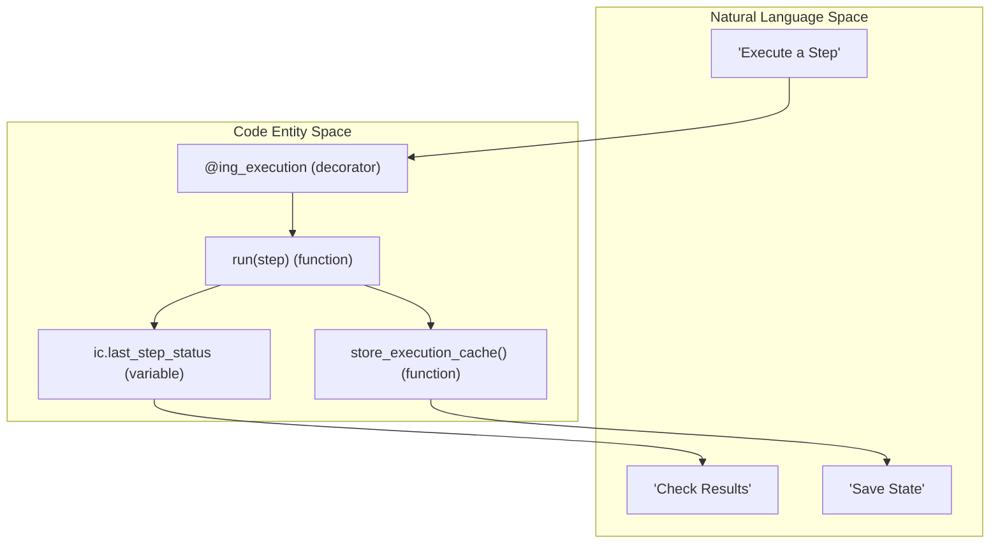
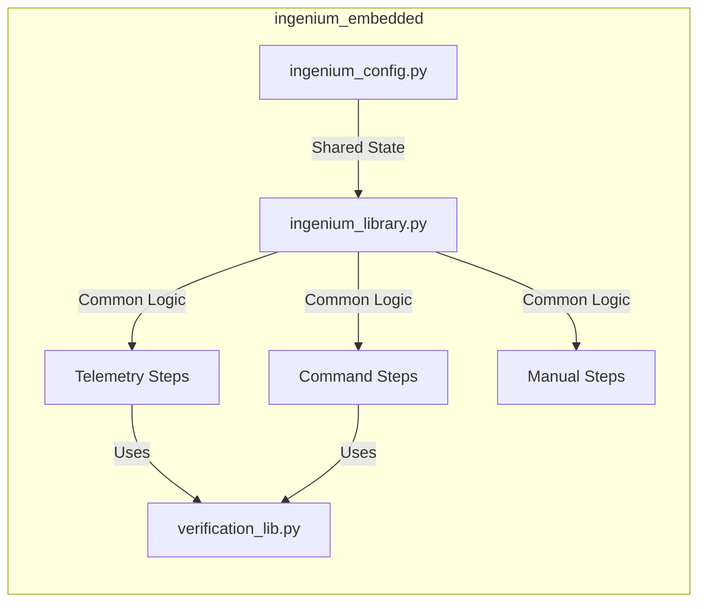

# Page: Ingenium Embedded Step Library

# Ingenium Embedded Step Library

Relevant source files

The following files were used as context for generating this wiki page:

- [image/ingenium_embedded/__init__.py](image/ingenium_embedded/__init__.py)
- [image/ingenium_embedded/ingenium_config.py](image/ingenium_embedded/ingenium_config.py)
- [image/ingenium_embedded/ingenium_library.py](image/ingenium_embedded/ingenium_library.py)
- [image/ingenium_embedded/ingenium_step_sdk.py](image/ingenium_embedded/ingenium_step_sdk.py)

The `ingenium_embedded` package is the core execution engine for all discrete test steps within the Ingenium Execution Server. It provides a standardized interface for commanding, telemetry verification, and operator interaction. By using a decorator-based pattern and a centralized configuration state, it ensures that diverse step types—from low-level FSW commands to high-level manual inputs—behave consistently within the execution lifecycle.

### Core Execution Pattern

Every step in the library follows a strict contract defined by the `@ing_execution` decorator and a `run(step)` function. This pattern handles common concerns such as logging, state persistence in Redis, error handling, and timing.

*   **`@ing_execution` Decorator**: Wraps the `run` function to automate setup and teardown tasks. It manages `STEP_START` and `STEP_END` events, updates the execution status in `ingenium_config`, and persists state to Redis [image/ingenium_embedded/ingenium_library.py:171-186]().
*   **`run(step)` Contract**: The entry point for every step module. It receives a `step` dictionary containing parameters and returns a status (typically "PASS" or "FAIL").
*   **State Management**: The `ingenium_config` module acts as a global singleton within the worker process, holding JWT tokens, venue IDs, and variable maps [image/ingenium_embedded/ingenium_config.py:20-36]().

#### Natural Language to Code Mapping: Execution Lifecycle

**Sources:** [image/ingenium_embedded/ingenium_library.py:171-186](), [image/ingenium_embedded/ingenium_config.py:39-41](), [image/ingenium_embedded/ingenium_library.py:171-186]()

---

### Step Taxonomy and Categories

Steps are categorized based on their interaction with the system under test (SUT) or the operator.

| Category | Primary Function | Key Code Entities |
| :--- | :--- | :--- |
| **Commanding** | Dispatch FSW/HW commands | `cmd_step.py`, `cmd_file_step.py` |
| **Telemetry** | Verify EHA, EVR, or 1553 data | `verify_eha_step.py`, `wait_evr_step.py` |
| **Operator** | Manual inputs and checkpoints | `manual_input_step.py`, `manual_verification_step.py` |
| **Utility** | Config management and timing | `update_config_step.py`, `wait_step.py` |

#### Step Category Relationships

**Sources:** [image/ingenium_embedded/ingenium_config.py:6-10](), [image/ingenium_embedded/ingenium_library.py:12-13]()

---

### Sub-Module Overviews

#### [Command Steps](#3.1)
Covers the dispatch of Flight Software (FSW) and Hardware (HW) commands. These steps interface with the venue service to send commands and optionally verify their successful radiation and execution via Event Records (EVRs).
*   **Key Files**: `cmd_step.py`, `cmd_file_step.py`, `cmd_sse_step.py`.
*   For details, see [Command Steps](#3.1).

#### [Telemetry Verification Steps (EHA, EVR, 1553)](#3.2)
Handles the querying and verification of Engineering Health Analysis (EHA) data, Event Records (EVRs), and MIL-STD-1553 bus logs. It supports both "Wait" (polling until a condition is met) and "Verify" (checking a specific time window) modes.
*   **Key Files**: `verify_eha_step.py`, `wait_evr_step.py`, `bus_1553_step.py`.
*   For details, see [Telemetry Verification Steps (EHA, EVR, 1553)](#3.2).

#### [Manual Input and Operator Interaction Steps](#3.3)
Provides mechanisms for the execution server to pause and request information or confirmation from a human operator. This includes entering variable values or performing manual hardware checks.
*   **Key Files**: `manual_input_step.py`, `manual_verification_step.py`.
*   For details, see [Manual Input and Operator Interaction Steps](#3.3).

#### [Configuration, Data Products, and Utility Steps](#3.4)
Miscellaneous steps for managing the test environment, including updating venue configurations, waiting for specific data products to be generated, and simple time delays.
*   **Key Files**: `update_config_step.py`, `wait_data_products_step.py`, `wait_step.py`.
*   For details, see [Configuration, Data Products, and Utility Steps](#3.4).

#### [Verification Library](#3.5)
The underlying engine for data validation. It provides the `Verify` factory class and specific subclasses for different data types (Integer, Float, String, etc.) and verification conditions (EQUAL, RANGE, CONTAINS).
*   **Key Files**: `verification_lib.py`.
*   For details, see [Verification Library](#3.5).

---

### Library Helpers and Configuration

The `ingenium_library.py` file contains critical utility functions and enumerations used across all step types:
*   **`ErrorType` and `EventName`**: Enumerations for structured logging [image/ingenium_embedded/ingenium_library.py:24-103]().
*   **`store_execution_cache`**: Persists the current `ingenium_config` state (variables, tokens, etc.) to Redis to ensure continuity across step executions [image/ingenium_embedded/ingenium_library.py:171-186]().
*   **`ic` (ingenium_config)**: Centralized storage for environment-specific constants like `eha_rt_timeout` and `rest_timeout` [image/ingenium_embedded/ingenium_config.py:87-103]().

**Sources:** [image/ingenium_embedded/ingenium_library.py:1-130](), [image/ingenium_embedded/ingenium_config.py:1-135]()
