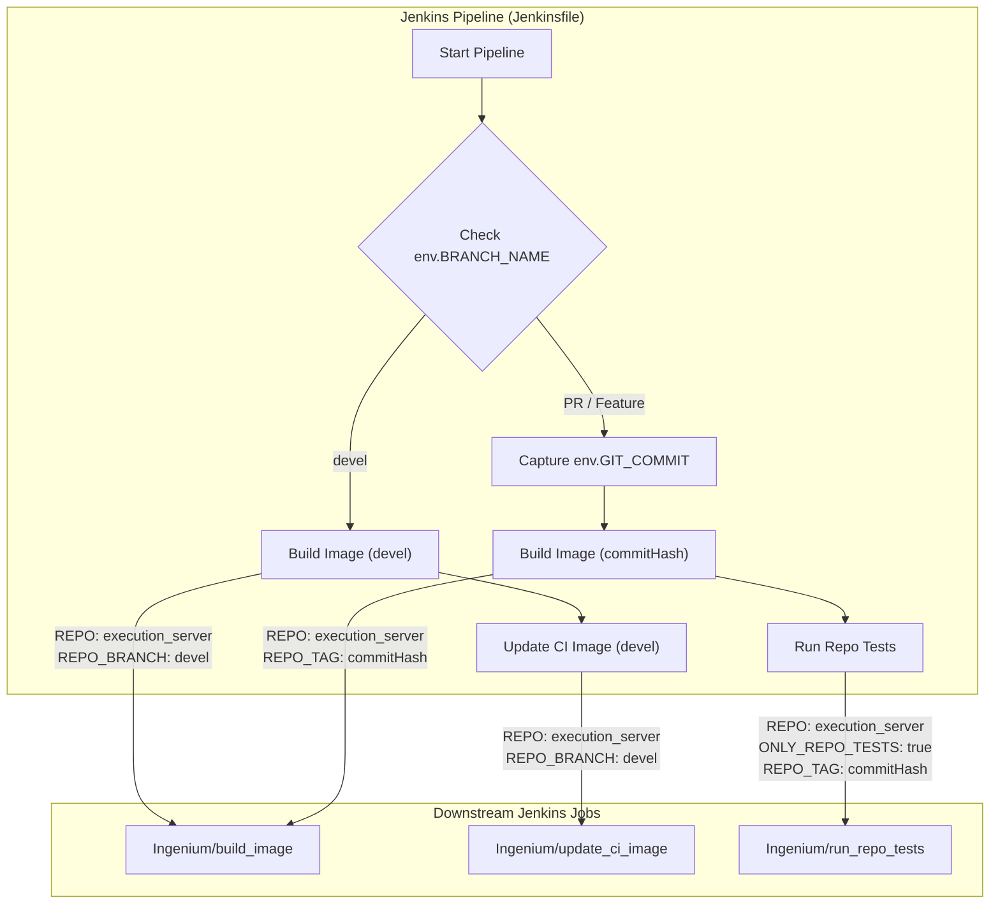

# Page: Jenkins CI/CD Pipeline

# Jenkins CI/CD Pipeline

<details>
<summary>Relevant source files</summary>

The following files were used as context for generating this wiki page:

- [Jenkinsfile](Jenkinsfile)

</details>


The Ingenium Execution Server utilizes a declarative Jenkins pipeline to automate image construction, continuous integration (CI) testing, and environment updates. The pipeline is branch-aware, distinguishing between the primary development branch (`devel`) and feature/pull-request (PR) branches to ensure that only stable code updates the core CI infrastructure.

### Pipeline Logic and Branch Management

The pipeline uses a `script` block within a single stage to evaluate the `BRANCH_NAME` environment variable and branch execution accordingly [Jenkinsfile:4-57](). 

#### 1. Devel Branch Workflow
When changes are pushed to the `devel` branch, the pipeline triggers a sequential update of the Ingenium ecosystem [Jenkinsfile:9-30]():
*   **Build Image**: Triggers the `Ingenium/build_image` job using the `devel` branch of the `execution_server` repository [Jenkinsfile:13-20]().
*   **Update CI Image**: Triggers the `Ingenium/update_ci_image` job. This ensures that the global CI environment used by other Ingenium services is updated with the latest stable version of the Execution Server [Jenkinsfile:22-29]().

#### 2. Feature and PR Branch Workflow
For any branch other than `devel`, the pipeline focuses on verification and testing rather than environment updates [Jenkinsfile:31-54]():
*   **Commit Hash Tagging**: The current git commit hash (`env.GIT_COMMIT`) is captured to uniquely identify the build artifact [Jenkinsfile:7-7]().
*   **Tagged Build**: Triggers `Ingenium/build_image` with the `REPO_TAG` parameter set to the commit hash [Jenkinsfile:35-42]().
*   **Repo Tests**: Triggers `Ingenium/run_repo_tests`. It specifically sets `ONLY_REPO_TESTS` to `true` to limit the scope to the current repository and uses the `devel` branch of the cluster for the test environment [Jenkinsfile:44-53]().

**Sources:**
* [Jenkinsfile:1-58]()

### Pipeline Flow and Data Mapping

The following diagram maps the Jenkinsfile logic to the downstream Jenkins jobs and the data parameters passed between them.

**Pipeline Execution Flow**

**Sources:**
* [Jenkinsfile:7-53]()

### Job Interfaces and Parameters

The pipeline interfaces with three primary external Jenkins jobs. The parameters passed to these jobs control how the Execution Server is containerized and tested.

| Job Name | Parameter | Value / Source | Purpose |
| :--- | :--- | :--- | :--- |
| `Ingenium/build_image` | `REPO` | `"execution_server"` | Identifies the repository to build. |
| | `REPO_BRANCH` | `"devel"` | Used only for `devel` branch builds. |
| | `REPO_TAG` | `env.GIT_COMMIT` | Used for PR builds to create unique images. |
| `Ingenium/update_ci_image` | `REPO` | `"execution_server"` | Identifies the image to promote to CI. |
| | `REPO_BRANCH` | `"devel"` | Promotes the stable `devel` image. |
| `Ingenium/run_repo_tests` | `REPO` | `"execution_server"` | Target for integration tests. |
| | `ONLY_REPO_TESTS` | `true` | Skips full system integration, focuses on local tests. |
| | `REPO_TAG` | `env.GIT_COMMIT` | Pulls the specific image built in the previous stage. |
| | `CLUSTER_BRANCH` | `"devel"` | Uses the stable cluster configuration. |

**Sources:**
* [Jenkinsfile:15-29]()
* [Jenkinsfile:37-53]()

### Post-Execution and Cleanup

The pipeline includes a comprehensive `post` block to handle different termination states and ensure workspace hygiene.

*   **Notifications**: The pipeline echoes status messages to the Jenkins console based on whether the branch was `devel` or a PR, and whether the result was `success`, `failure`, or `aborted` [Jenkinsfile:60-86]().
*   **Workspace Cleanup**: Regardless of the build outcome, the `cleanup` block executes the `cleanWs()` function [Jenkinsfile:87-92](). This is critical for preventing disk space exhaustion on Jenkins agents and ensuring subsequent builds start from a pristine state.

**Logic to Entity Mapping**
```mermaid
graph LR
    subgraph "Jenkins Logic"
        CWS["cleanWs()"]
        SCS["success {}"]
        FLR["failure {}"]
        ABR["aborted {}"]
    end

    subgraph "Code Entity Space"
        Post["post block"] -- "Always executes" --> CWS
        Post -- "Result: SUCCESS" --> SCS
        Post -- "Result: FAILURE" --> FLR
        Post -- "Result: ABORTED" --> ABR
    end
    
    CWS --- [Jenkinsfile:90-90]
    SCS --- [Jenkinsfile:60-68]
    FLR --- [Jenkinsfile:69-77]
    ABR --- [Jenkinsfile:78-86]
```

**Sources:**
* [Jenkinsfile:59-93]()
