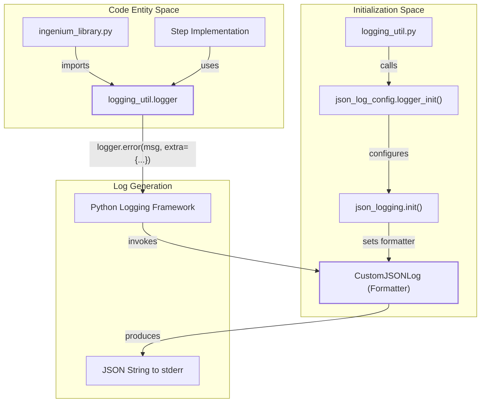
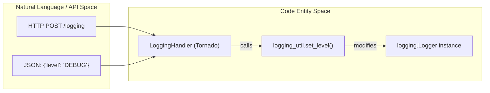

# Page: Logging Infrastructure

# Logging Infrastructure

<details>
<summary>Relevant source files</summary>

The following files were used as context for generating this wiki page:

- [image/ingenium_embedded/ingenium_library.py](image/ingenium_embedded/ingenium_library.py)
- [image/ingenium_embedded/json_log_config.py](image/ingenium_embedded/json_log_config.py)
- [image/ingenium_embedded/logging_util.py](image/ingenium_embedded/logging_util.py)
- [image/json_log_config.py](image/json_log_config.py)
- [tests/json_logging_example.py](tests/json_logging_example.py)
- [tests/logging_example.py](tests/logging_example.py)

</details>


The Ingenium Execution Server utilizes a structured JSON logging framework designed for observability across both the core server and the embedded step library. This infrastructure ensures that logs are machine-readable, contain consistent metadata for event tracking, and support dynamic runtime configuration.

## Core Logging Components

The logging system is built upon the `json-logging` library and standard Python `logging` modules, customized to meet Ingenium's schema requirements.

### Structured JSON Formatting
The `CustomJSONLog` class, defined in both the root [image/json_log_config.py:10-55]() and the embedded library [image/ingenium_embedded/json_log_config.py:11-55](), overrides the standard logging formatter. It produces an `OrderedDict` serialized to JSON with the following standard fields:

| Field | Description | Source |
| :--- | :--- | :--- |
| `timestamp` | UTC ISO8601 string with 'Z' suffix | [image/json_log_config.py:30]() |
| `level` | Log level (INFO, DEBUG, etc.) | [image/json_log_config.py:31]() |
| `message` | The primary log message | [image/json_log_config.py:32]() |
| `service` | The component generating the log (e.g., "EMBEDDED_CODE") | [image/ingenium_embedded/json_log_config.py:33]() |
| `event` | High-level action name from `EventName` enum | [image/json_log_config.py:37]() |
| `data` | Arbitrary dictionary for structured metadata | [image/json_log_config.py:39]() |
| `user_name` | The user context associated with the execution | [image/ingenium_embedded/json_log_config.py:34]() |

### Exception Handling
The formatter automatically captures stack traces. If `logger.exception()` is called or `exc_info` is present in the record, the `get_exc_fields` method [image/json_log_config.py:15-22]() extracts the traceback and appends it to `data['details']` as a list [image/json_log_config.py:41-53]().

**Sources:**
- [image/json_log_config.py:1-58]()
- [image/ingenium_embedded/json_log_config.py:1-58]()

---

## Enumerations for Observability

To maintain consistency across logs and API responses, Ingenium uses strictly defined enumerations in `ingenium_library.py`.

### EventName
The `EventName` enum [image/ingenium_embedded/ingenium_library.py:51-103]() provides a taxonomy of all significant actions within the execution lifecycle. Examples include:
- `STEP_START` / `STEP_END` [image/ingenium_embedded/ingenium_library.py:87-89]()
- `DISPATCH_COMMAND_FSW` [image/ingenium_embedded/ingenium_library.py:61]()
- `VERIFY_EHAS` [image/ingenium_embedded/ingenium_library.py:93]()
- `REDIS_CHECK` [image/ingenium_embedded/ingenium_library.py:79]()

### ErrorType and ErrorSource
When an error occurs, the logging metadata includes an `error_type` from the `ErrorType` enum [image/ingenium_embedded/ingenium_library.py:24-43]() and an `error_source` from `ErrorSource` [image/ingenium_embedded/ingenium_library.py:45-49](). These values are synchronized with the Core API specification to ensure the frontend can correctly categorize failures.

**Sources:**
- [image/ingenium_embedded/ingenium_library.py:24-103]()

---

## Implementation and Data Flow

The logging infrastructure is initialized globally and then utilized by various sub-modules via a utility wrapper.

### Initialization Flow
The following diagram illustrates how the logging configuration is bootstrapped and how a log request flows from a code entity to the structured output.

**Logging Architecture and Data Flow**

**Sources:**
- [image/ingenium_embedded/logging_util.py:8-13]()
- [image/ingenium_embedded/json_log_config.py:57-58]()

### Logging Utility (`logging_util.py`)
This module acts as the primary entry point for logging within the embedded library:
1. It initializes the JSON logger [image/ingenium_embedded/logging_util.py:8]().
2. It attaches a `StreamHandler` directed to `sys.stderr` [image/ingenium_embedded/logging_util.py:10]().
3. It sets the initial log level based on `ingenium_config.loglevel` [image/ingenium_embedded/logging_util.py:13]().

**Sources:**
- [image/ingenium_embedded/logging_util.py:1-23]()

---

## Dynamic Log Management

The server supports dynamic log-level management, allowing operators to change the verbosity of the logs without restarting the service.

### Level Management Logic
The `set_level(level)` function in `logging_util.py` [image/ingenium_embedded/logging_util.py:15-21]() updates the active logger level at runtime. This is typically invoked via the `/logging` HTTP endpoint (managed by the `LoggingHandler` in the execution server).

**Entity Mapping: API to Code**

**Sources:**
- [image/ingenium_embedded/logging_util.py:15-21]()

---

## Usage Example

To log a structured event with metadata, developers use the `extra` parameter. This pattern is prevalent throughout the `ingenium_library` for tracking system state.

```python
# Example of structured logging in the codebase
from .logging_util import logger
from .ingenium_library import EventName, ErrorType, ErrorSource

msg = 'REDIS port is not an integer'
logger.error(msg, extra = {
    "event": EventName.REDIS_CHECK.value,
    "data": {
        "message": msg,
        "error_type": ErrorType.CONFIGURATION_ERROR.value,
        "error_source": ErrorSource.EMBEDDED_CODE.value,
        "http_code_at_source": 0
    }
})
```
**Sources:**
- [image/ingenium_embedded/ingenium_library.py:119-127]()
- [tests/json_logging_example.py:81]()
