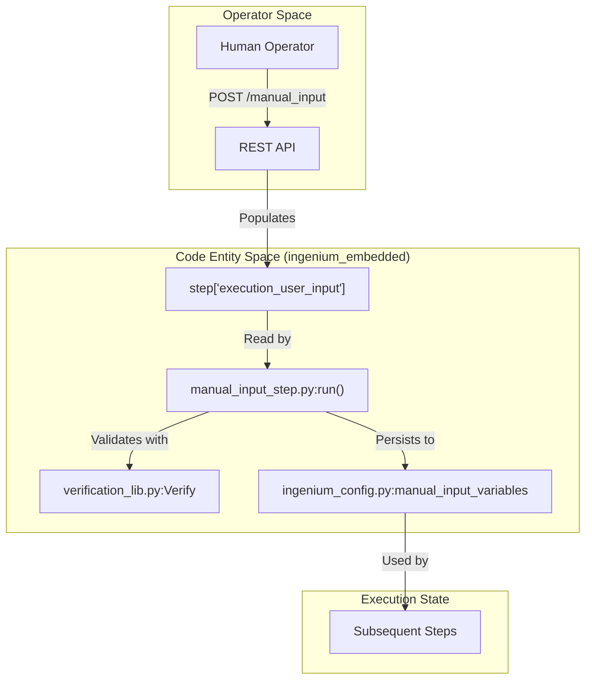
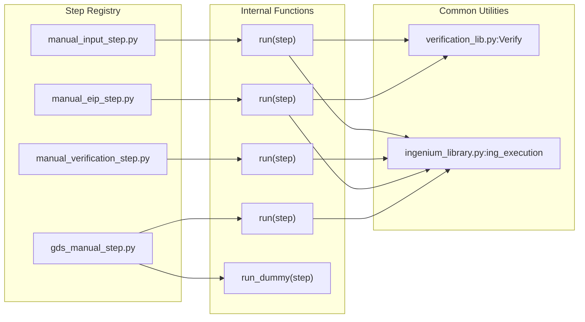

# Page: Manual Input and Operator Interaction Steps

# Manual Input and Operator Interaction Steps

Relevant source files

The following files were used as context for generating this wiki page:

- [image/ingenium_embedded/environment_manual_step.py](image/ingenium_embedded/environment_manual_step.py)
- [image/ingenium_embedded/gds_manual_step.py](image/ingenium_embedded/gds_manual_step.py)
- [image/ingenium_embedded/manual_eip_step.py](image/ingenium_embedded/manual_eip_step.py)
- [image/ingenium_embedded/manual_input_step.py](image/ingenium_embedded/manual_input_step.py)
- [image/ingenium_embedded/manual_input_step_with_sleep.py](image/ingenium_embedded/manual_input_step_with_sleep.py)
- [image/ingenium_embedded/manual_verification_step.py](image/ingenium_embedded/manual_verification_step.py)
- [image/ingenium_embedded/venue_config_manual_step.py](image/ingenium_embedded/venue_config_manual_step.py)

Manual steps in the Ingenium Execution Server facilitate interaction between the automated execution engine and human operators. These steps are typically used for capturing physical measurements (e.g., DMM readings), verifying visual states, or configuring environmental parameters that cannot be automated. All manual steps utilize the `MANUAL_INPUT` step type, which triggers the server to pause execution and wait for user-provided data via the REST API before proceeding.

## Core Interaction Pattern

All manual steps follow a consistent data flow:
1. The step is dispatched and enters a `RUNNING` state.
2. The server identifies the step as requiring manual input.
3. The operator provides data (e.g., `actual_value`, `verification_status`) via the `/execution/{id}/manual_input` endpoint.
4. The `run(step)` function in the specific module processes the `execution_user_input` and performs validation or unit conversion.

### Data Flow: Operator to Code Entity

The following diagram illustrates how human-provided data moves from the "Natural Language/Operator Space" into the "Code Entity Space" within the embedded step library.

**Operator Input Data Flow**

**Sources:** [image/ingenium_embedded/manual_input_step.py:66-75](), [image/ingenium_embedded/manual_input_step.py:53-55]().

---

## Manual Input and Verification Steps

### manual_input_step.py
This is the primary step for capturing arbitrary data (Integer, Float, String, Boolean). It supports automated verification of the user's input against expected ranges or values using the `Verify` factory [image/ingenium_embedded/manual_input_step.py:84-85]().

*   **Type Casting**: The function `cast_actual_value` attempts to convert the input string into the appropriate Python type (e.g., `int` or `float`) before verification [image/ingenium_embedded/manual_input_step.py:10-50]().
*   **Global Persistence**: Validated inputs are stored in `ic.manual_input_variables` using the `record_results` helper, making them accessible to future steps in the same execution context [image/ingenium_embedded/manual_input_step.py:53-55]().

### manual_verification_step.py
A simplified step where the operator is asked to provide a binary `PASS` or `FAIL` status for a manual check [image/ingenium_embedded/manual_verification_step.py:16-29](). It does not typically involve complex data entry, only the confirmation of a verification state.

**Sources:** [image/ingenium_embedded/manual_input_step.py:1-130](), [image/ingenium_embedded/manual_verification_step.py:1-42]().

---

## Specialized Interaction Steps

### manual_eip_step.py (Electrical Integration & Test)
This step is specifically designed for electrical measurements (Voltage, Resistance). It handles complex unit conversions (e.g., KiloOhm to Ohm) and supports "OL" (Over Load) inputs [image/ingenium_embedded/manual_eip_step.py:10-37]().

*   **OL Handling**: If the user inputs "OL" for resistance, the system treats it as `sys.float_info.max` for comparison logic [image/ingenium_embedded/manual_eip_step.py:68-81]().
*   **Unit Matching**: It enforces that the `unit` (expected) and `measured_unit` (actual) are compatible (e.g., both must be types of Ohms) [image/ingenium_embedded/manual_eip_step.py:157-160]().

### environment_manual_step.py
Used for recording and verifying ambient conditions like temperature and humidity [image/ingenium_embedded/environment_manual_step.py:10-20]().
*   **Persistence**: Values are stored in `ic.environment_step_variables` [image/ingenium_embedded/environment_manual_step.py:62-64]().
*   **Verification**: Uses `Verify.factory` with `environment_type` set to "temperature" or "humidity" [image/ingenium_embedded/environment_manual_step.py:44-90]().

### gds_manual_step.py
Handles Ground Data System (GDS) configuration, specifically for managing MTAK (Mission Tool Suite) sessions.
*   **Session Management**: It shuts down MTAK, clears old sessions, registers new data paths/session IDs, and restarts MTAK with the new configuration [image/ingenium_embedded/gds_manual_step.py:48-132]().
*   **Global State**: Clears `ic.ampcs_session_information` to ensure a clean state [image/ingenium_embedded/gds_manual_step.py:97]().

**Sources:** [image/ingenium_embedded/manual_eip_step.py:10-160](), [image/ingenium_embedded/environment_manual_step.py:1-121](), [image/ingenium_embedded/gds_manual_step.py:1-169]().

---

## Verification Condition Patterns

Manual steps leverage `verification_lib.py` to evaluate if the operator's input meets requirements.

| Step File | Verification Logic | Target Storage |
| :--- | :--- | :--- |
| `manual_input_step.py` | `Verify.factory(..., value_type=entry_type)` | `ic.manual_input_variables` |
| `environment_manual_step.py` | `Verify.factory(..., environment_type=...)` | `ic.environment_step_variables` |
| `manual_eip_step.py` | Custom range/unit logic | `step['execution']['results']` |

### Code Mapping: Step Type to Implementation

**Sources:** [image/ingenium_embedded/manual_input_step.py:84](), [image/ingenium_embedded/manual_verification_step.py:8](), [image/ingenium_embedded/gds_manual_step.py:11](), [image/ingenium_embedded/gds_manual_step.py:172]().

---

## Testing and Dummy Modes

Several manual steps implement a `run_dummy` function or a specific `_TEST_MODE_` flag to allow CI/CD pipelines to bypass human interaction.

1.  **run_dummy**: In `gds_manual_step.py` and `manual_verification_step.py`, this function simulates a successful operator interaction by immediately setting the status to `PASS` and populating dummy results [image/ingenium_embedded/gds_manual_step.py:172-201](), [image/ingenium_embedded/manual_verification_step.py:36-41]().
2.  **Error Injection**: `manual_input_step.py` includes a `check_error_mode` function. If an input named `_TEST_MODE_` with the value `RUN_ERROR` is detected, it forces a division-by-zero exception to test server error handling [image/ingenium_embedded/manual_input_step.py:58-63]().
3.  **Sleep Simulation**: `manual_input_step_with_sleep.py` provides a `run` function that simply sleeps for 10 seconds, used to test timeout scenarios and long-running manual steps [image/ingenium_embedded/manual_input_step_with_sleep.py:8-9]().

**Sources:** [image/ingenium_embedded/manual_input_step.py:58-70](), [image/ingenium_embedded/gds_manual_step.py:172-201](), [image/ingenium_embedded/manual_input_step_with_sleep.py:1-17]().
