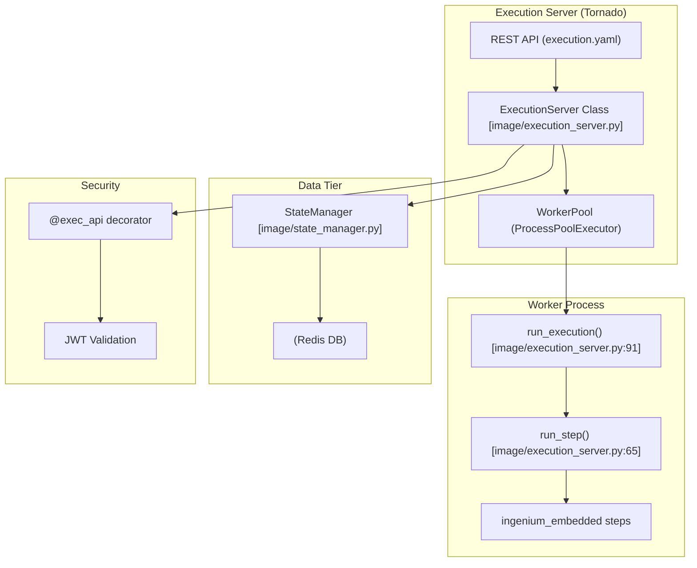

# Page: Overview

# Overview

Relevant source files

The following files were used as context for generating this wiki page:

- [README.md](README.md)
- [execution.yaml](execution.yaml)
- [image/execution_server.py](image/execution_server.py)

The **Ingenium Execution Server** is a high-performance step execution service designed to orchestrate and run automated procedures within the Ingenium ecosystem. It provides a RESTful interface for managing the lifecycle of test executions, utilizing a pool of isolated worker processes to execute individual steps or full procedure sequences.

## Purpose and Scope

The Execution Server acts as the bridge between high-level procedure definitions and the underlying hardware/software interfaces. Its primary responsibilities include:
*   **Execution Management**: Registering, running, halting, and switching between different execution contexts.
*   **Worker Orchestration**: Managing a `ProcessPoolExecutor` to ensure steps are executed in isolated environments to prevent state pollution.
*   **State Persistence**: Utilizing Redis via a `StateManager` to maintain configuration values and variable states across execution boundaries.
*   **Step Execution**: Hosting the `ingenium_embedded` library, which contains the logic for commanding, telemetry verification, and operator interaction.

For setup instructions, see [Getting Started](#1.1). For API details, see [REST API Reference](#1.2).

## System Architecture

The server is built on the Tornado web framework and follows an asynchronous concurrency model for handling HTTP requests while delegating heavy execution tasks to a worker pool.

### Architectural Component Diagram
This diagram illustrates the relationship between the REST API, the core server logic, and the execution workers.

**Sources:** [image/execution_server.py:1-100](), [execution.yaml:1-27](), [image/state_manager.py:1-10]()

## Key Architectural Concepts

### 1. Worker Pool and Execution Modes
The server manages execution through three primary modes defined in the API: `SYNC`, `ASYNC`, and `AUTO`. 
*   **`SYNC`**: The request blocks until the step completes [image/execution_server.py:99-135]().
*   **`ASYNC`**: The server returns an HTTP 202 immediately, and the step runs in the background [execution.yaml:73-81]().
*   **Worker Isolation**: Each execution is handled by a separate process to ensure that a crash in one test does not impact the entire server [image/execution_server.py:7-9]().

### 2. State Management
All execution state, including `manual_input_variables` and `config_value` data, is persisted in Redis. This allows the server to be stateless and supports the `copy_state` operation [execution.yaml:153-177]() which transfers variables between different execution IDs.

### 3. Step Library (`ingenium_embedded`)
The core logic of "what" is executed resides in the `ingenium_embedded` package. Steps are dynamically imported and called by the worker [image/execution_server.py:85-89](). Categories include:
*   **Commanding**: Dispatching FSW/HW commands.
*   **Verification**: Checking telemetry against expected ranges or values.
*   **Manual**: Pausing for operator input or confirmation.

## Navigation Guide

The wiki is organized into the following sections to help you navigate the codebase:

| Section | Description |
| :--- | :--- |
| **[Getting Started](#1.1)** | Environment setup, Docker instructions, and running your first test. |
| **[REST API Reference](#1.2)** | OpenAPI/Swagger documentation for all endpoints like `/run`, `/halt`, and `/logging`. |
| **Core Architecture** | Deep dives into `execution_server.py`, `StateManager`, and the security model. |
| **Embedded Step Library** | Documentation for specific step implementations (Command, Telemetry, Manual). |
| **Testing** | How to run CI integration tests and use developer example scripts. |
| **Infrastructure** | Details on Dockerization and the Jenkins CI/CD pipeline. |

**Sources:** [README.md:1-45](), [execution.yaml:27-250]()
