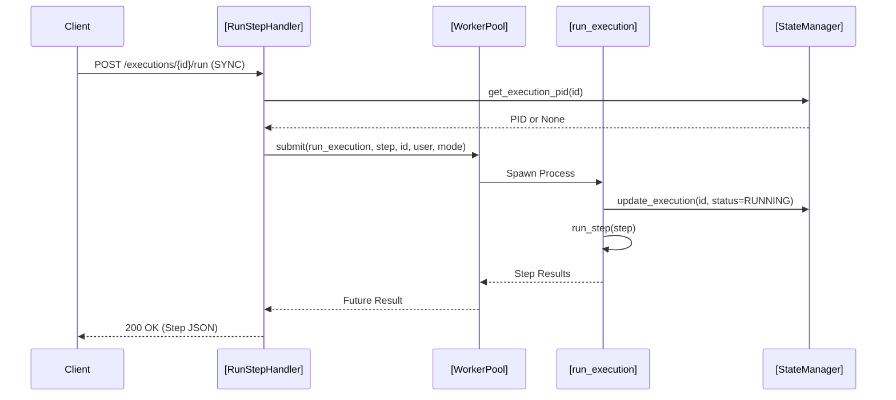
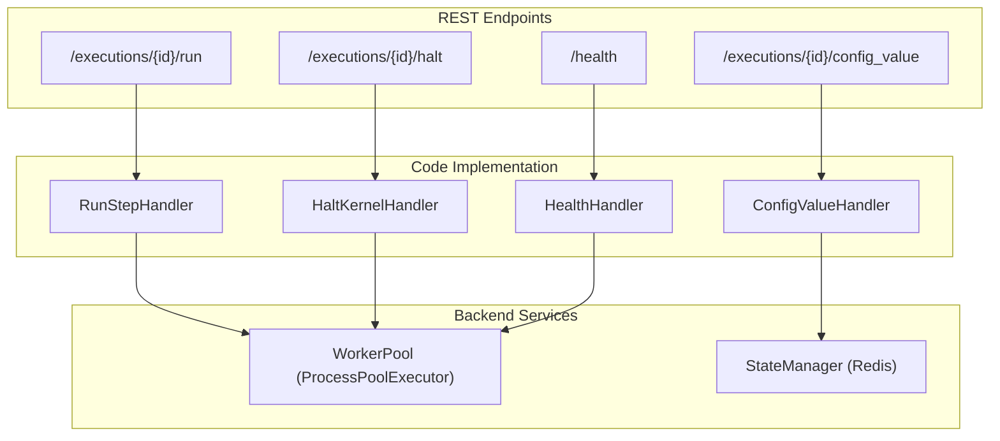

# Page: REST API Reference

# REST API Reference

Relevant source files

The following files were used as context for generating this wiki page:

- [execution.yaml](execution.yaml)
- [image/execution_server.py](image/execution_server.py)

The Ingenium Execution Server provides a RESTful interface for managing the lifecycle of test executions, interacting with the worker pool, and accessing state. The API is defined via an OpenAPI (Swagger 2.0) specification in `execution.yaml` [execution.yaml:1-4]().

## Base Configuration

*   **Base Path**: `/api/v4` [execution.yaml:6-6]()
*   **Protocols**: `http` [execution.yaml:8-8]()
*   **Content-Type**: `application/json` [execution.yaml:10-12]()

### Authentication
The API uses JWT-based authentication with two security levels:
*   **UserSecurity**: API key passed in the `user_api_key` header [execution.yaml:15-18]().
*   **AdminSecurity**: API key passed in the `admin_api_key` header [execution.yaml:19-22]().

Validation is performed by the `@exec_api` decorator using RS256 algorithm and public keys provided via environment variables (`PUBLIC_PEM`) [image/execution_server.py:423-448]().

---

## Execution Management

### Register Execution
`PUT /executions/{execution_id}`
Registers a new execution instance and initializes its state in Redis [execution.yaml:28-33]().

*   **Parameters**: `execution_id` (path) [execution.yaml:35-35]().
*   **Body**: `VenueInfo` object containing venue configuration and tokens [execution.yaml:36-41]().
*   **Implementation**: `RegisterExecutionHandler.put` calls `StateManager.register_execution` [image/execution_server.py:534-546]().

### Unregister Execution
`DELETE /executions/{execution_id}`
Removes an execution and its associated state from the server [execution.yaml:50-54]().

*   **Implementation**: `RegisterExecutionHandler.delete` calls `StateManager.unregister_execution` [image/execution_server.py:548-554]().

### Switch Execution
`POST /executions/{execution_id}/switch`
Used in automatic execution modes to transition a worker process from the current execution to a target execution [execution.yaml:178-183]().

*   **Parameters**: `target_execution_id` (query) [execution.yaml:186-190]().
*   **Implementation**: `SwitchExecutionHandler.post` calls `switch_execution` from the library [image/execution_server.py:841-850]().

---

## Step Execution

### Run Step
`POST /executions/{execution_id}/run`
Triggers the execution of a specific step or the continuation of an execution sequence [execution.yaml:65-70]().

*   **Run Modes** (`run_mode`):
    *   `SYNC`: Block until the step completes. Returns the updated step object [execution.yaml:79-81]().
    *   `ASYNC`: Dispatches the step to the `WorkerPool` and returns `202 Accepted` immediately [execution.yaml:80-80]().
*   **Logic**:
    1.  The `RunStepHandler` determines if a `step` body or `elem_id` was provided [image/execution_server.py:614-630]().
    2.  It submits a task to the `WorkerPool` using `run_execution` [image/execution_server.py:648-655]().
    3.  If `SYNC`, it awaits the `Future` result; if `ASYNC`, it returns the status [image/execution_server.py:663-678]().

### Halt Execution
`POST /executions/{execution_id}/halt`
Stops a running execution by sending signals to the worker process [execution.yaml:199-204]().

*   **Implementation**: `HaltKernelHandler.post` identifies the process ID (PID) associated with the `execution_id` and sends `SIGTERM`. If the process persists, it escalates to `SIGKILL` [image/execution_server.py:813-833]().

**Data Flow: Step Execution Request**
The following diagram illustrates the flow from a REST request to the worker process.

Sources: [image/execution_server.py:603-685](), [image/execution_server.py:91-146](), [image/state_manager.py:10-40]()

---

## State Access

### Get Config Value
`GET /executions/{execution_id}/config_value`
Retrieves a configuration parameter specific to the execution context [execution.yaml:107-112]().

*   **Implementation**: `ConfigValueHandler.get` uses `StateManager.get_config_value` [image/execution_server.py:734-742]().

### Get Variable Value
`GET /executions/{execution_id}/variable_value`
Retrieves the value of a variable stored within the execution's runtime kernel [execution.yaml:130-135]().

*   **Implementation**: `VariableValueHandler.get` uses `StateManager.get_variable_value` [image/execution_server.py:756-764]().

### Copy State
`POST /executions/{execution_id}/copy_state`
Copies all state variables from one execution to another [execution.yaml:153-158]().

*   **Implementation**: `CopyExecutionStateHandler.post` invokes `StateManager.copy_execution_state` [image/execution_server.py:781-792]().

---

## System Utilities

### Logging Configuration
*   **GET `/logging`**: Returns the current global log level [execution.yaml:215-220]().
*   **POST `/logging`**: Updates the log level (e.g., DEBUG, INFO) dynamically without restart [execution.yaml:231-235]().
*   **Implementation**: `LoggingHandler` interacts with the `logging` module to adjust levels [image/execution_server.py:864-884]().

### Health Check
`GET /health`
Returns the status of the server and its subcomponents (Redis, WorkerPool) [execution.yaml:251-255]().

*   **Implementation**: `HealthHandler.get` checks the `WorkerPool` status and process counts [image/execution_server.py:898-912]().

**System Mapping: API to Code Entities**

Sources: [execution.yaml:27-255](), [image/execution_server.py:925-950](), [image/state_manager.py:10-25]()
