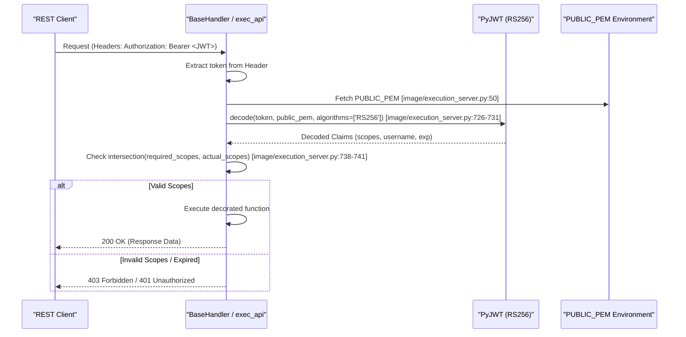
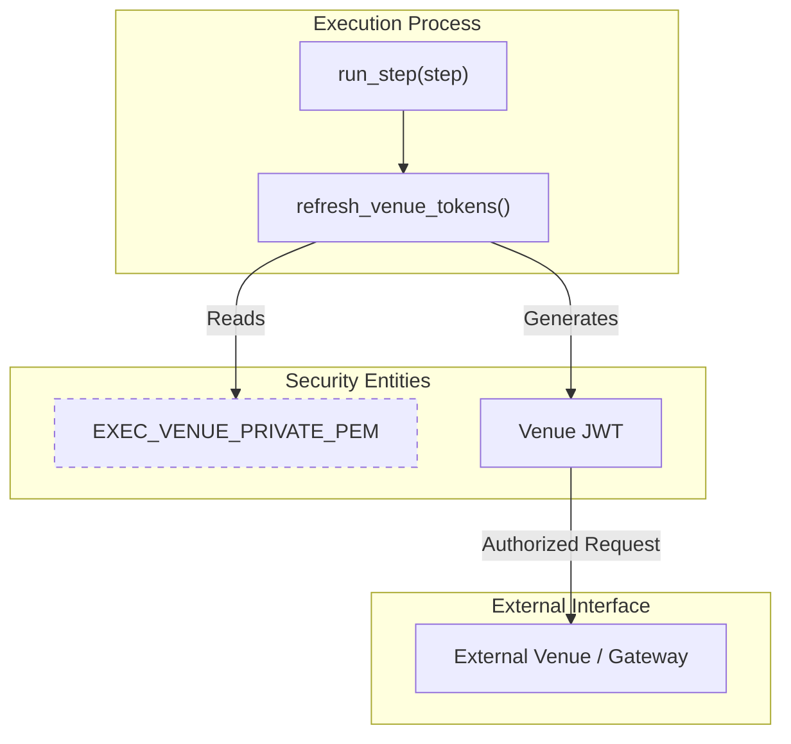
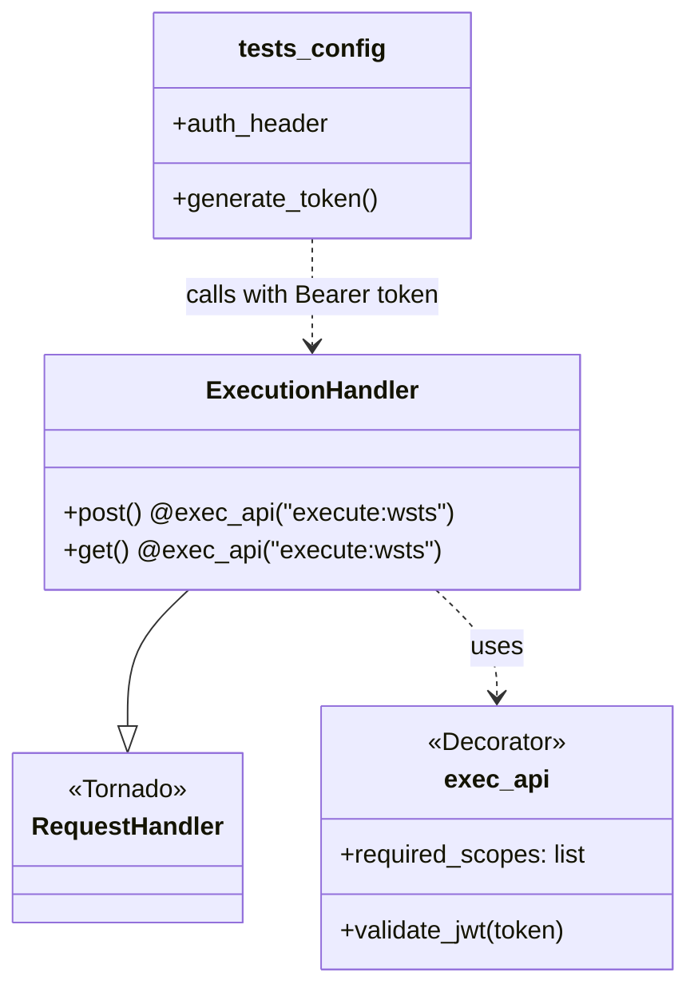

# Page: Security and Authentication

# Security and Authentication

Relevant source files

The following files were used as context for generating this wiki page:

- [image/execution_server.py](image/execution_server.py)
- [tests/config.py](tests/config.py)
- [tests/jwt_example.py](tests/jwt_example.py)

The Ingenium Execution Server employs a JWT-based security model to authorize REST API requests and secure communication between the execution engine and external venues. The system relies on asymmetric cryptography (RS256) for token validation and a scope-based authorization mechanism enforced via Python decorators.

## Security Architecture Overview

The security model is built around three primary components:
1.  **Request Authorization**: Validating incoming `Authorization: Bearer <token>` headers using a public key.
2.  **Scope Enforcement**: Ensuring the authenticated user possesses the specific permissions (scopes) required for a given API endpoint.
3.  **Venue Token Management**: Generating short-lived tokens using a private key to allow the execution server to authenticate with downstream services (Venues).

### Data Flow: Request Authentication

The following diagram illustrates the flow of a secured request through the `exec_api` decorator.

**Security Validation Flow**

Sources: [image/execution_server.py:50-59](), [image/execution_server.py:707-750]()

---

## JWT Validation and Scopes

The server uses the `PyJWT` library to validate tokens. The validation logic is configured to strictly check signatures, expiration (`exp`), and issued-at (`iat`) times.

### Configuration Constants
The server initializes `jwt_options` to enforce specific validation rules during the decoding process:
- `verify_signature`: True
- `verify_exp`: True
- `verify_iat`: True
- `verify_aud`: False (Audience validation is disabled)

[image/execution_server.py:53-59]()

### The `exec_api` Decorator
The primary entry point for security enforcement is the `exec_api` decorator. It wraps Tornado `RequestHandler` methods to perform pre-flight authentication.

| Feature | Implementation Detail |
| :--- | :--- |
| **Token Extraction** | Reads the `Authorization` header and strips the `Bearer ` prefix [image/execution_server.py:716-724](). |
| **Validation** | Uses `jwt.decode` with the `PUBLIC_PEM` environment variable [image/execution_server.py:726-731](). |
| **Scope Intersection** | Compares the `scopes` list in the JWT against the `required_scopes` passed to the decorator [image/execution_server.py:738-741](). |
| **User Context** | Extracts the `username` from the token and assigns it to `self.user_name` for logging and audit purposes [image/execution_server.py:745-746](). |

Sources: [image/execution_server.py:707-750]()

---

## Venue Token Generation

While the server *validates* incoming tokens using a public key, it *generates* outgoing tokens for venue communication using a private key. This is critical for steps that interact with external hardware or flight software interfaces.

### Key Functions
- **`refresh_venue_tokens()`**: This function is called during the execution of a step [image/execution_server.py:68](). It ensures that the execution server has a valid, non-expired token to present to venues.
- **`generate_token()` (Test Context)**: In the test suite, this utility creates mock RS256 tokens using `PRIVATE_PEM` to simulate an upstream identity provider [tests/config.py:21-35]().

### Token Refresh Flow
The execution loop triggers a token refresh before running any step to prevent authorization failures during long-running procedures.

**Venue Authentication Flow**

Sources: [image/execution_server.py:48-49](), [image/execution_server.py:65-69](), [image/execution_server.py:40]()

---

## Environment Variables

The security model is driven by environment variables. These must be correctly populated in the production container or the local development environment.

| Variable | Role | Usage |
| :--- | :--- | :--- |
| `PUBLIC_PEM` | RSA Public Key | Used by `exec_api` to verify incoming user JWTs [image/execution_server.py:50](). |
| `EXEC_VENUE_PRIVATE_PEM` | RSA Private Key | Used to sign tokens sent to external venues [image/execution_server.py:48](). |
| `EXEC_VENUE_PUBLIC_PEM` | RSA Public Key | Used to verify responses or tokens from venues [image/execution_server.py:49](). |
| `PRIVATE_PEM` (Tests) | RSA Private Key | Used in `tests/config.py` to generate valid test tokens [tests/config.py:25](). |

Sources: [image/execution_server.py:48-51](), [tests/config.py:25-32](), [tests/jwt_example.py:8-16]()

---

## Implementation in Tests

The test suite simulates the full authentication lifecycle. It uses `tests/config.py` to bootstrap an authenticated session for all integration tests.

1.  **Token Generation**: `generate_token()` creates a JWT with the `execute:wsts` scope and a 30-minute expiration [tests/config.py:21-35]().
2.  **Header Injection**: The generated token is formatted as a `Bearer` token and added to a global `headers` dictionary [tests/config.py:47-55]().
3.  **API Requests**: All subsequent calls to the Execution Server API (e.g., in `test_ci_execution_server.py`) include these headers to pass the `exec_api` decorator check.

**Code Entity Association**

Sources: [image/execution_server.py:707-750](), [tests/config.py:21-55](), [tests/jwt_example.py:18-52]()
