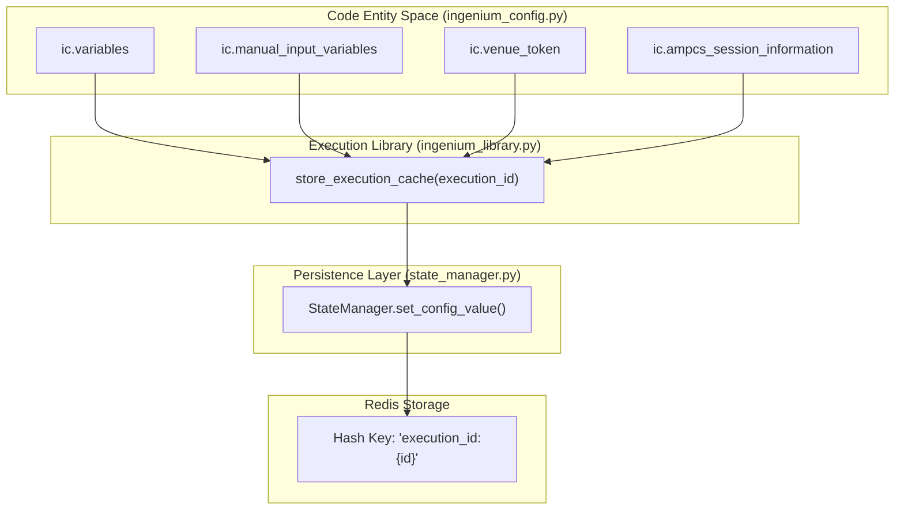
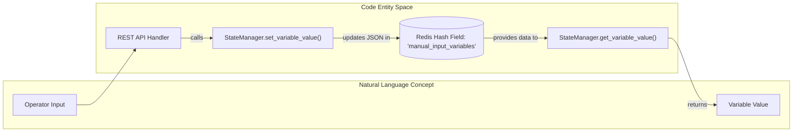

# Page: State Management with Redis

# State Management with Redis

Relevant source files

The following files were used as context for generating this wiki page:

- [image/ingenium_embedded/ingenium_config.py](image/ingenium_embedded/ingenium_config.py)
- [image/ingenium_embedded/ingenium_library.py](image/ingenium_embedded/ingenium_library.py)
- [image/state_manager.py](image/state_manager.py)

The Ingenium Execution Server utilizes Redis as a high-performance, persistent backing store for execution state. This state management is primarily handled by the `StateManager` class, which abstracts the interaction with Redis hashes. This architecture ensures that even if a worker process or the main server restarts, the configuration, user-defined variables, and execution metadata for a specific `execution_id` can be recovered and resumed.

## StateManager Implementation

The `StateManager` class in `image/state_manager.py` provides the interface for persisting and retrieving execution data. It uses a Redis Hash data structure to store key-value pairs associated with a specific execution.

### Key Schema
All data related to a single execution is stored under a Redis key following a specific template:
*   **Template**: `execution_id:{id}` [[image/state_manager.py:9-9]()]
*   **Data Type**: Redis Hash (`HSET`, `HGET`) [[image/state_manager.py:18-22]()]

### Core Methods
| Method | Description | Source |
| :--- | :--- | :--- |
| `set_config_value` | Sets a specific field within the execution's Redis hash. | [[image/state_manager.py:14-18]()] |
| `get_config_value` | Retrieves a field value from the execution's Redis hash. | [[image/state_manager.py:20-30]()] |
| `set_variable_value` | Updates a specific variable within the `manual_input_variables` JSON blob. | [[image/state_manager.py:32-41]()] |
| `get_variable_value` | Retrieves a specific variable from the `manual_input_variables` JSON blob. | [[image/state_manager.py:43-51]()] |
| `delete_execution` | Removes the entire hash associated with an `execution_id`. | [[image/state_manager.py:53-55]()] |

**Sources:** [[image/state_manager.py:1-55]()]

---

## Global State with `ingenium_config.py`

While Redis provides the persistent storage, the `ingenium_config.py` module acts as the in-memory global state for the execution process (embedded step runner). When an execution starts or resumes, values are loaded from Redis into this module's variables.

### Managed State Variables
The following variables are defined globally and managed by the execution service:
*   **Identity**: `execution_id`, `username`, `ing_token`, `venue_token`. [[image/ingenium_embedded/ingenium_config.py:21-33]()]
*   **Venue Info**: `venue_service_address`, `venue_name`, `venue_id`, `venue_type`. [[image/ingenium_embedded/ingenium_config.py:63-68]()]
*   **Variables**:
    *   `variables`: General user-defined variables. [[image/ingenium_embedded/ingenium_config.py:23-23]()]
    *   `manual_input_variables`: Variables specifically for operator input. [[image/ingenium_embedded/ingenium_config.py:25-25]()]
    *   `environment_step_variables`, `channel_variables`, `cmd_variables`. [[image/ingenium_embedded/ingenium_config.py:24-27]()]
*   **Execution Status**: `last_step_status`, `run_mode` (SYNC/ASYNC). [[image/ingenium_embedded/ingenium_config.py:36-40]()]

**Sources:** [[image/ingenium_embedded/ingenium_config.py:20-68]()]

---

## Execution Cache Patterns

The server employs a caching pattern to synchronize the in-memory `ingenium_config` with the Redis persistence layer. This is handled by utility functions in `ingenium_library.py`.

### Cache Flow: Store and Reload
When `use_execution_cache` is enabled (typically via environment variables in the Gateway), the system performs the following:

1.  **Store**: The `store_execution_cache` function takes the current state of `ingenium_config` (dictionaries, tokens, etc.), serializes them to JSON, and writes them to the Redis hash. [[image/ingenium_embedded/ingenium_library.py:171-186]()]
2.  **Reload**: The `reload_execution_cache` function (not fully shown but referenced) performs the inverse, reading from Redis and updating the `ic` (ingenium_config) module variables. [[image/ingenium_embedded/ingenium_library.py:81-81]()]

### Diagram: State Persistence Flow
This diagram shows how data flows from the code entities in `ingenium_config` to the Redis storage via the `StateManager`.

**Sources:** [[image/ingenium_embedded/ingenium_library.py:108-110](), [image/ingenium_embedded/ingenium_library.py:171-186](), [image/state_manager.py:9-18]()]

---

## Manual Input Variable Handling

Manual input variables represent a specific subset of state that often requires external updates (e.g., from a REST API call while an execution is paused).

### Update Logic
The `StateManager.set_variable_value` method implements a read-modify-write pattern:
1.  Fetch the existing `manual_input_variables` string from the Redis hash. [[image/state_manager.py:33-33]()]
2.  Deserialize the JSON string into a Python dictionary. [[image/state_manager.py:38-38]()]
3.  Update the specific `var_name` with the new `value`. [[image/state_manager.py:39-39]()]
4.  Re-serialize to JSON and save back to Redis. [[image/state_manager.py:41-41]()]

### Diagram: Manual Variable Interaction
This diagram maps the interaction between the `StateManager` code and the logical "Natural Language" concept of an operator providing input.

**Sources:** [[image/state_manager.py:32-51]()]

## Data Deletion
When an execution is finished or cancelled, the `delete_execution` function ensures no stale data remains in Redis by deleting the entire hash associated with the `execution_id`. This is critical for preventing memory leaks in Redis over long periods of operation. [[image/state_manager.py:53-55]()]

**Sources:** [[image/state_manager.py:53-55]()]
