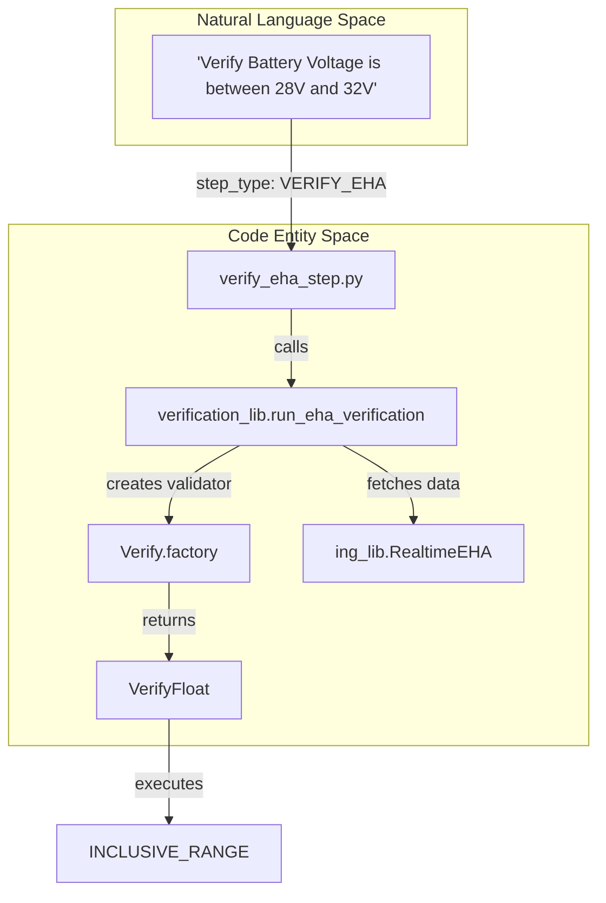
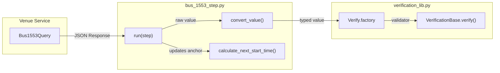

# Page: Telemetry Verification Steps (EHA, EVR, 1553)

# Telemetry Verification Steps (EHA, EVR, 1553)

Relevant source files

The following files were used as context for generating this wiki page:

- [image/ingenium_embedded/bus_1553_step.py](image/ingenium_embedded/bus_1553_step.py)
- [image/ingenium_embedded/graph_eha_step.py](image/ingenium_embedded/graph_eha_step.py)
- [image/ingenium_embedded/query_evr_step.py](image/ingenium_embedded/query_evr_step.py)
- [image/ingenium_embedded/verification_lib.py](image/ingenium_embedded/verification_lib.py)
- [image/ingenium_embedded/verify_eha_step.py](image/ingenium_embedded/verify_eha_step.py)
- [image/ingenium_embedded/wait_eha_step.py](image/ingenium_embedded/wait_eha_step.py)
- [image/ingenium_embedded/wait_evr_step.py](image/ingenium_embedded/wait_evr_step.py)

The Ingenium Execution Server provides a suite of specialized steps for querying, monitoring, and verifying telemetry data from various spacecraft subsystems. These steps interface with venue services to retrieve Engineering Health Analysis (EHA) data, Event Records (EVR), and MIL-STD-1553 bus traffic. They support both one-time verification and polling-based "wait" behaviors to synchronize execution with spacecraft state.

### Core Telemetry Step Types

| Step Type | File | Purpose |
| :--- | :--- | :--- |
| `VERIFY_EHA` | [image/ingenium_embedded/verify_eha_step.py:8-11]() | Performs a single query for EHA channel values and verifies them against conditions. |
| `WAIT_EHA` | [image/ingenium_embedded/wait_eha_step.py:7-12]() | Polls EHA channels until specified conditions are met or a timeout occurs. |
| `GRAPH_EHA` | [image/ingenium_embedded/graph_eha_step.py:11-168]() | Queries a range of historical EHA data for visualization or trend analysis. |
| `QUERY_EVR` | [image/ingenium_embedded/query_evr_step.py:13-157]() | Retrieves a historical list of Event Records based on filters (ID, Level, Name). |
| `WAIT_EVR` | [image/ingenium_embedded/wait_evr_step.py:15-236]() | Polls for specific EVRs appearing in the telemetry stream within a time window. |
| `BUS_1553` | [image/ingenium_embedded/bus_1553_step.py:135-260]() | Verifies data words within 1553 bus messages. |

Sources: [image/ingenium_embedded/verify_eha_step.py:8-11](), [image/ingenium_embedded/wait_eha_step.py:7-12](), [image/ingenium_embedded/graph_eha_step.py:11-168](), [image/ingenium_embedded/query_evr_step.py:13-157](), [image/ingenium_embedded/wait_evr_step.py:15-236](), [image/ingenium_embedded/bus_1553_step.py:135-260]()

---

### Engineering Health Analysis (EHA) Verification

EHA verification is unified through the `run_eha_verification` function in `verification_lib.py`. This function handles the logic for both `VERIFY_EHA` (instant check) and `WAIT_EHA` (polling check).

#### Implementation Details
1.  **Time Validation**: The step validates the `start_time` and `end_time` using `validate_times` [image/ingenium_embedded/graph_eha_step.py:61-61]().
2.  **Query Loop**: If `wait_mode` is enabled, the step enters a loop, querying the venue service at a frequency defined by `ic.chill_query_frequency` [image/ingenium_embedded/wait_evr_step.py:110-110]().
3.  **Data Retrieval**: It uses `ing_lib.RealtimeEHA` or `ing_lib.ChillEHAQuery` to fetch channel data [image/ingenium_embedded/graph_eha_step.py:80-86]().
4.  **Verification**: For each channel, it uses the `Verify.factory` to create a validator based on the data type (INTEGER, FLOAT, STRING) [image/ingenium_embedded/verification_lib.py:32-69]().

#### Natural Language to Code Mapping: EHA Verification
This diagram illustrates how a user's intent to verify a telemetry channel translates into specific class instances and library calls.

Title: EHA Verification Flow

Sources: [image/ingenium_embedded/verify_eha_step.py:11-11](), [image/ingenium_embedded/verification_lib.py:32-69](), [image/ingenium_embedded/verification_lib.py:24-24]()

---

### Event Record (EVR) Handling

EVR steps are used to confirm software events or state transitions. `WAIT_EVR` is particularly critical for command sequencing, as it allows the runner to wait for a "Command Complete" EVR before proceeding.

#### Wait vs. Query Modes
-   **Wait Mode (`wait_evr_step.py`)**: Uses `EvrResponse` to track multiple entries [image/ingenium_embedded/wait_evr_step.py:62-62](). It alternates between `RealtimeEVR` (for low latency) and `ChillEVRQuery` (to ensure no data is missed if the realtime buffer clears) [image/ingenium_embedded/wait_evr_step.py:114-135]().
-   **Query Mode (`query_evr_step.py`)**: Performs a single fetch of historical EVRs and applies `verify_query_evr_results` to check the count or presence of specific messages [image/ingenium_embedded/query_evr_step.py:148-148]().

#### EVR Type Filtering
The system supports filtering by the source of the EVR:
-   `SSE`: System Simulation Environment events [image/ingenium_embedded/wait_evr_step.py:140-141]().
-   `FSW_RECORDED`: Flight Software events stored in non-volatile memory [image/ingenium_embedded/wait_evr_step.py:142-143]().
-   `FSW_REALTIME`: Flight Software events sent in the realtime stream [image/ingenium_embedded/wait_evr_step.py:144-145]().

Sources: [image/ingenium_embedded/wait_evr_step.py:62-145](), [image/ingenium_embedded/query_evr_step.py:148-148]()

---

### 1553 Bus Verification

The `bus_1553_step.py` handles verification of MIL-STD-1553 bus traffic. This involves querying the `Bus1553Query` service and parsing binary/hex data words into engineering values.

#### Key Functions
-   **`convert_value`**: Casts bus response strings into `INTEGER`, `FLOAT`, or `STRING` (for HEX/BIN/ENUM) based on the `data_type` parameter [image/ingenium_embedded/bus_1553_step.py:16-85]().
-   **`calculate_next_start_time`**: Determines the time anchor for subsequent queries by looking at the `time_scet` or `time_sclk` of the last received message [image/ingenium_embedded/bus_1553_step.py:88-132]().

#### Data Flow: 1553 Verification
Title: 1553 Telemetry Processing

Sources: [image/ingenium_embedded/bus_1553_step.py:16-132](), [image/ingenium_embedded/bus_1553_step.py:135-260](), [image/ingenium_embedded/verification_lib.py:32-69]()

---

### Verification Conditions and Types

The `VerificationBase` class and its subclasses in `verification_lib.py` implement the actual comparison logic. The `data_type_mapping` defines which conditions are valid for which telemetry types.

#### Supported Conditions
-   **Numeric**: `GREATER_THAN`, `LESS_THAN`, `INCLUSIVE_RANGE`, `EXCLUSIVE_RANGE` [image/ingenium_embedded/verification_lib.py:15-25]().
-   **Equality**: `EQUAL`, `NOT_EQUAL` [image/ingenium_embedded/verification_lib.py:19-20]().
-   **Presence**: `NOT_PRESENT` (verifies data is missing), `RECORD` (just logs the value without failing) [image/ingenium_embedded/verification_lib.py:21-22]().
-   **String/Binary**: `CONTAINS` [image/ingenium_embedded/verification_lib.py:23-23]().

#### Time Handling (SCET vs. SCLK)
Telemetry steps support multiple time formats for querying:
-   **SCET (Spacecraft Event Time)**: UTC-based time.
-   **SCLK (Spacecraft Clock)**: Raw ticks from the onboard clock.
-   **ERT (Earth Receipt Time)**: When the packet was received at the ground station.

The `validate_times` helper [image/ingenium_embedded/graph_eha_step.py:61-61]() ensures that user-provided relative times (e.g., "now - 5 minutes") are translated into absolute timestamps required by the venue services.

Sources: [image/ingenium_embedded/verification_lib.py:14-26](), [image/ingenium_embedded/verification_lib.py:32-111](), [image/ingenium_embedded/graph_eha_step.py:61-61]()
