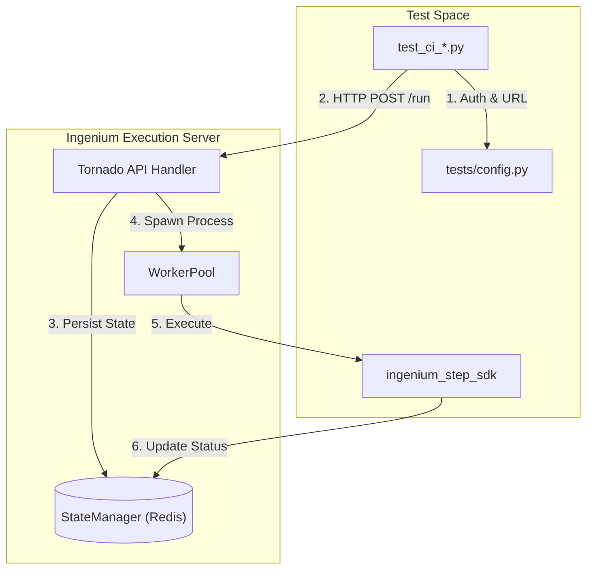

# Page: Testing

# Testing

Relevant source files

The following files were used as context for generating this wiki page:

- [tests/config.py](tests/config.py)
- [tests/ingenium_step_test.py](tests/ingenium_step_test.py)
- [tests/requirements.txt](tests/requirements.txt)
- [tests/test_ci_execution_server.py](tests/test_ci_execution_server.py)

The Ingenium Execution Server features a multi-layered testing strategy designed to validate the entire execution lifecycle, from low-level step logic to high-level REST API orchestration. The test suite is divided into automated CI integration tests and exploratory developer scripts.

### Test Architecture Overview

The testing infrastructure relies on a centralized configuration and a set of simulated environments to ensure consistency across different deployment targets.

#### Global Test Configuration
The `tests/config.py` file serves as the primary configuration hub for all tests. It manages:
*   **Authentication**: Generates RS256 JWT tokens using `generate_token()` for authorized API access, utilizing the `PRIVATE_PEM` environment variable [[tests/config.py:21-35](), [tests/config.py:47-53]()].
*   **Networking**: Defines the target `EXEC_SERVER_URL` and constructs the base `api_path` (defaulting to `/api/v4`) [[tests/config.py:39-42]()].
*   **Logging**: Configures a global logger with ISO-8601 UTC timestamps and adjustable levels via `TEST_LOG_LEVEL` [[tests/config.py:7-17]()].

#### Test Execution Flow
The following diagram illustrates how the test suite interacts with the Execution Server:

**Test Interaction Diagram**

Sources: [tests/config.py:39-55](), [tests/test_ci_execution_server.py:16-56](), [tests/ingenium_step_test.py:85-95]()

---

### CI Integration Tests

The CI suite consists of `test_ci_*.py` files designed to be run by a CI/CD pipeline (e.g., Jenkins). These tests use `unittest` and `xmlrunner` to produce machine-readable reports for automated verification [[tests/test_ci_execution_server.py:1-4]()].

Key coverage areas include:
*   **Server Orchestration**: Validating execution registration, multi-step sequencing, and session persistence [[tests/test_ci_execution_server.py:46-151]()].
*   **Step Logic**: Verifying specific step types such as Commands (1553, SSE), Telemetry (EHA, EVR), and Custom Scripts.
*   **System Health**: Monitoring the `/health` and `/logging` endpoints to ensure operational stability.

For detailed documentation on the integration test suite, see **[CI Integration Tests](#4.1)**.

Sources: [tests/test_ci_execution_server.py:1-9]()

---

### Developer Examples and Exploratory Scripts

The `tests/` directory contains numerous scripts that are not part of the automated CI pipeline but serve as critical tools for local development and debugging.

#### Step SDK Testing
Developers can test individual step implementations in isolation using `tests/ingenium_step_test.py`. This script demonstrates how to:
1.  Configure a mock step JSON object [[tests/ingenium_step_test.py:21-77]()].
2.  Initialize the `ingenium_step_sdk` with login information [[tests/ingenium_step_test.py:85-88]()].
3.  Dynamically import and execute a step's `run()` function [[tests/ingenium_step_test.py:94-95]()].

#### Feature Explorations
Additional scripts provide focused examples of complex server behaviors:
*   **Concurrency**: `asyncio_example.py` and `WorkerPool` process management.
*   **Interruption**: `halt_example.py` and `kernel_manager_interrupt_test.py`.
*   **State Persistence**: `redis_example.py` and `restore_kernel_example.py`.

For a full reference of these tools, see **[Developer Examples and Exploratory Scripts](#4.2)**.

Sources: [tests/ingenium_step_test.py:1-95]()

---

### Test Environment Requirements

To run the full suite, the following dependencies must be installed as specified in `tests/requirements.txt`:

| Package | Version | Purpose |
| :--- | :--- | :--- |
| `PyJWT` | 1.7.0 | Token generation for `exec_api` authentication [[tests/requirements.txt:3]()] |
| `unittest-xml-reporting` | 2.4.0 | XML output for CI pipelines [[tests/requirements.txt:8]()] |
| `requests` | 2.20.1 | HTTP client for API testing [[tests/requirements.txt:5]()] |
| `redis` | 2.10.6 | Direct state inspection during tests [[tests/requirements.txt:4]()] |

Sources: [tests/requirements.txt:1-10]()
