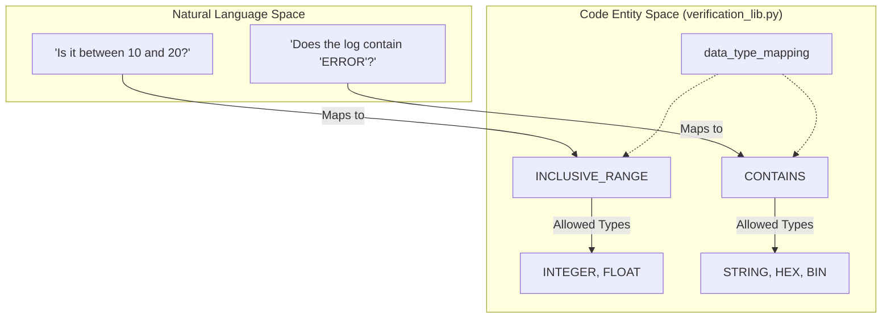
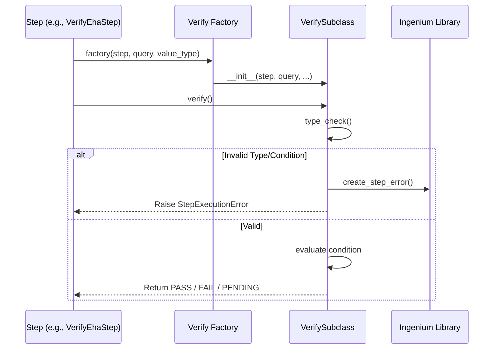

# Page: Verification Library

# Verification Library

Relevant source files

The following files were used as context for generating this wiki page:

- [image/ingenium_embedded/ingenium_library.py](image/ingenium_embedded/ingenium_library.py)
- [image/ingenium_embedded/verification_lib.py](image/ingenium_embedded/verification_lib.py)

The Verification Library is a core component of the `ingenium_embedded` package, providing a standardized framework for evaluating telemetry data, command status, and manual inputs against expected conditions. It encapsulates the logic for data type validation, condition evaluation (e.g., range checks, equality), and the determination of verification status (PASS/FAIL/PENDING).

## Core Architecture

The library is centered around a factory pattern that instantiates specific verification handlers based on the step type and the data type of the value being verified.

### The Verify Factory
The `Verify` class serves as a static factory that routes verification requests to the appropriate subclass. It determines the correct handler by inspecting the `step_type` and the `value_type` [image/ingenium_embedded/verification_lib.py:30-32]().

| Step Type | Data Type Determination | Target Subclass |
| :--- | :--- | :--- |
| `MANUAL_INPUT` | Explicitly provided in user input `value_type` | `VerifyInteger`, `VerifyFloat`, `VerifyString`, `VerifyBoolean` |
| `VERIFY_EHA`, `WAIT_EHA`, `BUS_1553` | Derived from the channel type in the telemetry response | `VerifyInteger`, `VerifyFloat`, `VerifyString` |
| `ENVIRONMENT_MANUAL` | Hardcoded to Float (Temperature/Humidity) | `VerifyFloat` |

**Sources:** [image/ingenium_embedded/verification_lib.py:30-113]()

### Data Type Mapping
The library maintains a `data_type_mapping` dictionary that defines which verification conditions are valid for specific data types. This ensures, for example, that a `GREATER_THAN` check is not attempted on a `BOOLEAN` or `STRING` type [image/ingenium_embedded/verification_lib.py:14-26]().

**Sources:** [image/ingenium_embedded/verification_lib.py:14-26]()

## Verification Subclasses

All verification logic inherits from `VerificationBase` [image/ingenium_embedded/verification_lib.py:116](), which initializes common attributes such as `condition`, `verification_values`, and `verify_on`.

### 1. Numeric Verification (`VerifyInteger`, `VerifyFloat`)
These classes handle mathematical comparisons.
*   **Conditions:** `GREATER_THAN`, `LESS_THAN`, `INCLUSIVE_RANGE`, `EXCLUSIVE_RANGE`, `EQUAL`.
*   **Logic:** They convert both the `actual_value` and `verification_values` to numeric types before comparison. `VerifyFloat` handles precision and `math.isclose` logic for equality where applicable.

### 2. String and Boolean Verification (`VerifyString`, `VerifyBoolean`)
*   **VerifyString:** Supports `EQUAL`, `NOT_EQUAL`, and `CONTAINS`. It is used for EVR messages, serial strings, and manual text inputs.
*   **VerifyBoolean:** Primarily supports `EQUAL` and `NOT_EQUAL`. It maps various truthy/falsy strings (e.g., "True", "1", "On") to boolean values.

### 3. Command Verification (`FSWVerify`, `HWVerify`)
These are specialized handlers for Flight Software and Hardware commands. Unlike telemetry verification, these often rely on two flags: `radiated` (was the command sent?) and `verified` (did the system acknowledge it?) [image/ingenium_embedded/ingenium_library.py:131-139]().

**Sources:** [image/ingenium_embedded/verification_lib.py:30-113](), [image/ingenium_embedded/ingenium_library.py:131-139]()

## Verification Conditions

The library evaluates the `actual_value` against the `verification_values` based on the following logic:

| Condition | Logic Description |
| :--- | :--- |
| `EQUAL` | Returns `True` if the actual value matches the expected value. |
| `NOT_EQUAL` | Returns `True` if the actual value does not match the expected value. |
| `GREATER_THAN` | Returns `True` if `actual_value > expected_value`. |
| `INCLUSIVE_RANGE` | Returns `True` if `min <= actual_value <= max`. Requires two verification values. |
| `CONTAINS` | Returns `True` if the expected substring is found within the actual string. |
| `NOT_PRESENT` | Used in `WAIT_EVR` or `QUERY_EVR` to ensure a specific pattern was not found in the logs. |
| `RECORD` | A special condition that always passes but records the `actual_value` into the execution state for future steps. |

**Sources:** [image/ingenium_embedded/verification_lib.py:14-26]()

## Status Determination (PASS/FAIL/PENDING)

The verification status is determined by the `verify()` method within the subclasses.

### Data Flow for Status

### Status Logic
1.  **PASS:** The `actual_value` meets the criteria defined by the `condition` and `verification_values`.
2.  **FAIL:** The `actual_value` is present but does not meet the criteria. For command steps, `radiated=False` or `verified=False` (if verification is enabled) triggers a failure [image/ingenium_embedded/ingenium_library.py:131-138]().
3.  **PENDING:** Primarily used in `WAIT` steps. If the condition is not yet met but the timeout has not expired, the status remains `PENDING` to signal the runner to poll again.
4.  **ERROR:** If a value conversion fails (e.g., trying to compare "ABC" as an `INTEGER`), the library raises a `StepExecutionError` with `ErrorType.VALUE_CONVERSION_ERROR` [image/ingenium_embedded/ingenium_library.py:42]().

**Sources:** [image/ingenium_embedded/verification_lib.py:116-150](), [image/ingenium_embedded/ingenium_library.py:24-44](), [image/ingenium_embedded/ingenium_library.py:131-139]()
