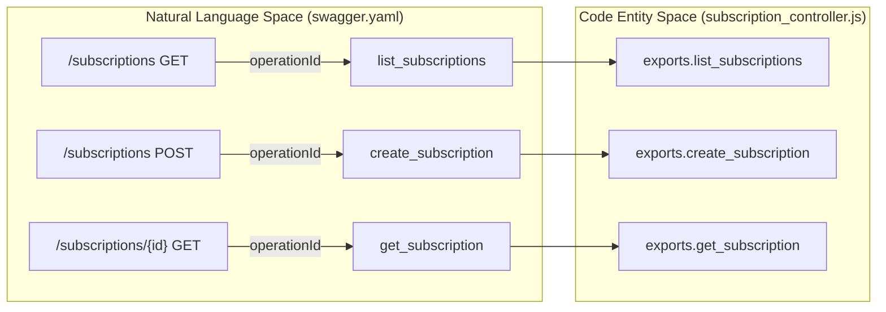
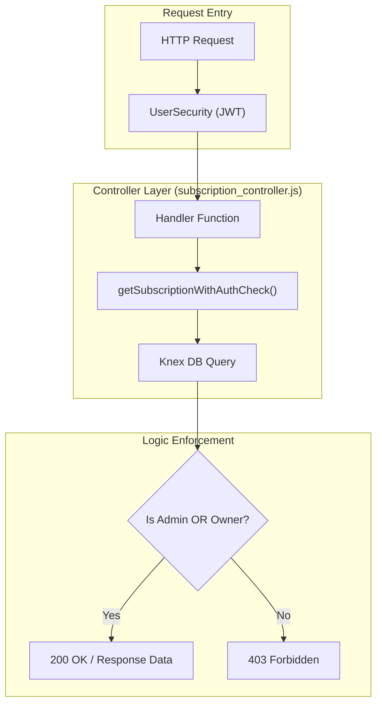

# API Reference

Relevant source files

The following files were used as context for generating this wiki page:

- [README.md](README.md)
- [image/api/swagger/swagger.yaml](image/api/swagger/swagger.yaml)

The Ingenium Notification Service provides a RESTful interface for managing user subscriptions to system events. This API is defined using the OpenAPI 2.0 (Swagger) specification and follows a standard resource-oriented structure. The primary resource is the `subscription`, which defines how and where a user receives notifications for specific event types.

## API Overview

The service exposes its endpoints under a versioned base path and requires JWT-based authentication for all operations except for basic health checks.

- **Base Path**: `/api/v1` [image/api/swagger/swagger.yaml:6-6]()
- **Protocol**: `http` [image/api/swagger/swagger.yaml:8-8]()
- **Content Type**: `application/json` [image/api/swagger/swagger.yaml:10-12]()

### Authentication & Authorization
The API uses an OAuth2 implicit flow named `UserSecurity` [image/api/swagger/swagger.yaml:15-18](). Access is governed by two primary scopes:
1. **`admin`**: Full access to all resources and the ability to manage subscriptions for any user [image/api/swagger/swagger.yaml:20-20]().
2. **`basic`**: Standard access for authenticated users to manage their own subscriptions [image/api/swagger/swagger.yaml:21-21]().

**Sources:**
- [image/api/swagger/swagger.yaml:1-24]()

---

## Endpoint Summary

The following table summarizes the available REST endpoints. All subscription endpoints are handled by the `subscription_controller` [image/api/swagger/swagger.yaml:97-97]().

| Method | Path | Operation ID | Description |
| :--- | :--- | :--- | :--- |
| `GET` | `/health` | `health_get` | Service health status check [image/api/swagger/swagger.yaml:33-33](). |
| `GET` | `/subscriptions` | `list_subscriptions` | List subscriptions (filtered by owner for non-admins) [image/api/swagger/swagger.yaml:51-51](). |
| `POST` | `/subscriptions` | `create_subscription` | Create a new event subscription [image/api/swagger/swagger.yaml:78-78](). |
| `GET` | `/subscriptions/{id}` | `get_subscription` | Retrieve details for a specific subscription [image/api/swagger/swagger.yaml:107-107](). |
| `PATCH` | `/subscriptions/{id}` | `update_subscription` | Update an existing subscription [image/api/swagger/swagger.yaml:137-137](). |
| `DELETE` | `/subscriptions/{id}` | `delete_subscription` | Remove a subscription [image/api/swagger/swagger.yaml:172-172](). |

**Sources:**
- [image/api/swagger/swagger.yaml:26-194]()
- [README.md:13-22]()

---

## Architecture: Specification to Implementation

The API surface is defined in a YAML specification which is then bound to JavaScript controller logic via `swagger-tools`.

### Mapping Specification to Code
This diagram illustrates how the OpenAPI `operationId` fields map directly to exported functions in the controller layer.

"OpenAPI to Controller Mapping"

**Sources:**
- [image/api/swagger/swagger.yaml:51-51]()
- [image/api/swagger/swagger.yaml:78-78]()
- [image/api/swagger/swagger.yaml:107-107]()
- [image/api/swagger/swagger.yaml:41-41]()

### Data Flow & Security Model
The API enforces a strict ownership model. While the OpenAPI spec defines the structure, the controller implements the Role-Based Access Control (RBAC) logic.

"Request Processing Flow"

**Sources:**
- [image/api/swagger/swagger.yaml:14-24]()
- [README.md:5-11]()

---

## Detailed Documentation

For exhaustive details on schemas, request parameters, and internal controller logic, refer to the following child pages:

### [OpenAPI Specification](#3.1)
Detailed reference for `image/api/swagger/swagger.yaml`. This page covers:
- Full request/response schemas for `Subscription` and `SubscriptionInput` [image/api/swagger/swagger.yaml:205-240]().
- Path parameter definitions and validation rules [image/api/swagger/swagger.yaml:196-203]().
- Error response structures [image/api/swagger/swagger.yaml:241-247]().

For details, see [OpenAPI Specification](#3.1).

### [Subscription Controller](#3.2)
Implementation details of `image/api/controllers/subscription_controller.js`. This page covers:
- Internal helper functions like `getSubscriptionWithAuthCheck`.
- Input sanitization via `sanitizeBody` and the `ALLOWED_FIELDS` whitelist.
- Database interaction logic and the `.returning('id')` shim for SQLite/PostgreSQL compatibility.

For details, see [Subscription Controller](#3.2).
