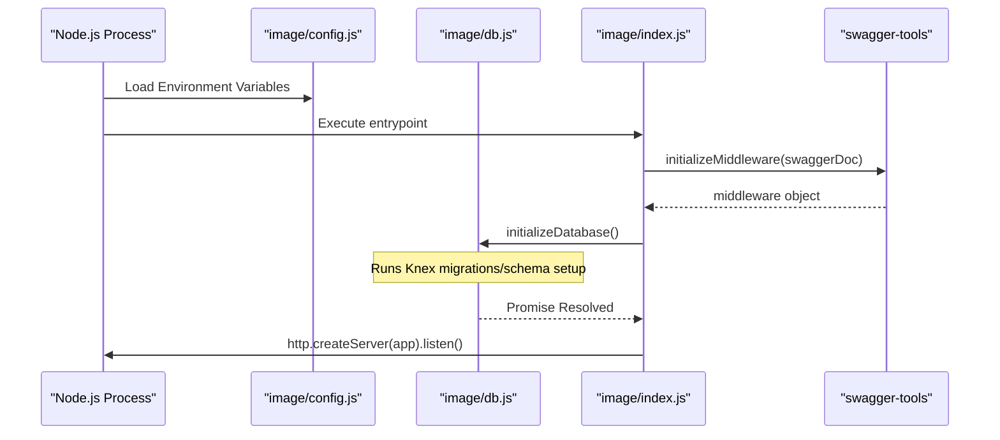
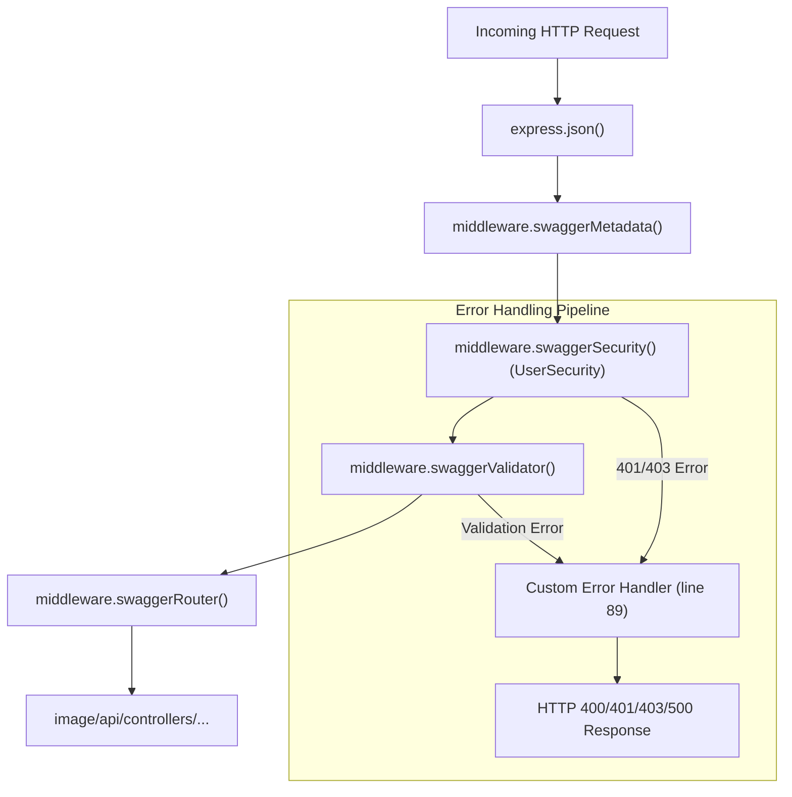

# Application Entrypoint & Middleware Pipeline

Relevant source files

The following files were used as context for generating this wiki page:

- [image/index.js](image/index.js)
- [image/package-lock.json](image/package-lock.json)

This page provides a deep dive into `image/index.js`, the central entrypoint for the Ingenium Notification Service. It details the initialization of the Express application, the configuration of the Swagger-tools middleware stack, and the asynchronous startup sequence that ensures the database is ready before the server begins accepting traffic.

## Overview

The application is built on **Express** and utilizes **swagger-tools** to provide a contract-first API experience. The entrypoint is responsible for loading the OpenAPI specification, wiring up security handlers, and defining the order of operations for every incoming request.

### Startup Lifecycle

The startup sequence is asynchronous and follows a strict order to prevent the service from accepting requests before its dependencies (like the database) are ready.

1.  **Environment Loading**: Reads configuration via `image/config.js` [image/index.js:10]().
2.  **Middleware Initialization**: Calls `swaggerTools.initializeMiddleware` with the loaded `swagger.yaml` [image/index.js:38]().
3.  **Database Migration**: Executes `initializeDatabase()` to ensure the schema is up-to-date [image/index.js:104-105]().
4.  **Server Start**: Once the database is ready, the HTTP server starts listening on the configured `PORT` [image/index.js:106-110]().

The following diagram maps the natural language startup steps to the specific code entities involved:

**Startup Sequence & Entity Mapping**

Sources: [image/index.js:10-13](), [image/index.js:38-39](), [image/index.js:104-106]()

---

## Middleware Pipeline

The service employs a structured middleware stack. Order is critical, as each layer performs transformations or validations required by subsequent layers.

### 1. Basic Express Middleware
Before the Swagger stack, the application uses standard Express middleware:
*   `express.json()`: Parses incoming request bodies with JSON payloads [image/index.js:26]().

### 2. Swagger-Tools Stack
The `swaggerTools.initializeMiddleware` callback provides a `middleware` object used to mount the following specific layers:

| Middleware | Function | Implementation Detail |
| :--- | :--- | :--- |
| `swaggerMetadata` | **Metadata Extraction** | Extracts Swagger-related metadata from the request and makes it available to other middleware [image/index.js:39](). |
| `swaggerSecurity` | **Authentication** | Executes the `UserSecurity` handler to verify JWTs and check scopes [image/index.js:41-83](). |
| `swaggerValidator` | **Schema Validation** | Validates the request (body, query, headers) against the `swagger.yaml` definitions [image/index.js:85](). |
| `swaggerRouter` | **Request Routing** | Routes the request to the correct controller file in `api/controllers` based on `x-swagger-router-controller` [image/index.js:86](). |
| `swaggerUi` | **Documentation** | Serves the interactive Swagger UI at the `/docs` endpoint [image/index.js:87](). |

### 3. Error Handling Middleware
A custom error handler is placed at the end of the stack to catch validation failures and security exceptions [image/index.js:89-102]().

**Middleware Data Flow**

Sources: [image/index.js:39-87](), [image/index.js:89-102]()

---

## Security Handler: UserSecurity

The `UserSecurity` function is the core of the service's authentication logic, defined within the `swaggerSecurity` middleware configuration [image/index.js:42-82]().

### Authentication Logic
1.  **Bearer Extraction**: Extracts the token from the `Authorization` header [image/index.js:48-51]().
2.  **JWT Verification**: Uses `jsonwebtoken.verify` with the `RS256` algorithm and the `public_pem` from config [image/index.js:56]().
3.  **Context Injection**: If valid, it attaches the following to the `req` object for use in controllers:
    *   `req.jwt`: The full decoded payload [image/index.js:64]().
    *   `req.username`: Derived from the `username` or `sub` claim [image/index.js:65]().
    *   `req.isAdmin`: A boolean indicating if the 'admin' scope is present [image/index.js:67]().
4.  **Scope Validation**: Compares the user's scopes against the `required_scopes` defined in `swagger.yaml` for that specific route using `_.intersection` [image/index.js:69-70]().

Sources: [image/index.js:42-82](), [image/config.js:1-13]()

---

## Error Handling Implementation

The application distinguishes between schema validation errors and general application errors.

*   **Validation Errors**: If `err.failedValidation` is true (set by `swaggerValidator`), the server returns a `400 Bad Request` with a JSON body containing `message` and `details` [image/index.js:93-96]().
*   **Security Errors**: If `UserSecurity` returns an error, it typically carries a `statusCode` of `401` or `403`, which is passed down the chain [image/index.js:59, 74, 79]().
*   **Safety Check**: If headers have already been sent, the middleware delegates to the default Express error handler to avoid crashing [image/index.js:90-92]().

Sources: [image/index.js:89-102]()
