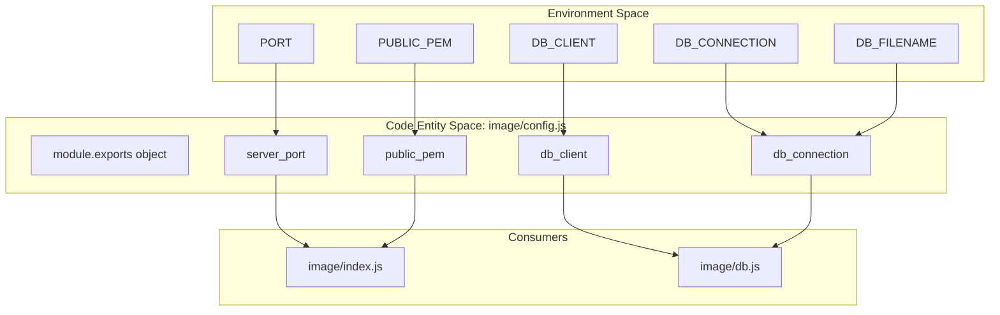
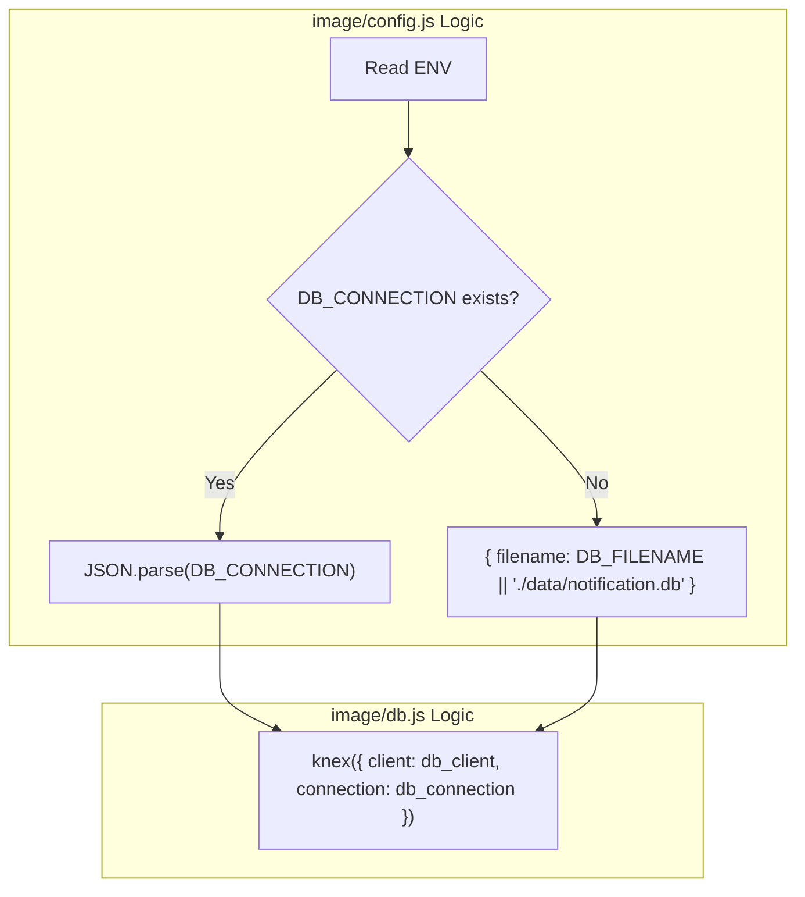

# Configuration

Relevant source files

The following files were used as context for generating this wiki page:

- [Dockerfile](Dockerfile)
- [image/config.js](image/config.js)

The configuration system for the Ingenium Notification Service is centralized in `image/config.js`. It utilizes environment variables to manage server settings, security credentials, and database connectivity. This allows the application to remain portable across local development environments (typically using SQLite) and production environments (typically using PostgreSQL or other Knex-supported databases).

### Configuration Loading Flow

The application initializes by reading environment variables into a structured object in `image/config.js` [image/config.js:1-10](). This object is then imported by the application entrypoint `image/index.js` to configure the Express server and by `image/db.js` to initialize the Knex database client.

**Configuration Data Flow**

**Sources:** [image/config.js:3-10](), [image/index.js:1-10](), [image/db.js:1-5]()

---

### Environment Variables

The following variables are consumed by the service. All variables are optional and provide defaults suitable for a local Docker-based SQLite deployment.

| Variable | Description | Default | Usage in Code |
| :--- | :--- | :--- | :--- |
| `PORT` | The TCP port the Express server listens on. | `8080` | `server_port` [image/config.js:4]() |
| `PUBLIC_PEM` | RSA Public Key (PEM format) used for JWT verification. | `''` | `public_pem` [image/config.js:5]() |
| `DB_CLIENT` | The Knex database dialect (e.g., `sqlite3`, `pg`). | `sqlite3` | `db_client` [image/config.js:6]() |
| `DB_CONNECTION` | A JSON string representing the Knex connection object. | *Computed* | `db_connection` [image/config.js:7-9]() |
| `DB_FILENAME` | Path to the SQLite database file (used if `DB_CONNECTION` is absent). | `./data/notification.db` | `db_connection.filename` [image/config.js:9]() |

**Sources:** [image/config.js:4-10]()

---

### Database Configuration Implementation

The database configuration logic in `image/config.js` features a fallback mechanism to simplify SQLite usage while supporting complex production connection strings.

1.  **Priority Check**: The system first checks for `process.env.DB_CONNECTION`. If present, it expects a valid JSON string which is parsed via `JSON.parse()` [image/config.js:7-8](). This is intended for production drivers like `pg` where host, user, and password are required.
2.  **SQLite Fallback**: If `DB_CONNECTION` is not provided, it constructs a connection object specifically for the `sqlite3` driver using `process.env.DB_FILENAME` [image/config.js:9]().
3.  **Default Path**: If no filename is provided, it defaults to `./data/notification.db`. This path corresponds to the volume created in the `Dockerfile` [Dockerfile:11]().

**Database Initialization Mapping**

**Sources:** [image/config.js:6-10](), [image/db.js:4-6]()

---

### Integration with Entrypoint and Middleware

The configuration values are injected into the application lifecycle at two primary points:

#### 1. Server Listener
In `image/index.js`, the `server_port` is used to bind the Express application to the network interface.
*   **Implementation**: `http.createServer(app).listen(config.server_port)` [image/index.js:84]().

#### 2. JWT Security Handler
The `public_pem` value is critical for the `UserSecurity` function within the `swagger-tools` middleware stack.
*   **Implementation**: The `public_pem` is passed to `jsonwebtoken.verify()` to validate incoming Bearer tokens [image/index.js:45-48](). If `public_pem` is not configured, token verification will fail for any secured route.

**Sources:** [image/index.js:45-48](), [image/index.js:84](), [image/config.js:5]()
