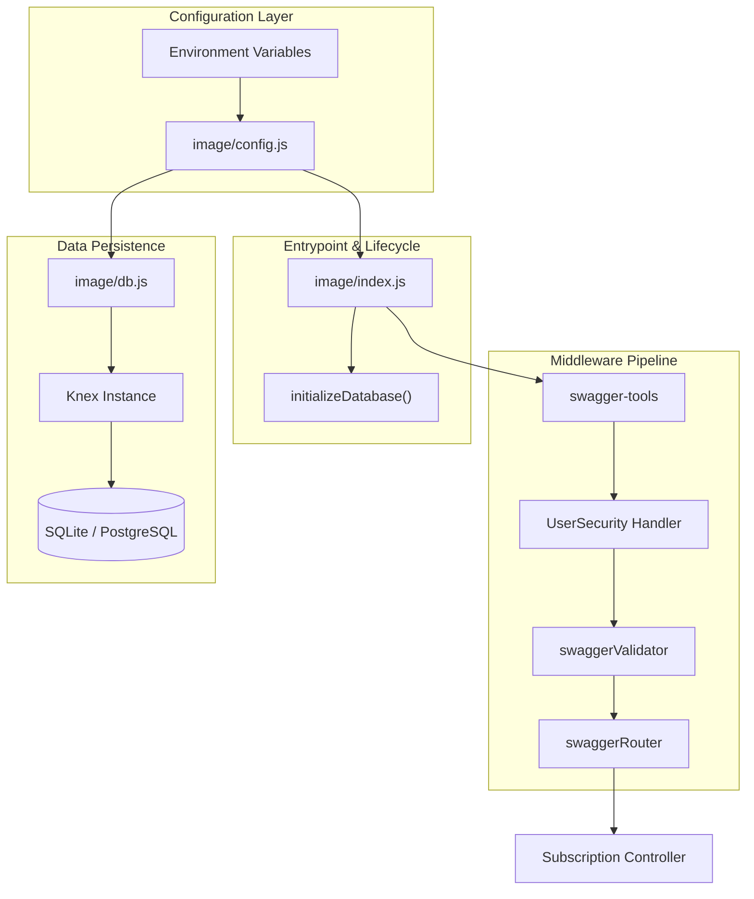
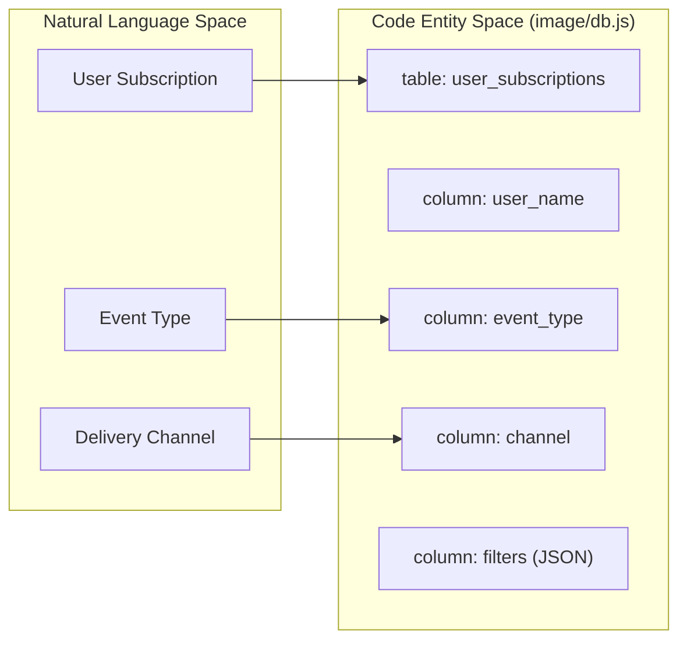

# Core Architecture

Relevant source files

The following files were used as context for generating this wiki page:

- [image/config.js](image/config.js)
- [image/db.js](image/db.js)
- [image/index.js](image/index.js)

The Ingenium Notification Service is a Node.js application built on the Express framework, utilizing a schema-first design driven by OpenAPI (Swagger). The architecture is structured around a centralized middleware pipeline that handles authentication, validation, and routing before reaching the controller logic.

## System Overview

The service follows a layered architecture where the entrypoint orchestrates the integration of configuration, database initialization, and the API middleware stack.

### Component Relationships

The following diagram illustrates the relationship between the primary code entities during the service lifecycle.

**Service Assembly Diagram**

Sources: [image/index.js:10-13](), [image/config.js:3-10](), [image/db.js:6-10]()

## Application Entrypoint & Middleware Pipeline

The application entrypoint in `image/index.js` initializes an Express application and wraps it with `swagger-tools` middleware. This pipeline ensures that every request is automatically validated against the OpenAPI specification before it reaches the business logic.

The startup sequence is asynchronous:
1.  **Middleware Initialization**: `swagger-tools` processes the `swagger.yaml` file.
2.  **Database Migration**: The service calls `initializeDatabase()` to ensure the schema exists.
3.  **Server Start**: The HTTP server begins listening only after the database is ready.

For details, see [Application Entrypoint & Middleware Pipeline](#2.1).

Sources: [image/index.js:38-116](), [image/index.js:104-111]()

## Configuration

The service uses a centralized configuration module that pulls from environment variables. It defines critical operational parameters such as the listening `PORT`, the `PUBLIC_PEM` used for JWT verification, and database connection details.

Key configuration aspects:
*   **Port Management**: Defaults to `8080`.
*   **Security**: Requires a Public Key (PEM) for RS256 token verification.
*   **Database**: Supports flexible Knex configurations, defaulting to a local SQLite file.

For details, see [Configuration](#2.2).

Sources: [image/config.js:1-11](), [image/index.js:33-36]()

## Database Layer

The database layer, implemented in `image/db.js`, uses the **Knex.js** query builder. It provides an idempotent initialization function, `initializeDatabase()`, which creates the `user_subscriptions` table if it does not exist.

**Data Flow and Schema Mapping**

The schema is designed to store user preferences for notifications, including support for JSON-based filtering and timestamping.

For details, see [Database Layer](#2.3).

Sources: [image/db.js:12-25](), [image/db.js:6-10]()

## Request Lifecycle

1.  **Request Arrival**: Express receives the HTTP request.
2.  **Metadata & Security**: `swaggerMetadata` extracts API info, and `UserSecurity` verifies the JWT `Bearer` token against the `PUBLIC_PEM`.
3.  **Validation**: `swaggerValidator` checks the request body and parameters against `swagger.yaml`.
4.  **Routing**: `swaggerRouter` dispatches the request to the appropriate handler in `subscription_controller.js`.
5.  **Controller Execution**: The controller interacts with the `db` instance to perform CRUD operations.
6.  **Response**: The result is returned to the client, or the error middleware catches any failures to return a formatted `400` or `500` error.

Sources: [image/index.js:38-87](), [image/index.js:89-102]()
