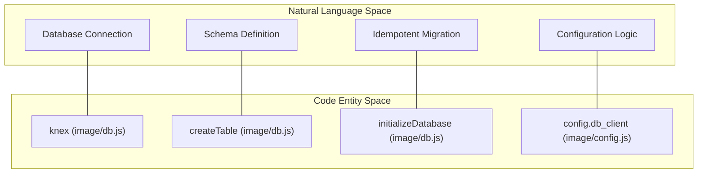
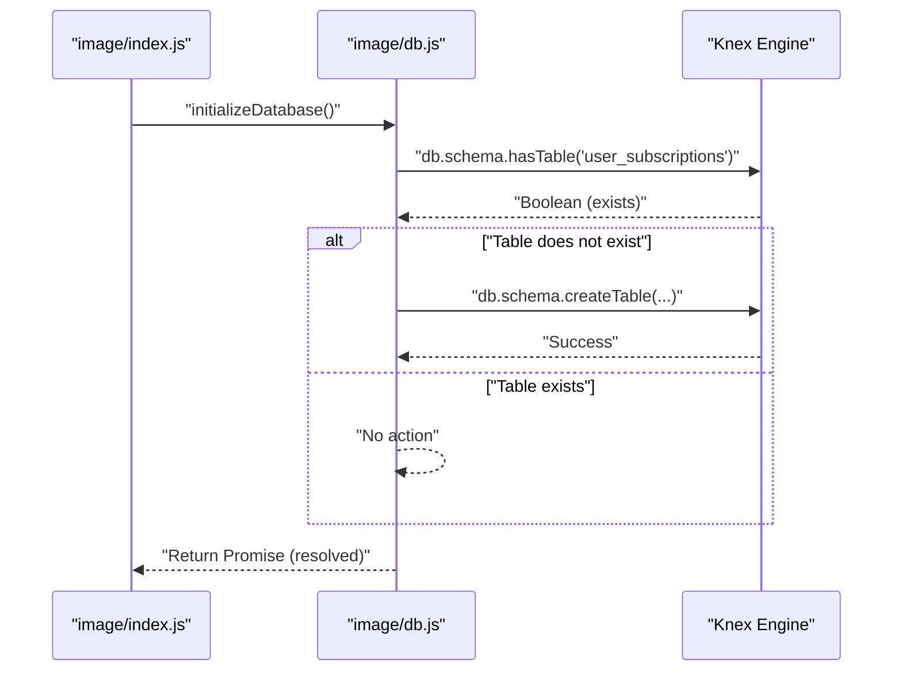

# Database Layer

Relevant source files

The following files were used as context for generating this wiki page:

- [image/config.js](image/config.js)
- [image/db.js](image/db.js)

The database layer of the Ingenium Notification Service is responsible for persistent storage of user notification preferences. It utilizes the **Knex.js** query builder to provide a database-agnostic interface, supporting both local development with SQLite and production-grade relational databases.

## Persistence Overview

The service initializes a singleton Knex instance exported from `image/db.js` [image/db.js:6-10](). This instance is configured based on settings defined in `image/config.js`, allowing for dynamic switching between database clients and connection strings via environment variables [image/config.js:6-10]().

### Natural Language to Code Entity: Persistence Mapping

The following diagram maps high-level persistence concepts to the specific code entities and files that implement them.

**Persistence Architecture Mapping**

**Sources:** [image/db.js:3-12](), [image/config.js:3-10]()

## The Knex Instance

The database connection is established using the `knex` library [image/db.js:3](). The configuration is pulled from `image/config.js`, which defaults to a local SQLite file [image/config.js:6-9]().

### Configuration Parameters
| Parameter | Code Reference | Description |
| :--- | :--- | :--- |
| `client` | `config.db_client` | The database driver (e.g., `sqlite3`, `pg`). |
| `connection` | `config.db_connection` | Connection details (file path for SQLite, or object/URI for others). |
| `useNullAsDefault` | `image/db.js:9` | Required for SQLite compatibility; ensures null is used for undefined values. |

**Sources:** [image/db.js:6-10](), [image/config.js:6-10]()

## Schema Definition: `user_subscriptions`

The primary table in the system is `user_subscriptions`. It stores the mapping between users, the events they wish to be notified about, and the delivery channels.

### Table Columns and Constraints

The table is defined within the `initializeDatabase` function [image/db.js:15-23]().

| Column Name | Data Type | Constraints / Default | Description |
| :--- | :--- | :--- | :--- |
| `id` | Integer | Primary Key, Auto-increment | Unique identifier for the subscription. |
| `user_name` | String | Not Null | The username/subject from the JWT. |
| `event_type` | String | Not Null | The type of event to trigger the notification. |
| `channel` | String | Default: `'email'` | Delivery method (e.g., email, sms). |
| `enabled` | Boolean | Default: `true` | Toggle to activate/deactivate the subscription. |
| `filters` | JSON | Default: `'{}'` | Key-value pairs for granular event filtering. |
| `created_at` | Timestamp | Default: Current Time | Auto-populated by Knex `timestamps(true, true)`. |
| `updated_at` | Timestamp | Default: Current Time | Auto-populated by Knex `timestamps(true, true)`. |

**Sources:** [image/db.js:16-22]()

## Idempotent Initialization

The service uses an idempotent initialization function, `initializeDatabase()`, to manage the schema [image/db.js:12-25](). This function is called during the application startup sequence before the Express server begins listening for requests.

### Initialization Logic Flow

The logic ensures that the table is only created if it does not already exist, preventing errors on service restarts.

**Database Initialization Sequence**

**Sources:** [image/db.js:12-25]()

## SQLite vs. Production Databases

The implementation includes specific considerations for different database environments:

1.  **SQLite Compatibility:** The use of `useNullAsDefault: true` in the Knex configuration [image/db.js:9]() is a requirement for SQLite to handle default values correctly.
2.  **Dynamic Connection:** The `db_connection` in `config.js` can either be a simple file path (defaulting to `./data/notification.db`) or a complex JSON object passed via the `DB_CONNECTION` environment variable [image/config.js:7-9]().
3.  **Idempotency:** By using `hasTable` checks [image/db.js:13](), the service avoids the need for a separate migration CLI (like `knex migrate:latest`) during container deployment, allowing the application to self-bootstrap its schema.

**Sources:** [image/db.js:6-14](), [image/config.js:6-10]()
