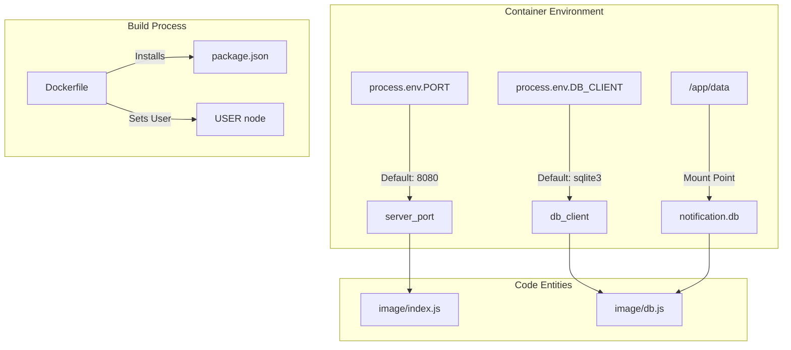
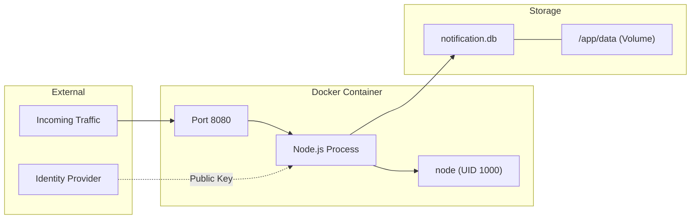

# Deployment & Infrastructure

Relevant source files

The following files were used as context for generating this wiki page:

- [.gitignore](.gitignore)
- [Dockerfile](Dockerfile)
- [image/config.js](image/config.js)

This section covers the operational concerns of the Ingenium Notification Service, focusing on how the application is containerized, configured, and secured for production environments. The service is designed to be cloud-native, utilizing a lightweight Docker image and environment-based configuration to ensure portability across different infrastructures.

### Operational Overview

The service follows a standard containerized deployment pattern. It uses a `node:18-alpine` base image to minimize the attack surface and image size [Dockerfile:1-1](). The infrastructure relies on environment variables to toggle between local development (using SQLite) and production-grade deployments (typically using PostgreSQL) [image/config.js:6-10]().

#### Infrastructure to Code Mapping

The following diagram illustrates how the infrastructure components defined in the `Dockerfile` and `config.js` map to the physical file structure and runtime entities.

**Infrastructure Entity Mapping**

Sources: [Dockerfile:1-17](), [image/config.js:1-10]()

### Containerization Strategy

The service is packaged using a multi-stage-like approach within a single `Dockerfile` to optimize for layer caching. By copying `package*.json` and running `npm ci --only=production` before copying the rest of the source code, the build process avoids re-installing dependencies unless the dependency manifest changes [Dockerfile:5-9]().

Security is a primary concern in the container configuration:
- **Least Privilege**: The container drops root privileges by switching to the built-in `node` user [Dockerfile:15-15]().
- **Persistence**: A `/app/data` directory is initialized with appropriate ownership to allow the `node` user to manage the SQLite database file if external volumes are mounted [Dockerfile:11-11]().
- **Networking**: The service defaults to port `8080` for internal container communication [Dockerfile:13-13]().

For a detailed walkthrough of the build steps and caching strategy, see [Docker Container](#6.1).

### Environment & Configuration

The application is configured entirely through environment variables, which are processed in `image/config.js`. This allows the same container image to be deployed in various environments without modification.

**Key Configuration Parameters**
| Variable | Description | Default |
| :--- | :--- | :--- |
| `PORT` | The port the Express server listens on. | `8080` |
| `DB_CLIENT` | The Knex database driver (e.g., `sqlite3`, `pg`). | `sqlite3` |
| `PUBLIC_PEM` | The RSA public key used for JWT verification. | `''` |
| `DB_FILENAME` | Path to the SQLite file (if using `sqlite3`). | `./data/notification.db` |

The configuration logic specifically handles complex objects like `DB_CONNECTION` by parsing JSON strings, enabling support for full connection strings or object-based configurations required by production databases like PostgreSQL [image/config.js:7-9]().

For a complete reference of all available variables and example configurations, see [Environment Configuration Reference](#6.2).

### Deployment Architecture

The following diagram shows how the container interacts with external infrastructure and internal storage.

**Runtime Infrastructure Diagram**

Sources: [Dockerfile:11-17](), [image/config.js:4-10]()

---
**Child Pages:**
- [Docker Container](#6.1)
- [Environment Configuration Reference](#6.2)
