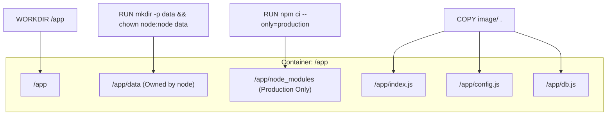
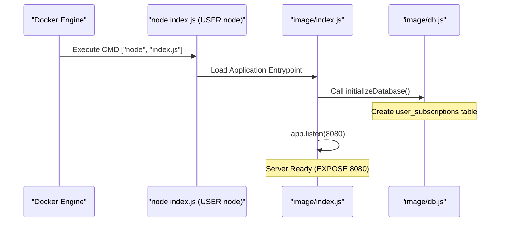

# Docker Container

Relevant source files

The following files were used as context for generating this wiki page:

- [Dockerfile](Dockerfile)

This page provides a technical walkthrough of the `Dockerfile` used to containerize the Ingenium Notification Service. The build process is optimized for layer caching, security, and production readiness using the `node:18-alpine` base image.

## Build Process and Layer Caching

The `Dockerfile` follows a multi-stage approach to optimize build times by leveraging Docker's layer caching mechanism. By separating the installation of dependencies from the copying of source code, the image does not need to re-download packages unless `package.json` or `package-lock.json` changes.

| Step | Instruction | Purpose |
| :--- | :--- | :--- |
| **Base Image** | `FROM node:18-alpine` | Provides a minimal Linux distribution with Node.js 18 pre-installed [Dockerfile:1-1](). |
| **Workdir** | `WORKDIR /app` | Sets the execution context for all subsequent commands [Dockerfile:3-3](). |
| **Dependency Manifest** | `COPY image/package*.json ./` | Copies only the package manifests to the container to check for cache hits [Dockerfile:5-5](). |
| **Production Install** | `RUN npm ci --only=production` | Performs a clean install of production-only dependencies, ignoring `devDependencies` [Dockerfile:7-7](). |
| **Source Code** | `COPY image/ .` | Copies the application source (controllers, middleware, and entrypoint) into the image [Dockerfile:9-9](). |

**Sources:**
- [Dockerfile:1-9]()

## Data Directory and Permissions

The service requires a persistent storage location for its SQLite database when running in a containerized environment.

1.  **Directory Creation**: The command `RUN mkdir -p data` creates a `data` directory within the `/app` workspace [Dockerfile:11-11]().
2.  **Ownership Assignment**: `chown node:node data` changes the owner of the directory to the built-in `node` user [Dockerfile:11-11](). This ensures that the application has the necessary write permissions to create and update the database file defined by the `DB_FILENAME` environment variable.

### Container File System Structure
The following diagram illustrates the relationship between the Dockerfile instructions and the resulting container filesystem.

**Container Filesystem Mapping**

**Sources:**
- [Dockerfile:3-11]()

## Security and Execution

The image is designed with the principle of least privilege to minimize the attack surface.

### Privilege Drop
By default, Docker containers run as `root`. To mitigate security risks, the `Dockerfile` utilizes the `USER node` instruction [Dockerfile:15-15](). This ensures that the Node.js process runs as a non-privileged user. This is particularly important because the service handles sensitive JWT-signed notifications and interacts with a local filesystem database.

### Networking and Entrypoint
-   **EXPOSE 8080**: Informs Docker that the container listens on port 8080 at runtime [Dockerfile:13-13](). This matches the default `PORT` configuration used by the Express server.
-   **CMD**: The container starts by executing `node index.js` [Dockerfile:17-17](). This triggers the `initializeDatabase()` sequence and starts the Express middleware pipeline.

### Service Startup Flow
This diagram bridges the Docker `CMD` to the application entrypoint logic defined in the codebase.

**Process Execution Flow**

**Sources:**
- [Dockerfile:13-17]()
- [image/index.js:1-180]()
- [image/db.js:1-50]()
