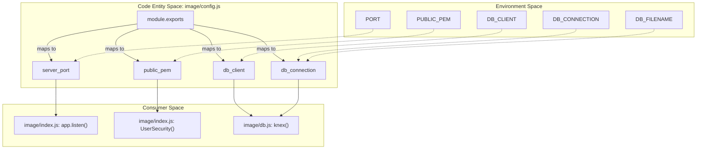
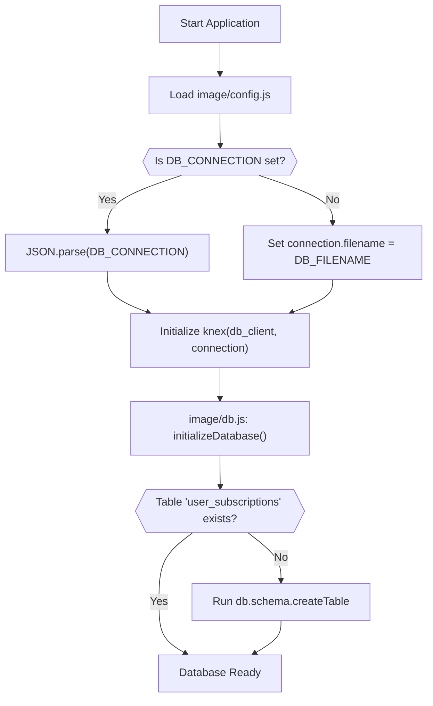

# Environment Configuration Reference

Relevant source files

The following files were used as context for generating this wiki page:

- [Dockerfile](Dockerfile)
- [image/config.js](image/config.js)
- [image/db.js](image/db.js)

This page provides a comprehensive technical reference for the environment variables used to configure the Ingenium Notification Service. Configuration is managed primarily through `image/config.js`, which aggregates environment variables into a structured object used by the application entrypoint and the database layer.

## Configuration Architecture

The application follows a "Configuration as Code" pattern where `process.env` values are mapped to internal configuration keys. This mapping occurs during the initial load of the `image/config.js` module. These settings influence the network binding of the Express server, the cryptographic verification of JWTs, and the persistence layer behavior.

### Configuration Data Flow
The following diagram illustrates how environment variables propagate from the host/container environment into specific code entities.

**Diagram: Configuration Propagation Map**

**Sources:** [image/config.js:1-10](), [image/db.js:3-10](), [image/index.js:1-125]()

---

## Environment Variable Reference

| Variable | Type | Default | Description |
|:---|:---|:---|:---|
| `PORT` | Integer | `8080` | The TCP port the Express server listens on. [image/config.js:4]() |
| `PUBLIC_PEM` | String | `''` | The RSA Public Key (PEM format) used to verify RS256 JWT signatures. [image/config.js:5]() |
| `DB_CLIENT` | String | `'sqlite3'` | The Knex.js database client (e.g., `sqlite3`, `pg`). [image/config.js:6]() |
| `DB_CONNECTION` | JSON String | *See Note* | A JSON string representing the Knex connection object. [image/config.js:7-9]() |
| `DB_FILENAME` | String | `'./data/notification.db'` | The path to the SQLite file (only used if `DB_CONNECTION` is unset). [image/config.js:9]() |

### Detailed Variable Analysis

#### PORT
Determines the port for the HTTP server. In the `Dockerfile`, this is documented as `EXPOSE 8080`, aligning with the default value.
**Sources:** [image/config.js:4](), [Dockerfile:13]()

#### PUBLIC_PEM
A critical security setting. The `UserSecurity` middleware in `image/index.js` uses this string to verify incoming Bearer tokens. If left empty, JWT verification will fail for any token requiring RS256 validation.
**Sources:** [image/config.js:5](), [image/index.js:28-40]()

#### DB_CLIENT & DB_CONNECTION
These variables control the `knex` instance initialization in `image/db.js`.
*   **Logic:** If `DB_CONNECTION` is provided as a string, it is parsed via `JSON.parse()`. If it is absent, the system defaults to a connection object containing only the `filename` derived from `DB_FILENAME`.
*   **Implementation:** `knex({ client: config.db_client, connection: config.db_connection, ... })`.

**Sources:** [image/config.js:6-10](), [image/db.js:6-10]()

---

## Deployment Profiles

The service is designed to be portable between local development (SQLite) and production (PostgreSQL) environments.

### Local SQLite Setup (Default)
This is the default configuration used when no environment variables are provided. It targets a local file and requires the `data/` directory to exist.

| Variable | Value |
|:---|:---|
| `DB_CLIENT` | `sqlite3` |
| `DB_FILENAME` | `./data/notification.db` |

**Note:** The `Dockerfile` ensures the data directory is created and owned by the `node` user: `mkdir -p data && chown node:node data`.
**Sources:** [image/config.js:9](), [Dockerfile:11]()

### Production PostgreSQL Setup
For production, the `DB_CONNECTION` variable must be a valid JSON string containing the database credentials.

| Variable | Example Value |
|:---|:---|
| `DB_CLIENT` | `pg` |
| `DB_CONNECTION` | `{"host": "db.example.com", "user": "admin", "password": "pwd", "database": "notify"}` |

**Diagram: Database Initialization Logic**

**Sources:** [image/config.js:6-10](), [image/db.js:12-25]()

---

## Security Implications

### Least Privilege
The `Dockerfile` executes the service as the `node` user (`USER node`) rather than `root`. This limits the impact of potential vulnerabilities, especially since the application requires write access to the filesystem for the SQLite database.
**Sources:** [Dockerfile:15]()

### JWT Validation
The configuration of `PUBLIC_PEM` is mandatory for any environment requiring authenticated access. The service expects an RSA Public Key to perform `jwt.verify` with the `RS256` algorithm. Failure to provide a valid PEM will result in 401 Unauthorized responses for all protected routes.
**Sources:** [image/config.js:5](), [image/index.js:33-45]()
