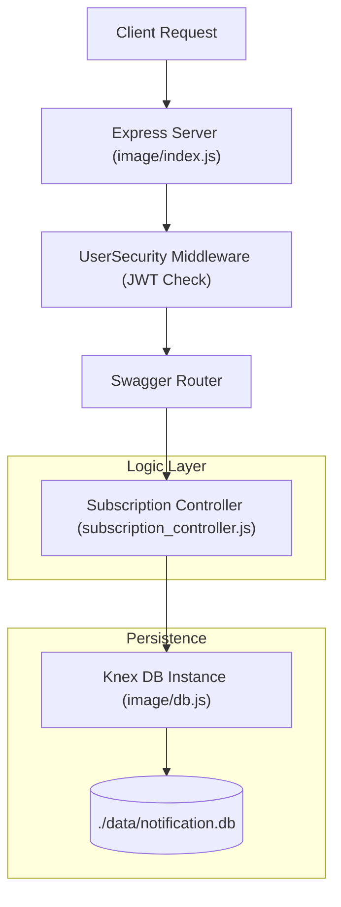
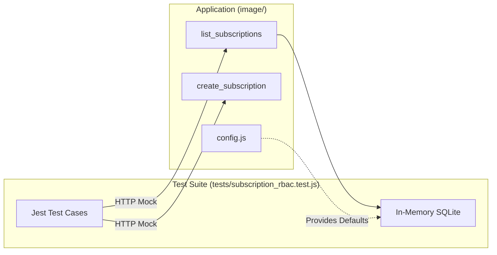

# Getting Started

<details>
<summary>Relevant source files</summary>

The following files were used as context for generating this wiki page:

- [.gitignore](.gitignore)
- [Dockerfile](Dockerfile)
- [README.md](README.md)
- [image/config.js](image/config.js)

</details>


This page provides a technical guide for setting up and running the Ingenium Notification Service. This service manages user subscriptions to system events using a Role-Based Access Control (RBAC) model [README.md:3-11](). It is built on Node.js and uses Express with OpenAPI (Swagger) for routing and validation [image/index.js:1-5]().

## Prerequisites

Before running the service, ensure the following are installed:
*   **Node.js**: Version 18 or higher (the service uses the `node:18-alpine` base image in production) [Dockerfile:1]().
*   **npm**: Included with Node.js.
*   **Docker** (Optional): For containerized execution.

## Local Development Setup

The service application logic resides in the `image/` directory.

### 1. Install Dependencies
Navigate to the application directory and install the required npm packages:
```bash
cd image
npm install
```
*Sources: [README.md:27-28]()*

### 2. Environment Configuration
The service is configured via environment variables, which are processed in `image/config.js`. You can set these in your shell or via a `.env` file (note: `.env` is ignored by git [/.gitignore:4]()).

| Variable | Description | Default |
| :--- | :--- | :--- |
| `PORT` | The port the Express server listens on [image/config.js:4](). | `8080` |
| `PUBLIC_PEM` | The RS256 public key used to verify JWT tokens [image/config.js:5](). | `''` |
| `DB_CLIENT` | The Knex.js database client (e.g., `sqlite3`, `pg`) [image/config.js:6](). | `sqlite3` |
| `DB_FILENAME` | Path to the SQLite database file [image/config.js:9](). | `./data/notification.db` |
| `DB_CONNECTION` | JSON string for complex DB connections (overrides `DB_FILENAME`) [image/config.js:7-9](). | `undefined` |

*Sources: [image/config.js:1-10]()*

### 3. Running the Service
To start the service locally:
```bash
cd image
npm start
```
*Sources: [README.md:27-29]()*

## Docker Execution

The `Dockerfile` is optimized for production, using a non-root user and stripping development dependencies.

### Build and Run
1. **Build the image**:
   ```bash
   docker build -t ingenium-notification .
   ```
2. **Run the container**:
   ```bash
   docker run -p 8080:8080 \
     -e PUBLIC_PEM="your_pem_string" \
     -v $(pwd)/data:/app/data \
     ingenium-notification
   ```

### Docker Implementation Details
The container lifecycle follows these steps:
1.  **Base**: Uses `node:18-alpine` for a minimal footprint [Dockerfile:1]().
2.  **Dependencies**: Copies `package.json` and `package-lock.json` first to leverage layer caching, then runs `npm ci --only=production` [Dockerfile:5-7]().
3.  **Permissions**: Creates a `/app/data` directory and changes ownership to the `node` user to allow SQLite database writes [Dockerfile:11]().
4.  **Security**: Drops root privileges by switching to `USER node` before execution [Dockerfile:15]().

*Sources: [Dockerfile:1-17]()*

## Data Flow and System Components

The following diagram illustrates the flow from an external request through the security and controller layers to the database.

### Request Processing Pipeline

*Sources: [image/index.js:1-10](), [image/config.js:6-10](), [image/api/controllers/subscription_controller.js:1-10]()*

## Testing

The test suite uses **Jest** and **Supertest**. Tests are located in the `tests/` directory at the repository root, but they require dependencies from the `image/` directory.

### Running Tests
```bash
# Ensure dependencies are installed
cd image
npm install
cd ..

# Run the test suite
npx jest tests/
```
*Sources: [README.md:34-38]()*

### Test Environment Mapping
The tests bridge the gap between the REST endpoints and the underlying RBAC logic.


*Sources: [README.md:34-38](), [image/config.js:6-10]()*

## Summary of Commands

| Task | Command | Directory |
| :--- | :--- | :--- |
| Install Dependencies | `npm install` | `image/` |
| Start Service | `npm start` | `image/` |
| Run Tests | `npx jest tests/` | Root |
| Build Docker | `docker build -t ... .` | Root |

*Sources: [README.md:24-38](), [Dockerfile:1-17]()*
