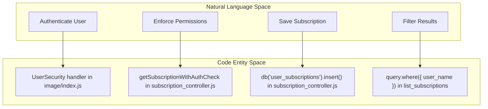
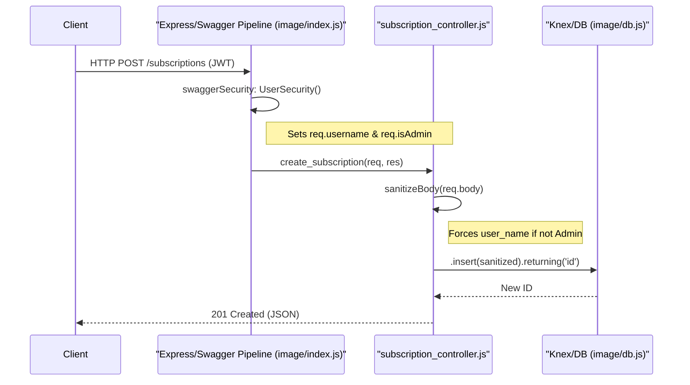

# Glossary

Relevant source files

The following files were used as context for generating this wiki page:

- [README.md](README.md)
- [image/api/controllers/subscription_controller.js](image/api/controllers/subscription_controller.js)
- [image/api/swagger/swagger.yaml](image/api/swagger/swagger.yaml)
- [image/config.js](image/config.js)
- [image/db.js](image/db.js)
- [image/index.js](image/index.js)
- [tests/subscription_rbac.test.js](tests/subscription_rbac.test.js)

This glossary defines the technical terms, architectural concepts, and domain-specific identifiers used within the Ingenium Notification Service. It serves as a reference for onboarding engineers to bridge the gap between business logic and the implementation details found in the codebase.

## Domain Concepts

### Subscription
A record representing a user's intent to receive notifications for specific system events. It defines the "who" (`user_name`), the "what" (`event_type`), and the "how" (`channel`).
*   **Implementation**: Represented by the `user_subscriptions` table in the database [image/db.js:15-23]().
*   **Schema**: Defined in the OpenAPI specification under `#/definitions/Subscription` [image/api/swagger/swagger.yaml:205-226]().

### Event Type
A string identifier representing a specific occurrence in the Ingenium ecosystem (e.g., `execution_complete`). Subscriptions are filtered based on this value.
*   **Code Pointer**: Handled as the `event_type` field in the controller [image/api/controllers/subscription_controller.js:55-57]().

### Channel
The medium through which a notification is delivered. Defaults to `email` but can be configured for other platforms like `slack`.
*   **Code Pointer**: Default value set in database initialization [image/db.js:19-19]() and verified in RBAC tests [tests/subscription_rbac.test.js:58-60]().

---

## Technical Terms & Components

### UserSecurity (Middleware Handler)
The primary security interceptor defined in the Swagger middleware. It handles JWT extraction, signature verification, and role extraction.
*   **Implementation**: Found within the `swaggerSecurity` configuration in the main entrypoint [image/index.js:42-82]().
*   **Data Flow**: Extracts the token from the `Authorization: Bearer <token>` header [image/index.js:48-51]().

### RBAC (Role-Based Access Control)
The system's authorization model which distinguishes between `admin` and `basic` users.
*   **Admin**: Users with the `admin` scope in their JWT. They have unrestricted access to all subscriptions [image/index.js:67-67]().
*   **Basic**: Standard users who can only manage subscriptions where the `user_name` matches their own JWT `sub` or `username` claim [image/api/controllers/subscription_controller.js:17-20]().

### Sanitization
The process of stripping disallowed or sensitive fields from request bodies before they reach the database layer to prevent parameter injection.
*   **Code Pointer**: The `sanitizeBody` function in the controller [image/api/controllers/subscription_controller.js:7-9]().
*   **Whitelisted Fields**: `user_name`, `event_type`, `channel`, `enabled`, `filters` [image/api/controllers/subscription_controller.js:5-5]().

### In-Memory Mock DB
A transient SQLite instance used during testing to ensure test isolation and speed.
*   **Implementation**: Configured using Knex with `:memory:` filename in the test suite [tests/subscription_rbac.test.js:5-9]().

---

## Code Entity Mapping

### Natural Language to Code Entity Space
The following diagram maps high-level system operations to the specific functions and files that implement them.

**Operation Mapping Diagram**

**Sources**: [image/index.js:42-82](), [image/api/controllers/subscription_controller.js:11-22](), [image/api/controllers/subscription_controller.js:60-60](), [image/api/controllers/subscription_controller.js:28-35]()

### Data Lifecycle and Flow
This diagram illustrates how a request flows from the network into the database, highlighting key transformation points.

**Request Flow Diagram**

**Sources**: [image/index.js:38-87](), [image/api/controllers/subscription_controller.js:44-67](), [image/db.js:6-10]()

---

## Glossary Table

| Term | Definition | Code Reference |
| :--- | :--- | :--- |
| `PUBLIC_PEM` | The RSA public key used to verify JWT signatures. | [image/config.js:5-5]() |
| `x-swagger-router-controller` | OpenAPI extension linking a path to a JS file. | [image/api/swagger/swagger.yaml:41-41]() |
| `initializeDatabase` | Idempotent function that creates the schema if it doesn't exist. | [image/db.js:12-25]() |
| `returning('id')` | Knex method to retrieve the ID of a newly inserted row. | [image/api/controllers/subscription_controller.js:60-60]() |
| `req.swagger.params` | Object where the middleware stores parsed/validated inputs. | [image/api/controllers/subscription_controller.js:46-46]() |
| `useNullAsDefault` | Knex configuration required for SQLite compatibility. | [image/db.js:9-9]() |

**Sources**: [image/config.js](), [image/db.js](), [image/api/controllers/subscription_controller.js](), [image/api/swagger/swagger.yaml]()
