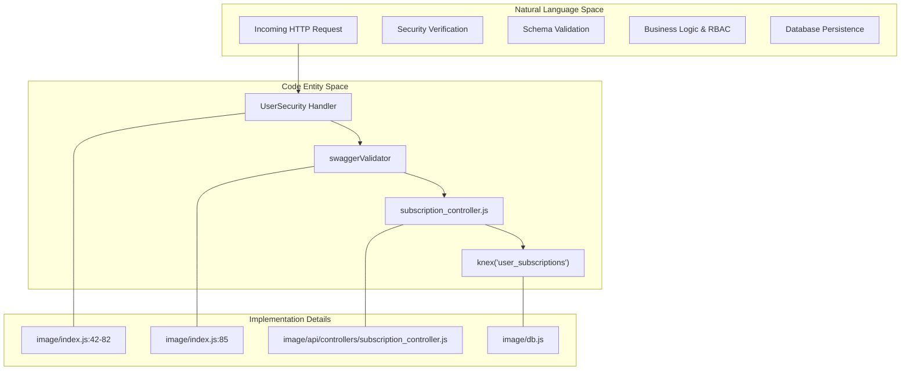
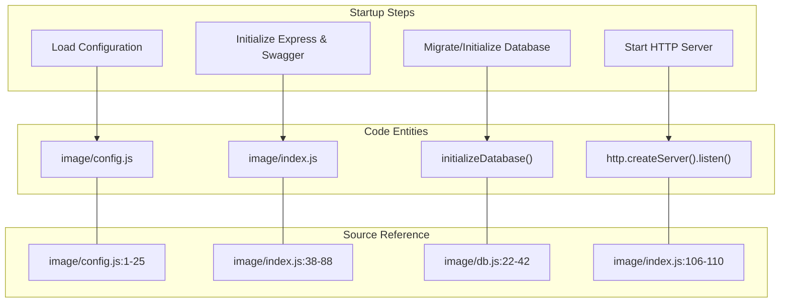

# Ingenium Notification Service — Overview

Relevant source files

The following files were used as context for generating this wiki page:

- [README.md](README.md)
- [image/index.js](image/index.js)
- [image/package.json](image/package.json)

The **Ingenium Notification Service** is a core component of the Ingenium ecosystem responsible for managing user subscriptions to system events [README.md:1-3](). It provides a RESTful API to create, list, update, and delete subscriptions, backed by a robust Role-Based Access Control (RBAC) model [README.md:5-12]().

The service is built using **Node.js** and **Express**, leveraging the `swagger-tools` suite to provide an API-first development experience where the implementation is tightly coupled to an OpenAPI specification [image/index.js:3-5]().

### System Context

Within the Ingenium ecosystem, this service acts as the source of truth for "who wants to be notified about what." It handles the persistence of subscription metadata—such as event types and delivery targets—while ensuring that users can only access data they are authorized to see [README.md:3-12]().

### High-Level Architecture

The service follows a layered architecture:
1.  **Middleware Layer**: Handles JWT verification, schema validation, and request routing using `swagger-tools` [image/index.js:38-88]().
2.  **Controller Layer**: Implements business logic and enforces RBAC constraints [image/api/controllers/subscription_controller.js]().
3.  **Database Layer**: Manages persistence using the **Knex.js** query builder, supporting SQLite for local development and potentially other SQL dialects in production [image/db.js:1-20]().

#### Natural Language to Code Entity Mapping: Request Lifecycle

The following diagram maps the conceptual request flow to specific code entities and files.

**Diagram: Request Processing Pipeline**

**Sources:** [image/index.js:38-88](), [image/api/controllers/subscription_controller.js:1-10](), [image/db.js:1-10]()

### Key Architectural Decisions

*   **OpenAPI-Driven**: The API is defined in `image/api/swagger/swagger.yaml`. The `swagger-tools` middleware automatically routes requests to controllers based on the `x-swagger-router-controller` extension [image/index.js:35-38]().
*   **Dual-Layer Security**: Security is enforced first at the middleware level (JWT verification and scope check) [image/index.js:41-83]() and subsequently at the controller level (ownership checks for regular users) [README.md:5-11]().
*   **Database Portability**: By using `knex`, the service abstracts the underlying database. It defaults to a local SQLite file for ease of deployment and testing [image/config.js:13-17]().

#### Natural Language to Code Entity Mapping: Startup Sequence

The following diagram illustrates how the service initializes its dependencies before accepting traffic.

**Diagram: Service Initialization Flow**

**Sources:** [image/index.js:104-115](), [image/config.js:1-25](), [image/db.js:22-42]()

### Child Pages Map

For detailed technical documentation, please refer to the following sub-pages:

| Page | Description |
| :--- | :--- |
| **[Getting Started](#1.1)** | Instructions for local setup, Docker execution, and running the test suite. |
| **[Project Structure](#1.2)** | Detailed breakdown of the repository layout and how the test environment bridges with the application. |

**Sources:** [README.md:24-38](), [image/package.json:31-35]()
