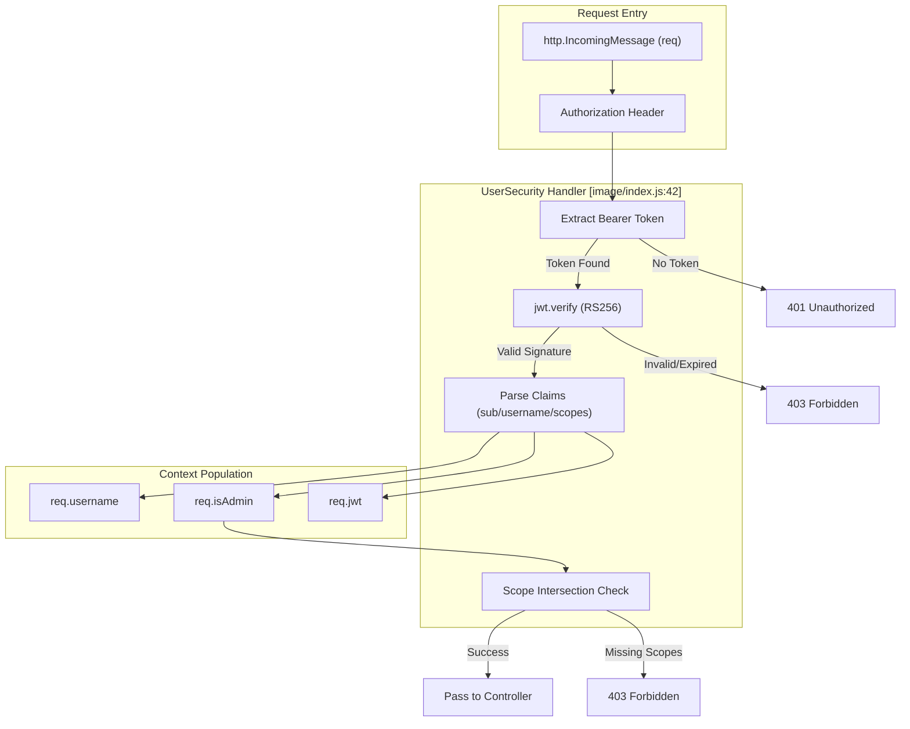

# JWT Authentication Middleware

Relevant source files

The following files were used as context for generating this wiki page:

- [image/config.js](image/config.js)
- [image/index.js](image/index.js)

The Ingenium Notification Service uses a JWT-based authentication model integrated directly into the `swagger-tools` middleware pipeline. Authentication is handled by a custom `UserSecurity` handler which validates incoming Bearer tokens, extracts identity claims, and evaluates required scopes before a request ever reaches the controller layer.

## Overview of UserSecurity Handler

The security logic is defined within the `swaggerSecurity` middleware in [image/index.js:41-83](). It acts as a gatekeeper for any route defined in the OpenAPI specification that includes a `security` requirement.

### Token Extraction and Verification
The middleware expects an `Authorization` header containing a Bearer token [image/index.js:48-51](). 

1.  **Extraction**: It looks for the `authorization` or `Authorization` header and strips the `Bearer ` prefix.
2.  **Verification**: The token is verified using the `jsonwebtoken` library's `jwt.verify` method [image/index.js:56]().
    *   **Algorithm**: Explicitly restricted to `RS256`.
    *   **Key**: Uses the `PUBLIC_PEM` provided via environment variables (accessible via `config.public_pem`) [image/index.js:33](), [image/config.js:5]().
3.  **Error Handling**: If verification fails (e.g., expired token, invalid signature), the middleware returns a `403 Forbidden` error [image/index.js:57-61](). If no token is provided at all, it returns a `401 Unauthorized` error [image/index.js:78-80]().

### Identity and Role Mapping
Once verified, the JWT payload is parsed to populate the `req` object, which downstream controllers use for Authorization and filtering.

| Request Property | Source in JWT | Purpose |
| :--- | :--- | :--- |
| `req.jwt` | Full Decoded Object | Stores the entire payload for potential auditing [image/index.js:64](). |
| `req.username` | `decoded.username` OR `decoded.sub` | Identifies the owner of the subscription [image/index.js:65](). |
| `req.isAdmin` | `decoded.scopes` | Boolean flag set to `true` if the `admin` scope is present [image/index.js:67](). |

**Sources:** [image/index.js:63-67](), [image/config.js:5]()

## Authentication Data Flow

The following diagram illustrates how a request flows through the `UserSecurity` handler and how the `req` object is transformed.

**Diagram: JWT Validation and Request Augmentation**

**Sources:** [image/index.js:42-82]()

## Scope Intersection Logic

The middleware performs a mandatory check between the scopes present in the JWT and the `required_scopes` defined in the `swagger.yaml` for that specific operation.

1.  **Normalization**: The handler handles both simple string scopes and object-based scopes (e.g., `{ "scope": "admin" }`) [image/index.js:66]().
2.  **Intersection**: It uses `_.intersection` from the Lodash library to compare the user's `scope_names` against the `required_scopes` [image/index.js:69]().
3.  **Validation**: 
    *   If there is at least one overlapping scope, the request proceeds via `cb(null)` [image/index.js:70-71]().
    *   If no intersection exists, it returns a `403 Forbidden` with the message "user does not have the permission" [image/index.js:72-75]().
    *   If the OpenAPI spec defines an empty array of scopes for an endpoint, the check is bypassed [image/index.js:43-45]().

## Security Error Paths

The middleware differentiates between missing credentials and invalid permissions:

| HTTP Status | Scenario | Error Message |
| :--- | :--- | :--- |
| **401** | No `Authorization` header or header does not start with `Bearer ` | `api key was not provided` [image/index.js:78-80]() |
| **403** | Token signature verification failed (expired, wrong key, malformed) | `access denied: [Error Details]` [image/index.js:58-61]() |
| **403** | Token is valid, but lacks the specific scope required by the route | `user does not have the permission` [image/index.js:73-75]() |

**Sources:** [image/index.js:41-83]()
