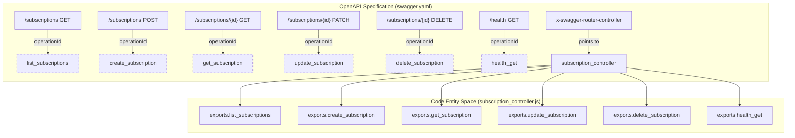
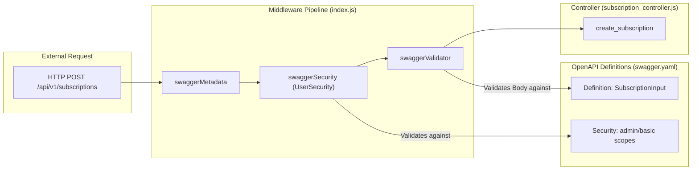

# OpenAPI Specification

Relevant source files

The following files were used as context for generating this wiki page:

- [image/api/swagger/swagger.yaml](image/api/swagger/swagger.yaml)

The Ingenium Notification Service API is defined using the **Swagger 2.0 (OpenAPI)** specification. This specification serves as the single source of truth for the REST interface, defining the available paths, expected request payloads, response schemas, and security requirements. The specification is utilized by the `swagger-tools` middleware in the application entrypoint to automate request validation, routing, and security enforcement.

## API Metadata and Base Configuration

The API is versioned at `1.0.0` and serves requests under the `/api/v1` base path [image/api/swagger/swagger.yaml:1-6](). It is configured to consume and produce `application/json` [image/api/swagger/swagger.yaml:9-12]().

### Routing Logic
The specification uses the `x-swagger-router-controller` extension to bind OpenAPI paths to specific JavaScript modules in the codebase. All current endpoints are routed to the `subscription_controller` [image/api/swagger/swagger.yaml:41,97,194](), which corresponds to the file `image/api/controllers/subscription_controller.js`.

### Security Definitions
The service implements an OAuth2 implicit flow named `UserSecurity` [image/api/swagger/swagger.yaml:15-18](). It defines two primary scopes:
*   `admin`: Full access to all resources [image/api/swagger/swagger.yaml:20]().
*   `basic`: Standard access for authenticated users [image/api/swagger/swagger.yaml:21]().

Sources: [image/api/swagger/swagger.yaml:1-25]()

---

## Endpoint Definitions

### Health Check
*   **Path**: `/health`
*   **Method**: `GET`
*   **Operation ID**: `health_get` [image/api/swagger/swagger.yaml:33]()
*   **Description**: Returns the operational status of the service.
*   **Security**: Requires an authenticated session but no specific scope [image/api/swagger/swagger.yaml:35]().

### Subscriptions Collection
*   **Path**: `/subscriptions`
*   **Methods**: `GET` (List), `POST` (Create)
*   **Controller Binding**: `subscription_controller` [image/api/swagger/swagger.yaml:97]()

| Method | Operation ID | Description |
| :--- | :--- | :--- |
| `GET` | `list_subscriptions` | Retrieves subscriptions. Regular users are restricted to their own; admins can filter by `user_name` [image/api/swagger/swagger.yaml:47-59](). |
| `POST` | `create_subscription` | Creates a new subscription. Enforces ownership based on the authenticated user's role [image/api/swagger/swagger.yaml:74-78](). |

### Subscription Instance
*   **Path**: `/subscriptions/{id}`
*   **Methods**: `GET`, `PATCH`, `DELETE`
*   **Parameters**: Uses a global `subscription_id` parameter (integer) in the path [image/api/swagger/swagger.yaml:197-202]().

| Method | Operation ID | Security Logic |
| :--- | :--- | :--- |
| `GET` | `get_subscription` | Returns 403 if a regular user requests an ID they do not own [image/api/swagger/swagger.yaml:103-107](). |
| `PATCH` | `update_subscription` | Allows partial updates. Regular users cannot modify the `user_name` field [image/api/swagger/swagger.yaml:132-137](). |
| `DELETE` | `delete_subscription` | Removes the subscription. Restricted to owner or admin [image/api/swagger/swagger.yaml:168-172](). |

Sources: [image/api/swagger/swagger.yaml:28-194]()

---

## Data Schemas

The specification defines several JSON schemas used for request validation and response formatting.

### Subscription Models
*   **`Subscription`**: The full representation of a subscription as stored in the database, including system-generated fields like `id`, `created_at`, and `updated_at` [image/api/swagger/swagger.yaml:205-226]().
*   **`SubscriptionInput`**: The subset of fields allowed during creation or update (e.g., `event_type`, `channel`, `enabled`, `filters`) [image/api/swagger/swagger.yaml:227-240]().

### Response Models
*   **`HealthResponse`**: Contains a simple `status` string [image/api/swagger/swagger.yaml:241-245]().
*   **`ErrorResponse`**: Standardized error format for 403, 404, and default error scenarios [image/api/swagger/swagger.yaml:119,123,127]().

Sources: [image/api/swagger/swagger.yaml:204-245]()

---

## Architectural Mapping

The following diagrams illustrate how the OpenAPI Specification bridges the gap between the external API contract and the internal code implementation.

### API Routing and Controller Mapping
This diagram shows how the `swagger.yaml` definitions map to specific functions within the `subscription_controller.js` file.

Sources: [image/api/swagger/swagger.yaml:33,51,78,107,137,172,41,97,194]()

### Request Data Flow and Validation
This diagram traces a request from the OpenAPI definition through the `swagger-tools` middleware to the controller, highlighting the schema enforcement.

Sources: [image/api/swagger/swagger.yaml:14-25,82-87,227-240]()
