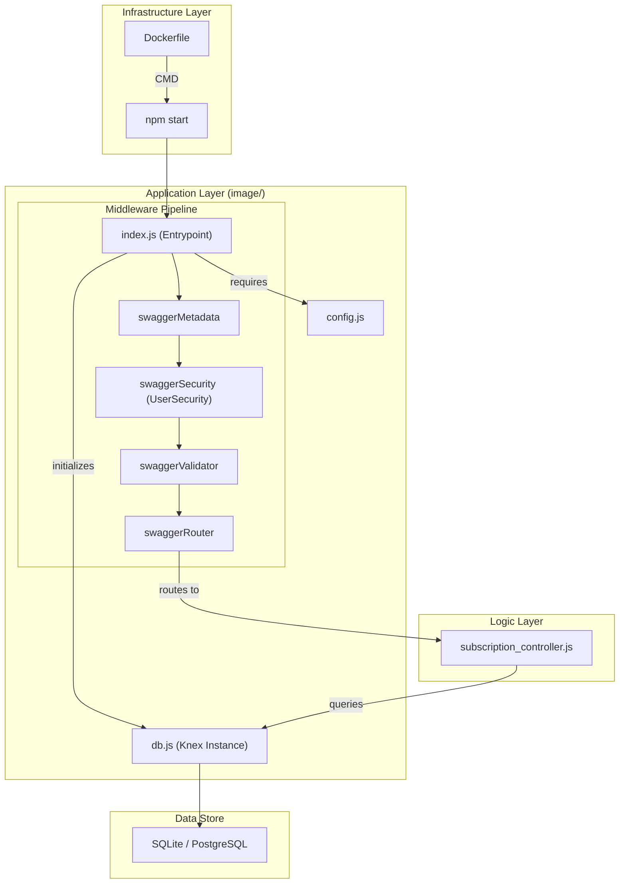
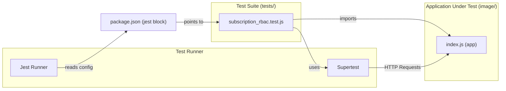

# Project Structure

Relevant source files

The following files were used as context for generating this wiki page:

- [.gitignore](.gitignore)
- [image/package-lock.json](image/package-lock.json)
- [image/package.json](image/package.json)

This page documents the physical and logical layout of the `ingenium_notification` repository. The project is organized to separate the application source code from its testing suite and containerization logic, using `package.json` configurations to bridge these distinct directories.

## Repository Layout

The repository is divided into two primary directories: `image/`, containing the application source and runtime configuration, and `tests/`, containing the integration test suite.

| Directory / File | Description |
| :--- | :--- |
| `image/` | Contains the Express application, OpenAPI specifications, and business logic. |
| `tests/` | Contains the Jest test suite for validating API behavior and RBAC logic. |
| `Dockerfile` | Defines the container image build process for the service. |
| `.gitignore` | Excludes `node_modules`, local SQLite databases (`*.db`), and coverage reports. |

### Source Directory (`image/`)
The `image/` directory functions as the root for the Node.js application. It contains the entry point, configuration logic, and the OpenAPI-driven controller architecture.

*   **`index.js`**: The application entry point. It initializes the Express server, configures the `swagger-tools` middleware pipeline, and starts the database connection [image/package.json:5]().
*   **`config.js`**: Centralizes environment variable management (e.g., `PORT`, `DB_CLIENT`).
*   **`db.js`**: Manages the Knex.js database connection and schema initialization.
*   **`api/`**: Contains the OpenAPI definition (`swagger/swagger.yaml`) and the corresponding controller implementations (`controllers/subscription_controller.js`).

### Test Directory (`tests/`)
The `tests/` directory is kept separate from the application code to ensure a clean production build. It utilizes `supertest` and `jest` to perform black-box testing against the API endpoints.

*   **`subscription_rbac.test.js`**: The primary test file covering Role-Based Access Control and CRUD operations.

**Sources:** [image/package.json:1-36](), [.gitignore:1-6]()

---

## Bridge Configuration: Jest & package.json

Although the tests reside outside the `image/` directory, the `package.json` located within `image/` is configured to bridge this gap. This allows developers to run `npm test` from within the application directory while targeting the external test suite.

### Jest Configuration Mapping
The `jest` block in `package.json` uses `<rootDir>` (which is `image/`) to resolve the test files and modules.

| Property | Value | Purpose |
| :--- | :--- | :--- |
| `roots` | `["<rootDir>/../tests"]` | Instructs Jest to look for test files in the sibling `tests/` directory [image/package.json:32](). |
| `testMatch` | `["**/*.test.js"]` | Matches files ending in `.test.js` within the specified roots [image/package.json:33](). |
| `modulePaths` | `["<rootDir>/node_modules"]` | Ensures Jest can resolve dependencies installed in `image/node_modules` [image/package.json:34](). |

**Sources:** [image/package.json:31-35]()

---

## Data Flow and Component Interaction

The following diagram illustrates how the project components interact, from the Docker entrypoint through the middleware stack to the database.

### System Component Map
"Natural Language Space" to "Code Entity Space"

**Sources:** [image/package.json:5-7](), [image/package.json:17-24]()

---

## Test Execution Flow

The testing architecture bridges the `image/` and `tests/` directories by loading the application instance into `supertest`.

### Test Integration Map
"Natural Language Space" to "Code Entity Space"

**Sources:** [image/package.json:8](), [image/package.json:31-35](), [image/package.json:28-29]()

---

## Dependencies

The project maintains a minimal footprint by separating production and development dependencies.

*   **Production Dependencies**: Includes `express` for the server, `knex` and `sqlite3` for data persistence, `swagger-tools` for OpenAPI integration, and `jsonwebtoken` for security [image/package.json:17-24]().
*   **Development Dependencies**: Includes `jest` for testing, `supertest` for API assertions, and `eslint` for code quality [image/package.json:27-29]().

**Sources:** [image/package.json:16-30]()
