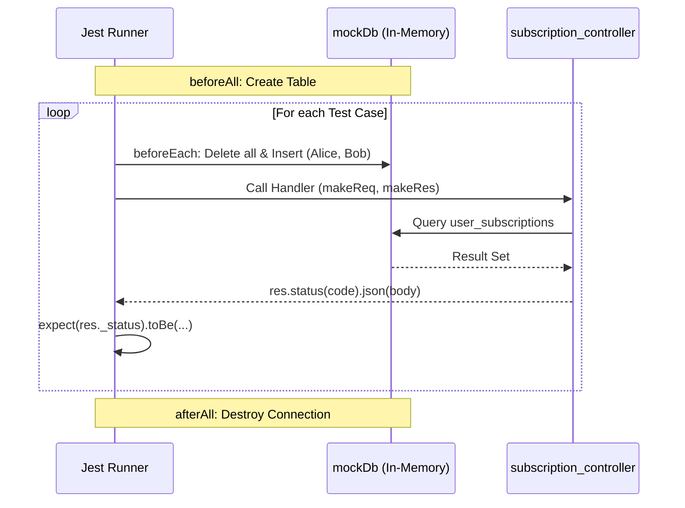
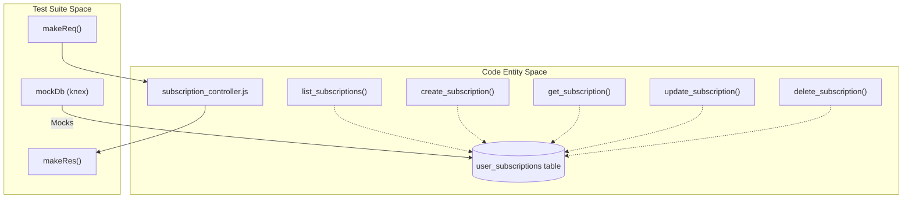

# RBAC Test Suite

Relevant source files

The following files were used as context for generating this wiki page:

- [image/db.js](image/db.js)
- [tests/subscription_rbac.test.js](tests/subscription_rbac.test.js)

The **RBAC Test Suite** ([tests/subscription_rbac.test.js]()) provides comprehensive validation of the Role-Based Access Control logic within the Ingenium Notification Service. It ensures that regular users are isolated to their own data while administrators maintain cross-user visibility and modification privileges. The suite utilizes an in-memory SQLite database and manual request/response mocks to test the controller layer in isolation from the network stack.

## Test Environment Setup

The test suite bypasses the physical database by mocking the `image/db` module with an in-memory Knex instance.

### Mocking and Database Initialization
The suite uses `jest.mock` to replace the production database configuration with a volatile SQLite instance [tests/subscription_rbac.test.js:5-11](). Before any tests run, the `user_subscriptions` table is created with a schema identical to the production environment [tests/subscription_rbac.test.js:39-49]().

### Helper Functions
To simulate the Express and Swagger-Tools middleware pipeline, two helper functions are used:
*   **`makeReq(overrides)`**: Constructs a mock request object. It defaults to a non-admin user named `alice` and includes the necessary `swagger.params` structure required by the controller [tests/subscription_rbac.test.js:17-25]().
*   **`makeRes()`**: Constructs a mock response object that captures the status code and JSON body for assertions [tests/subscription_rbac.test.js:27-35]().

### Data Seeding
Before every individual test case, the database is cleared and re-seeded with two records to ensure a clean state and predictable IDs:
1.  **ID 1**: Owned by `alice`.
2.  **ID 2**: Owned by `bob`.

### Test Suite Lifecycle
The following diagram illustrates the setup and execution flow for each test case.

**Test Execution Flow**

**Sources:** [tests/subscription_rbac.test.js:5-61](), [image/db.js:12-25]()

---

## Endpoint Test Coverage

### GET /subscriptions (List)
These tests verify that the `list_subscriptions` handler correctly filters the result set based on the `req.username` and `req.isAdmin` flags.

| Scenario | Input | Expected Result |
| :--- | :--- | :--- |
| **Regular User Isolation** | `username: 'alice'`, `isAdmin: false` | Returns only 1 record (Alice's) [tests/subscription_rbac.test.js:66-73]() |
| **Admin Visibility** | `username: 'admin'`, `isAdmin: true` | Returns all 2 records [tests/subscription_rbac.test.js:75-81]() |
| **Admin Filtering** | `isAdmin: true`, `user_name: 'bob'` | Returns only 1 record (Bob's) [tests/subscription_rbac.test.js:83-94]() |

### POST /subscriptions (Create)
These tests ensure that the `user_name` field is protected during subscription creation.

*   **Regular User Force-Ownership**: If a regular user attempts to create a subscription for another user (e.g., `alice` tries to create for `bob`), the controller overrides the input and forces `user_name` to the requester's username [tests/subscription_rbac.test.js:100-115]().
*   **Admin Override**: Administrators are permitted to specify any `user_name` in the payload [tests/subscription_rbac.test.js:117-133]().

### GET /subscriptions/{id} (Read)
Validates the `getSubscriptionWithAuthCheck` logic used within the `get_subscription` handler.

*   **Ownership Check**: `alice` can successfully retrieve ID 1 [tests/subscription_rbac.test.js:139-145]().
*   **403 Forbidden**: `alice` receives a 403 status and "Access denied" message when requesting ID 2 (owned by `bob`) [tests/subscription_rbac.test.js:147-153]().
*   **Admin Bypass**: An admin can retrieve ID 2 regardless of ownership [tests/subscription_rbac.test.js:155-161]().
*   **404 Not Found**: If the ID does not exist, the system returns 403 (to avoid leaking existence) or 404 depending on the internal lookup result [tests/subscription_rbac.test.js:163-168]().

### PATCH /subscriptions/{id} (Update)
Tests the field-stripping and ownership logic in `update_subscription`.

*   **Field Stripping**: When a regular user sends a `user_name` in the update payload, it is stripped. The test verifies that `alice` can update her channel to `slack` but cannot change the record's owner to `bob` [tests/subscription_rbac.test.js:199-216]().
*   **Cross-User Denial**: A regular user attempting to PATCH another user's record receives a 403 [tests/subscription_rbac.test.js:187-197]().
*   **Admin Authority**: Admins can update any subscription and are not subject to the same field-stripping restrictions regarding target records [tests/subscription_rbac.test.js:218-226]().

**Sources:** [tests/subscription_rbac.test.js:65-226]()

---

## Code Entity Mapping

The following diagram maps the test helper abstractions to the actual controller functions and database table entities they exercise.

**Entity Association Map**

**Sources:** [tests/subscription_rbac.test.js:13-35](), [image/db.js:15-25]()
