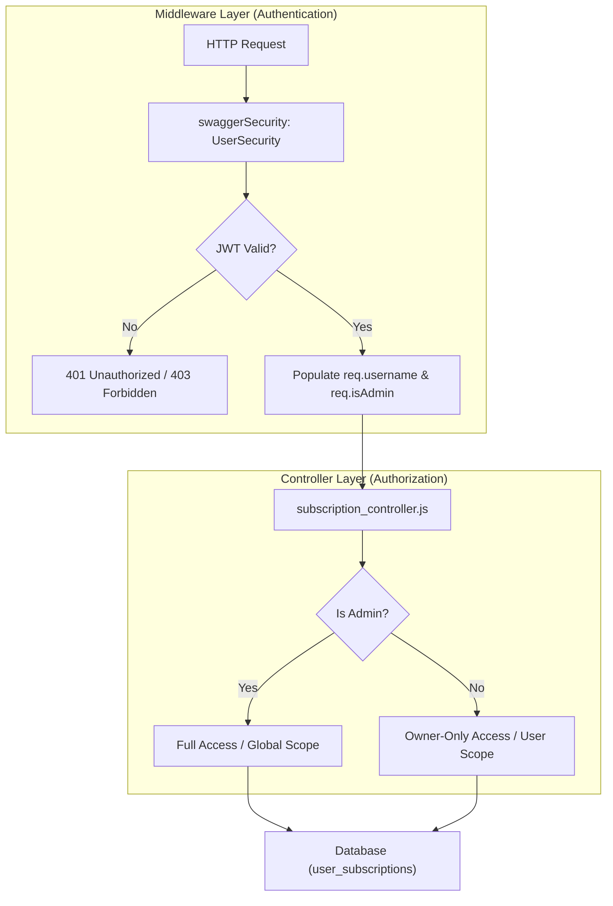

# Security & Access Control

Relevant source files

The following files were used as context for generating this wiki page:

- [image/api/controllers/subscription_controller.js](image/api/controllers/subscription_controller.js)
- [image/api/swagger/swagger.yaml](image/api/swagger/swagger.yaml)
- [image/index.js](image/index.js)

The Ingenium Notification Service implements a robust two-layer security model to ensure that user data is protected and that administrative actions are restricted to authorized personnel. Security is enforced first at the transport/authentication layer via JWT verification and subsequently at the application/resource layer through Role-Based Access Control (RBAC).

### Security Architecture Overview

The security model follows a "Defense in Depth" approach, where the request must pass through an authentication middleware before reaching the controller logic that handles resource-specific permissions.

Title: Security Enforcement Pipeline

**Sources:**
- [image/index.js:41-83]() (UserSecurity middleware)
- [image/api/controllers/subscription_controller.js:11-22]() (Auth check logic)

---

### 1. JWT Authentication Middleware

The first layer of security is handled by the `UserSecurity` handler within the `swagger-tools` middleware stack. This handler is responsible for extracting the JSON Web Token (JWT) from the `Authorization` header and verifying its integrity using an RSA public key.

Key responsibilities of this layer:
- **Token Extraction**: Extracts the Bearer token from the request headers [image/index.js:48-51]().
- **Signature Verification**: Validates the token using the `RS256` algorithm and the `PUBLIC_PEM` configuration [image/index.js:56-61]().
- **Identity Injection**: Decodes the `sub` or `username` claims and attaches them to the `req.username` object for downstream use [image/index.js:65]().
- **Scope Verification**: Checks the `scopes` claim against the requirements defined in `swagger.yaml`. If the token contains the `admin` scope, `req.isAdmin` is set to `true` [image/index.js:63-76]().

For a deep dive into the implementation of token parsing and scope intersection, see **[JWT Authentication Middleware](#4.1)**.

**Sources:**
- [image/index.js:42-82]()
- [image/api/swagger/swagger.yaml:14-24]()

---

### 2. Role-Based Access Control (RBAC)

Once a user is authenticated, the `subscription_controller` enforces specific access rules based on the identity and roles identified in the JWT. This ensures that regular users cannot access or modify subscriptions belonging to others.

The RBAC model distinguishes between two roles:
- **Basic User**: Can only view, create, update, or delete subscriptions where the `user_name` matches their own `req.username`.
- **Admin**: Has global visibility and can perform any operation on any subscription, including specifying a different `user_name` during creation.

| Operation | Basic User Behavior | Admin Behavior |
| :--- | :--- | :--- |
| **List** | Filtered to `req.username` [image/api/controllers/subscription_controller.js:28-29]() | Returns all; optional `user_name` filter [image/api/controllers/subscription_controller.js:31-34]() |
| **Create** | `user_name` forced to `req.username` [image/api/controllers/subscription_controller.js:48-50]() | Can specify any `user_name` [image/api/controllers/subscription_controller.js:46]() |
| **Update** | Forbidden if not owner; `user_name` field stripped [image/api/controllers/subscription_controller.js:86-88]() | Full update access on any subscription |
| **Delete** | Forbidden if not owner [image/api/controllers/subscription_controller.js:106-107]() | Can delete any subscription |

For details on the ownership check patterns and field-level sanitization, see **[Role-Based Access Control (RBAC)](#4.2)**.

**Sources:**
- [image/api/controllers/subscription_controller.js:11-22]() (getSubscriptionWithAuthCheck)
- [image/api/controllers/subscription_controller.js:24-42]() (list_subscriptions)
- [image/api/controllers/subscription_controller.js:79-102]() (update_subscription)
