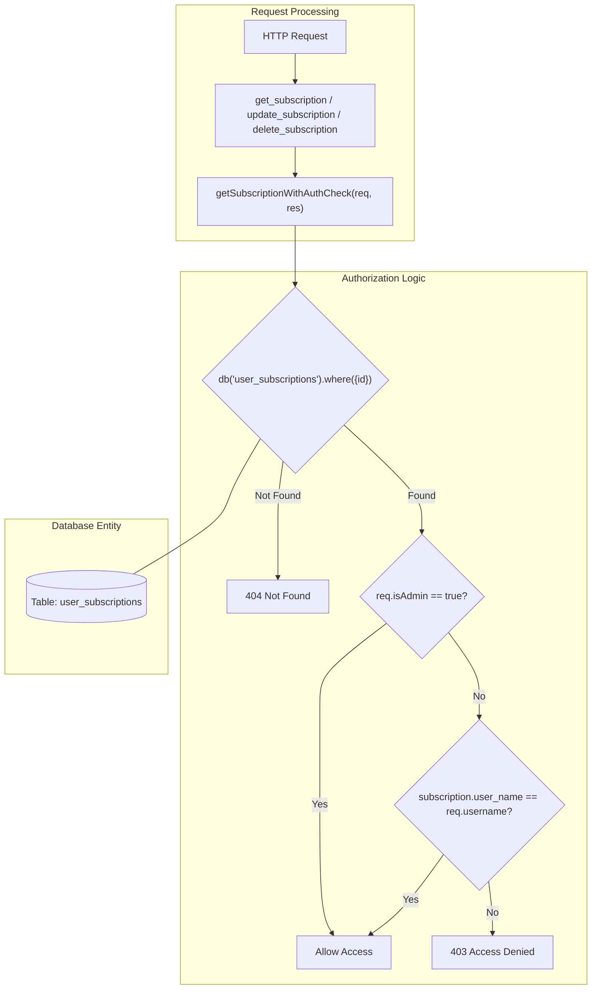
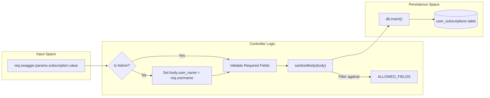

# Subscription Controller

Relevant source files

The following files were used as context for generating this wiki page:

- [image/api/controllers/subscription_controller.js](image/api/controllers/subscription_controller.js)

The `subscription_controller.js` file serves as the primary business logic layer for the Ingenium Notification Service. It handles incoming REST requests, enforces Role-Based Access Control (RBAC), interacts with the database via Knex, and ensures data integrity through sanitization.

## Internal Utility Functions

Before processing requests, the controller utilizes several internal helpers to manage security and data validation.

### Data Sanitization
The controller maintains a whitelist of fields that are permitted to be written to the database. This prevents "mass assignment" vulnerabilities where a client might attempt to modify internal fields like `id` or `created_at`.

*   **`ALLOWED_FIELDS`**: A constant array containing `['user_name', 'event_type', 'channel', 'enabled', 'filters']` [[image/api/controllers/subscription_controller.js:5-5]]().
*   **`sanitizeBody(body)`**: A helper function that filters the input object, returning only keys present in the `ALLOWED_FIELDS` whitelist [[image/api/controllers/subscription_controller.js:7-9]]().

### Authorization Helper: `getSubscriptionWithAuthCheck`
This internal function centralizes the logic for retrieving a subscription and verifying that the requesting user has permission to access it [[image/api/controllers/subscription_controller.js:11-22]]().

| Step | Logic | Failure Response |
| :--- | :--- | :--- |
| **Fetch** | Queries `user_subscriptions` by `id` [[image/api/controllers/subscription_controller.js:12-12]](). | `404 Not Found` [[image/api/controllers/subscription_controller.js:14-14]]() |
| **Verify** | Checks if `req.isAdmin` is true OR if `subscription.user_name` matches `req.username` [[image/api/controllers/subscription_controller.js:17-17]](). | `403 Access Denied` [[image/api/controllers/subscription_controller.js:18-18]]() |

**Sources:**
- [image/api/controllers/subscription_controller.js:5-22]()

---

## Exported Handlers

### `list_subscriptions`
Retrieves a list of subscriptions. It applies filters based on the user's role:
*   **Standard Users**: The query is automatically restricted to records where `user_name` matches `req.username` [[image/api/controllers/subscription_controller.js:28-29]]().
*   **Admins**: Can view all records or filter by a specific `user_name` provided in the query parameters [[image/api/controllers/subscription_controller.js:31-34]]().

### `create_subscription`
Handles the creation of new notification subscriptions.
1.  **Identity Enforcement**: If the user is not an admin, the `user_name` field is forced to the user's authenticated `req.username` [[image/api/controllers/subscription_controller.js:48-50]]().
2.  **Validation**: Ensures `user_name` and `event_type` are present [[image/api/controllers/subscription_controller.js:52-57]]().
3.  **Persistence**: Sanitizes the body and inserts it into the database [[image/api/controllers/subscription_controller.js:59-60]]().
4.  **Compatibility Shim**: The code handles different return formats for `.returning('id')` to ensure compatibility across database drivers (e.g., SQLite vs. PostgreSQL) [[image/api/controllers/subscription_controller.js:60-61]]().

### `get_subscription`, `update_subscription`, `delete_subscription`
These handlers all utilize `getSubscriptionWithAuthCheck` to ensure the requester owns the resource or has admin privileges [[image/api/controllers/subscription_controller.js:71,81,106]]().
*   **Update**: Specifically prevents non-admins from changing the `user_name` of an existing subscription by deleting that key from the input body before sanitization [[image/api/controllers/subscription_controller.js:86-88]](). It also sets the `updated_at` timestamp using `db.fn.now()` [[image/api/controllers/subscription_controller.js:96-96]]().

### `health_get`
A simple heartbeat endpoint returning `{ status: 'ok' }` [[image/api/controllers/subscription_controller.js:116-118]]().

**Sources:**
- [image/api/controllers/subscription_controller.js:24-118]()

---

## Data Flow & Security Logic

The following diagrams illustrate how the controller bridges the gap between the HTTP request (Natural Language/API Space) and the Database (Code/Persistence Space).

### Logic Flow: Subscription Access Control
This diagram shows how the controller enforces ownership during a `GET`, `PUT`, or `DELETE` request.

**Sources:**
- [image/api/controllers/subscription_controller.js:11-22]()
- [image/api/controllers/subscription_controller.js:69-114]()

### Data Transformation: `create_subscription`
This diagram traces how user input is transformed into a database record, highlighting the role of `sanitizeBody` and `ALLOWED_FIELDS`.

**Sources:**
- [image/api/controllers/subscription_controller.js:5-9]()
- [image/api/controllers/subscription_controller.js:44-67]()

---

## Implementation Details

### The `.returning('id')` Compatibility Shim
In `create_subscription`, the controller handles the discrepancy between how different Knex dialects (like `sqlite3` vs `pg`) return the ID of an inserted row.
*   **Logic**: `const insertedId = (typeof id === 'object' && id !== null) ? id.id : id;` [[image/api/controllers/subscription_controller.js:61-61]]().
*   **Purpose**: Ensures that whether the database returns a simple integer or a row object, the controller can reliably fetch the newly created record for the response [[image/api/controllers/subscription_controller.js:62-63]]().

### Database Interaction Table
| Method | Controller Function | Knex Operation |
| :--- | :--- | :--- |
| `GET` | `list_subscriptions` | `db('user_subscriptions').select('*')` [[image/api/controllers/subscription_controller.js:37-37]]() |
| `POST` | `create_subscription` | `db('user_subscriptions').insert(sanitized).returning('id')` [[image/api/controllers/subscription_controller.js:60-60]]() |
| `GET` | `get_subscription` | `db('user_subscriptions').where({ id }).first()` [[image/api/controllers/subscription_controller.js:12-12]]() |
| `PUT` | `update_subscription` | `db('user_subscriptions').update({ ...sanitized, updated_at: db.fn.now() })` [[image/api/controllers/subscription_controller.js:96-96]]() |
| `DELETE` | `delete_subscription` | `db('user_subscriptions').del()` [[image/api/controllers/subscription_controller.js:109-109]]() |

**Sources:**
- [image/api/controllers/subscription_controller.js:1-119]()
