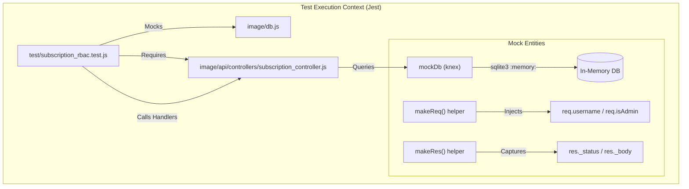
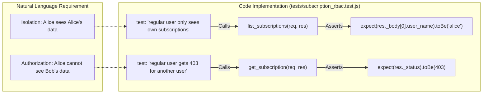

# Testing

<details>
<summary>Relevant source files</summary>

The following files were used as context for generating this wiki page:

- [image/package.json](image/package.json)
- [tests/subscription_rbac.test.js](tests/subscription_rbac.test.js)

</details>


The Ingenium Notification Service employs a testing strategy focused on validating Role-Based Access Control (RBAC) and data integrity across the subscription lifecycle. The suite utilizes a combination of unit-like controller tests and integration-style database interactions using an in-memory execution environment.

## Test Strategy and Tooling

The testing infrastructure is designed to be fast and isolated, avoiding the need for external database dependencies during CI/CD cycles.

| Tool | Purpose |
| :--- | :--- |
| **Jest** | Test runner, assertion library, and mocking framework [image/package.json:28-28](). |
| **Supertest** | HTTP assertions for testing Express endpoints [image/package.json:29-29](). |
| **In-Memory SQLite** | Provides a real SQL environment for `knex` queries without disk I/O [tests/subscription_rbac.test.js:5-9](). |
| **Mocking** | The database module `image/db` is mocked to redirect all controller queries to the in-memory instance [tests/subscription_rbac.test.js:11-11](). |

### Test Execution Environment
The test suite is configured via `package.json` to look for test files in the `tests/` directory relative to the application root [image/package.json:31-35](). Coverage reporting is enabled by default when running the test script [image/package.json:8-8]().

**Command to run tests:**
```bash
npm test
```

## Natural Language to Code Entity Mapping

The following diagrams illustrate how the abstract testing concepts (like "Identity Mocking" and "Database Isolation") are implemented using specific code entities within the repository.

### Test Environment Orchestration
This diagram shows how the test suite replaces production components with mock entities to ensure isolation.


Sources: [tests/subscription_rbac.test.js:5-11](), [tests/subscription_rbac.test.js:17-35](), [image/package.json:31-35]()

### RBAC Validation Flow
This diagram maps the natural language requirement "Users cannot see others' data" to the specific code functions and assertions used in the test suite.


Sources: [tests/subscription_rbac.test.js:65-73](), [tests/subscription_rbac.test.js:147-153]()

## RBAC Test Suite Overview

The primary test file, `tests/subscription_rbac.test.js`, validates the security logic implemented in the `subscription_controller.js`. It ensures that the `isAdmin` and `username` flags (typically populated by the JWT middleware) are correctly honored by the data access layer.

### Key Test Components
*   **Database Schema Setup**: A `beforeAll` hook creates the `user_subscriptions` table in the in-memory SQLite instance using the same schema defined in the production database layer [tests/subscription_rbac.test.js:39-49]().
*   **Data Seeding**: A `beforeEach` hook resets the table and inserts fresh records for users `alice` and `bob` to ensure test independence [tests/subscription_rbac.test.js:55-61]().
*   **Request/Response Mocks**: Custom `makeReq` and `makeRes` functions simulate the Express/Swagger objects, allowing fine-grained control over user identity and parameters [tests/subscription_rbac.test.js:17-35]().

For a deep dive into specific test cases for each endpoint, including field-stripping during updates and admin-only filtering, see the detailed [RBAC Test Suite](#5.1) page.

Sources: [tests/subscription_rbac.test.js:1-61](), [image/api/controllers/subscription_controller.js:1-10]()
