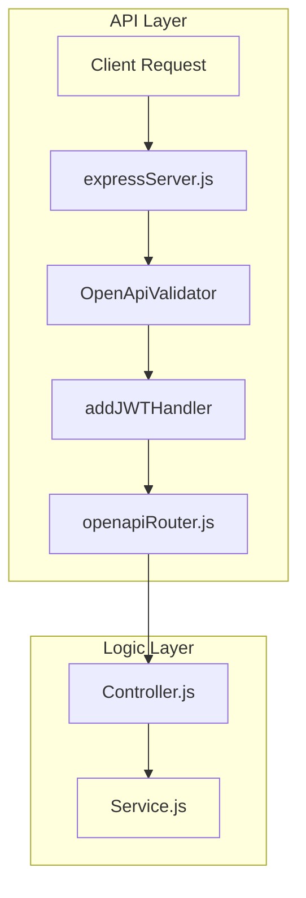

# API Layer

<details>
<summary>Relevant source files</summary>

The following files were used as context for generating this wiki page:

- [server/.openapi-generator-ignore](server/.openapi-generator-ignore)
- [server/.openapi-generator/VERSION](server/.openapi-generator/VERSION)
- [server/api/openapi.yaml](server/api/openapi.yaml)

</details>


The API Layer serves as the entry point for all external interactions with the Ingenium Report Service. It provides a structured RESTful interface defined by the OpenAPI 3.0 specification, enabling clients to request PDF reports, Excel exports, and asynchronous difference reports.

The layer is built on [Express.js](https://expressjs.com/) and utilizes a contract-first approach where the API definition in `openapi.yaml` drives the routing, validation, and documentation of the service.

## Architectural Overview

The API Layer coordinates between incoming HTTP requests and the internal [Controller Layer](#3). It handles cross-cutting concerns such as authentication, request validation against the schema, and dynamic routing to the appropriate logic handlers.

### Request Flow
The following diagram illustrates how a request traverses the API Layer components to reach the business logic:

**API Request Lifecycle**

**Sources:** [server/expressServer.js:1-100](), [server/utils/openapiRouter.js:1-40]()

## Key Components

### OpenAPI Specification
The service uses a central `openapi.yaml` file to define its entire surface area. This includes:
*   **Endpoints:** Paths for PDF generation, execution searches, and difference reports.
*   **Security:** Definition of `bearerAuth` using RS256 JWT tokens [server/api/openapi.yaml:10-11]().
*   **Routing Metadata:** Custom vendor extensions (`x-openapi-router-controller` and `x-openapi-router-service`) that map routes directly to code entities [server/api/openapi.yaml:70-71]().

For a detailed breakdown of all endpoints and schemas, see **[OpenAPI Specification](#2.1)**.

### Express Server & Middleware
The `ExpressServer` class bootstraps the application, mounting a stack of middleware to handle the HTTP lifecycle. This includes standard utilities like `cors` and `body-parser`, as well as specialized middleware for the Ingenium ecosystem:
*   **JWT Validation:** Uses `addJWTHandler` to verify identity via public keys [server/expressServer.js:68-75]().
*   **Schema Validation:** Employs `express-openapi-validator` to ensure requests match the spec before reaching controllers.
*   **Documentation:** Mounts Swagger UI at `/docs` for interactive API exploration.

For details on the bootstrap process and middleware stack, see **[Express Server and Middleware](#2.2)**.

### Dynamic OpenAPI Router
Rather than manual route definitions, the service uses `openapiRouter.js` to dynamically connect the OpenAPI spec to the filesystem. It reads the `operationId` and custom `x-openapi-` tags from the YAML file to instantiate the correct Controller and call the corresponding method.

**Code Entity Mapping**
```mermaid
classDiagram
    class "openapi.yaml" {
        "x-openapi-router-controller: PDFController"
        "x-openapi-router-service: PDFService"
        "operationId: pdf_procedure_get"
    }
    class "openapiRouter.js" {
        "handleRequest(request, response)"
    }
    class "PDFController" {
        "pdf_procedure_get(request, response)"
    }

    "openapi.yaml" ..> "openapiRouter.js" : "Defines Mapping"
    "openapiRouter.js" --> "PDFController" : "Instantiates & Calls"
```
**Sources:** [server/api/openapi.yaml:70-74](), [server/utils/openapiRouter.js:15-35]()

For details on the dynamic dispatch mechanism, see **[OpenAPI Router](#2.3)**.

## Related Pages
*   **[OpenAPI Specification](#2.1)** — Detailed endpoint definitions and security schemes.
*   **[Express Server and Middleware](#2.2)** — Server initialization and the request processing pipeline.
*   **[OpenAPI Router](#2.3)** — Technical implementation of the dynamic routing logic.
*   **[Controller Layer](#3)** — The next step in the request flow, where HTTP data is parsed.
