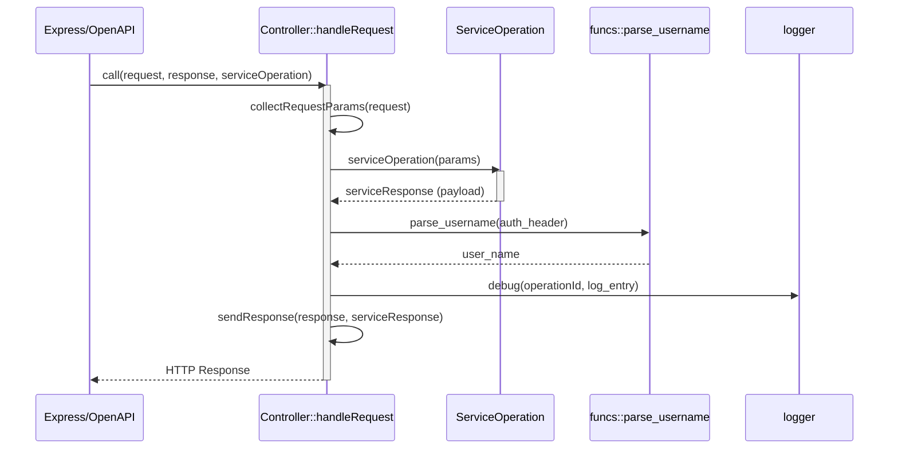
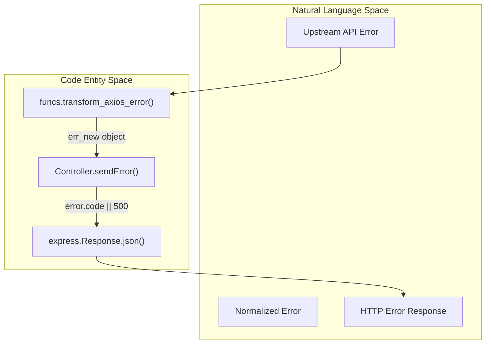

# Base Controller

Relevant source files

The following files were used as context for generating this wiki page:

- [server/controllers/Controller.js](server/controllers/Controller.js)
- [server/funcs.js](server/funcs.js)

The `Controller` class in `server/controllers/Controller.js` serves as the abstract base for all domain-specific controllers in the Ingenium Report Service [server/controllers/Controller.js:4](). It provides a standardized interface for handling HTTP requests, extracting parameters from OpenAPI-validated requests, managing multipart file uploads, and serializing polymorphic responses (JSON, PDF, or Excel).

## Request Orchestration

The primary entry point for any controller action is the `handleRequest()` method. This static method orchestrates the lifecycle of a request by extracting parameters, invoking the service layer, and managing logging and response dispatching [server/controllers/Controller.js:78-97]().

### Request Lifecycle Flow
The following diagram illustrates how `handleRequest` bridges the Express/OpenAPI layer with the internal Service layer.

**Figure 1: handleRequest Sequence**

**Sources:** [server/controllers/Controller.js:78-97](), [server/funcs.js:26-33]()

## Parameter Collection and File Handling

The `collectRequestParams()` method aggregates data from three distinct sources in the Express `request` object: the request body, path parameters, and query parameters [server/controllers/Controller.js:62-76]().

### Multipart and File Uploads
The controller handles file uploads via `collectFiles()`. It inspects the OpenAPI schema to determine if a property is defined as `binary` or `base64` format [server/controllers/Controller.js:45-60]().

*   **Multipart/form-data**: It iterates through the `request.openapi.schema` properties. If a property is marked as binary, it maps the file from `request.files` (populated by middleware) to the corresponding key in `request.body` [server/controllers/Controller.js:48-54]().
*   **Single File Uploads**: If the content type is not multipart but files exist, it assigns the first file directly to `request.body` [server/controllers/Controller.js:55-58]().

**Sources:** [server/controllers/Controller.js:45-60](), [server/controllers/Controller.js:62-76]()

## Polymorphic Response Handling

The `sendResponse()` method implements a polymorphic dispatcher that adjusts HTTP headers and status codes based on the structure of the payload returned by the service layer [server/controllers/Controller.js:5-30]().

| Response Type | Trigger Condition | Content-Type Header | Behavior |
| :--- | :--- | :--- | :--- |
| **PDF** | `payload` has `_pdf_buffer` | `application/pdf` | Sends binary buffer [server/controllers/Controller.js:14-17]() |
| **Excel** | `payload` has `_excel_buffer` | `application/vnd.openxml...` | Sends buffer with `Content-Disposition` attachment [server/controllers/Controller.js:18-23]() |
| **JSON** | Standard Object | `application/json` | Standard Express `res.json()` [server/controllers/Controller.js:25]() |
| **Raw** | Non-Object | Variable | Standard Express `res.end()` [server/controllers/Controller.js:28]() |

**Sources:** [server/controllers/Controller.js:5-30]()

## Error Normalization

The `sendError()` method ensures that all failures result in a consistent JSON error structure, preventing internal stack traces from leaking unless explicitly structured, while maintaining compatibility with upstream error formats [server/controllers/Controller.js:32-43]().

### Error Data Flow
When an error occurs in the service layer (e.g., an Axios error from the Core API), it is often transformed using `funcs.transform_axios_error()` before reaching the controller [server/funcs.js:51-99]().

**Figure 2: Error Mapping to Code Entities**

If the `error` passed to `sendError` is not a structured object, the controller manually constructs a response containing:
1.  **message**: Extracted from `error.error` or `error.message` [server/controllers/Controller.js:38]().
2.  **details**: The `error.stack` trace (defaults to an empty array) [server/controllers/Controller.js:39]().

**Sources:** [server/controllers/Controller.js:32-43](), [server/funcs.js:51-99]()
