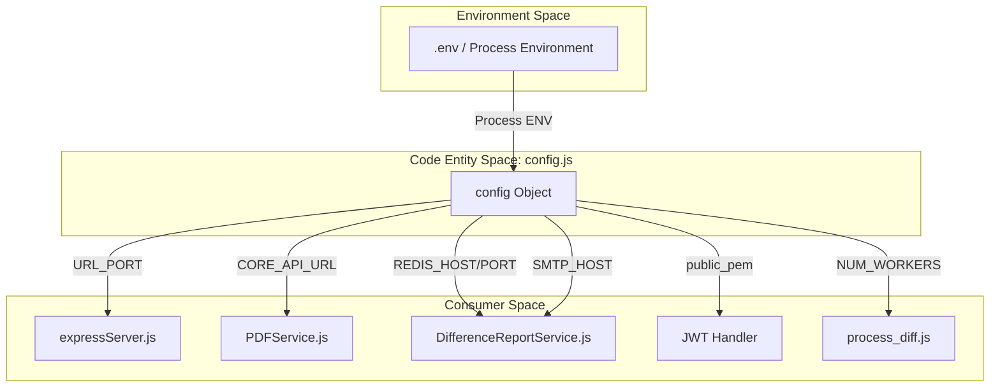
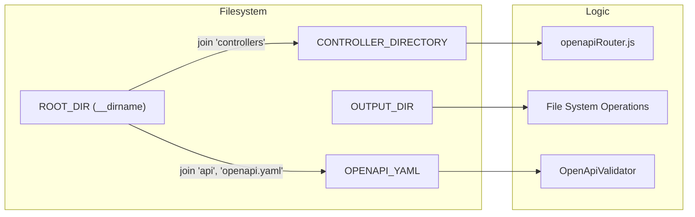

# Configuration Reference

Relevant source files

The following files were used as context for generating this wiki page:

- [README.md](README.md)
- [server/config.js](server/config.js)

The Ingenium Report Service utilizes a centralized configuration pattern where environment variables are consumed and normalized within `server/config.js`. This configuration object drives the behavior of the Express server, background workers, external API integrations, and security protocols.

## Configuration Architecture

The system follows a "fail-soft" approach where many parameters have sensible defaults for local development, but critical infrastructure (Redis, SMTP, JWT keys) requires explicit environment variable injection for production environments [server/config.js:13-50]().

### Configuration Data Flow

The following diagram illustrates how environment variables are ingested into the `config` object and distributed to various service layers.

**Diagram: Configuration Ingestion and Distribution**

**Sources:** [server/config.js:3-51](), [README.md:72-103]()

---

## Network and Service URLs

The service acts as a middleware layer, necessitating connections to the Ingenium Core API, Search API, and File Storage.

| Variable | Config Constant | Default | Description |
| :--- | :--- | :--- | :--- |
| `URL_PORT` | `URL_PORT` | `3003` | The port on which the Express server listens [server/config.js:5](). |
| `CORE_API_URL` | `CORE_API_URL` | `http://127.0.0.1:8080/api/v5/` | URL for the primary Ingenium Core API [server/config.js:14](). |
| `SEARCH_API_URL` | `SEARCH_API_URL` | `http://127.0.0.1:3025/api/v1/` | URL for the Search API service [server/config.js:13](). |
| `ING_SERVER` | `ING_SERVER` | `http://localhost` | The base URL of the Ingenium web frontend [server/config.js:19](). |
| `FILE_SERVER_API_HOST` | `FILE_SERVER_API_HOST` | `http://127.0.0.1:9000` | Host for the S3-compatible file storage [server/config.js:16](). |

**Sources:** [server/config.js:5-19](), [README.md:76-82]()

---

## Processing and Timeouts

These constants control the resource allocation and lifecycle of report generation tasks, particularly those involving Puppeteer and background workers.

| Variable | Config Constant | Default | Description |
| :--- | :--- | :--- | :--- |
| `REPORT_TIMEOUT` | `REPORT_TIMEOUT` | `600000` (10m) | Max time allowed for a full report generation cycle [server/config.js:27](). |
| `HTML_TIMEOUT` | `HTML_TIMEOUT` | `300000` (5m) | Max time Puppeteer waits for HTML page loading [server/config.js:30](). |
| `NUM_WORKERS` | `NUM_WORKERS` | `4` | Number of concurrent BullMQ worker threads for async jobs [server/config.js:32](). |
| `BROWSER_DEBUG` | `BROWSER_DEBUG` | `false` | If true, browser activity logs are sent to stdout [server/config.js:35](). |

**Sources:** [server/config.js:27-35](), [README.md:97-102]()

---

## Security and Authentication

The service uses RS256 JWT authentication. The public key must be provided to verify tokens issued by the Ingenium Identity Provider.

### JWT Configuration
*   **Constant**: `config.public_pem` [server/config.js:22]()
*   **Environment Variable**: `PUBLIC_PEM`
*   **Implementation**: This key is used by the JWT handler in `expressServer.js` to decode and validate incoming `Authorization: Bearer <token>` headers [README.md:159]().

**Sources:** [server/config.js:22](), [README.md:94]()

---

## Infrastructure: Redis, SMTP, and Storage

Async operations (like Difference Reports) require Redis for queue management and SMTP for user notifications.

### Redis Configuration
Used by `BullMQ` for managing the job queue.
*   **Host**: `REDIS_HOST` (Default: `127.0.0.1`) [server/config.js:43]()
*   **Port**: `REDIS_PORT` (Default: `6379`) [server/config.js:45]()

### SMTP Configuration
Used for sending email notifications upon completion of background reports.
*   **Host**: `SMTP_HOST` (Default: `smtp.ingenium-open.com`) [server/config.js:47]()
*   **Port**: `SMTP_HOST_PORT` (Default: `25`) [server/config.js:49]()

### File Server Credentials
Credentials for uploading generated reports to S3-compatible storage.
*   **Access Key**: `FILE_SERVER_ACCESS_KEY` [server/config.js:39]()
*   **Secret Key**: `FILE_SERVER_SECRET_KEY` [server/config.js:41]()
*   **Bucket**: `MEDIA_BUCKET` [server/config.js:37]()

**Sources:** [server/config.js:37-50](), [README.md:86-91]()

---

## Internal Paths and Constants

The `config` object also defines internal directory structures used for locating controllers and temporary file storage.

**Diagram: Internal Path Resolution**

*   **`ROOT_DIR`**: The base directory of the server [server/config.js:4]().
*   **`CONTROLLER_DIRECTORY`**: Path where the `openapiRouter.js` looks for controller classes [server/config.js:8]().
*   **`OUTPUT_DIR`**: Local directory for temporary storage of generated files before upload (Default: `output`) [server/config.js:24]().
*   **`OPENAPI_YAML`**: Absolute path to the `openapi.yaml` specification file [server/config.js:11]().

**Sources:** [server/config.js:1-11](), [README.md:143-152]()
