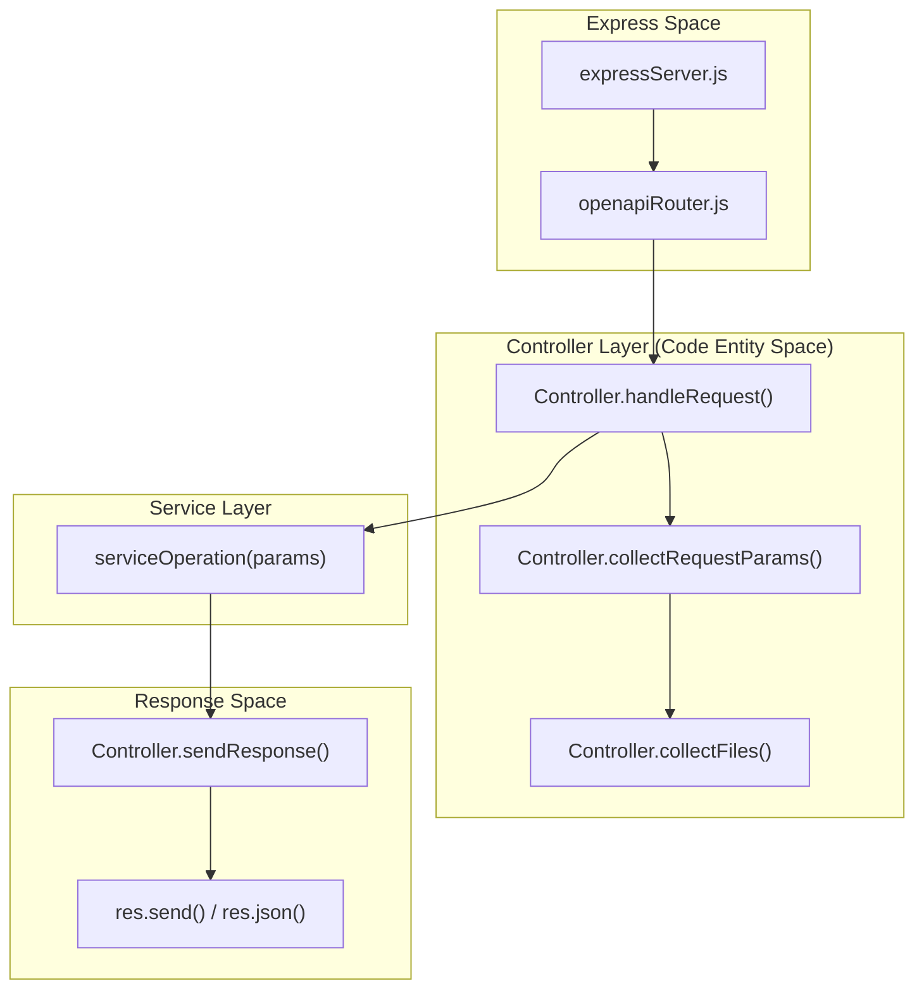
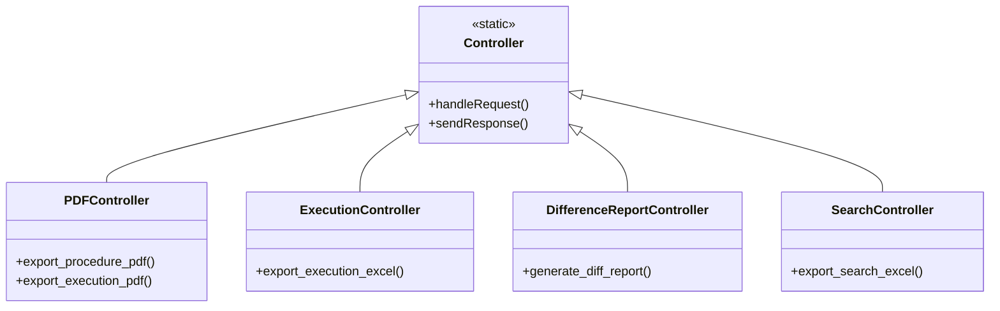

# Controller Layer

Relevant source files

The following files were used as context for generating this wiki page:

- [server/controllers/Controller.js](server/controllers/Controller.js)
- [server/controllers/index.js](server/controllers/index.js)

The Controller Layer in the Ingenium Report Server acts as a thin mediation layer between the Express HTTP server and the underlying business logic in the Service Layer. Controllers are responsible for extracting parameters from incoming requests, delegating execution to the appropriate service function, and normalizing the output into HTTP responses.

## Architectural Role

Controllers in this system are stateless and follow a static pattern. They do not contain business logic; instead, they orchestrate the flow of data. The `openapiRouter.js` dynamically invokes these controllers based on the `x-openapi-router-controller` extension defined in the OpenAPI specification [server/controllers/index.js:7-13]().

### Request Flow
The following diagram illustrates how the Controller Layer bridges the gap between the raw Express `request` and the domain-specific `serviceOperation`.

**Diagram: Request Processing Pipeline**

**Sources:** [server/controllers/Controller.js:78-97](), [server/controllers/Controller.js:62-76]()

---

## Base Controller

The `Controller` class serves as the base utility for all domain controllers. It provides standardized methods for handling the lifecycle of an HTTP request [server/controllers/Controller.js:4-98]().

*   **Parameter Extraction**: `collectRequestParams()` aggregates data from path parameters, query strings, and request bodies into a single `params` object [server/controllers/Controller.js:62-76]().
*   **File Handling**: `collectFiles()` processes `multipart/form-data` to handle binary uploads for reports [server/controllers/Controller.js:45-60]().
*   **Response Polymorphism**: `sendResponse()` inspects the service payload to automatically set headers for `application/pdf`, Excel spreadsheets, or standard `application/json` [server/controllers/Controller.js:5-30]().
*   **Error Normalization**: `sendError()` ensures that service-level failures are translated into structured JSON error responses with appropriate HTTP status codes [server/controllers/Controller.js:32-43]().

For a deep dive into the base implementation, see [Base Controller](#3.1).

---

## Domain Controllers

The application implements several domain-specific controllers that map directly to the system's functional requirements. Each controller is exported via a central index [server/controllers/index.js:7-13]().

| Controller | Responsibility | Service Delegation |
| :--- | :--- | :--- |
| `PDFController` | Handles requests for PDF generation of procedures and executions. | `PDFService` |
| `ExecutionController` | Manages execution-specific exports, including Excel workbooks. | `ExecutionService` |
| `DifferenceReportController` | Orchestrates the generation of HTML/PDF diffs between executions. | `DifferenceReportService` |
| `SearchController` | Provides endpoints for exporting search results to Excel. | `SearchService` |
| `HealthController` | Provides system status and heartbeat monitoring. | `HealthService` |

**Diagram: Controller to Service Mapping**

**Sources:** [server/controllers/index.js:1-13](), [server/controllers/Controller.js:4-5]()

For details on individual controller implementations and their specific service mappings, see [Domain Controllers](#3.2).

---

## Logging and Security
During the `handleRequest` lifecycle, the controller performs two critical non-functional tasks:
1.  **Identity Propagation**: It extracts the `Authorization` header and uses `funcs.parse_username` to identify the actor [server/controllers/Controller.js:81-87]().
2.  **Audit Logging**: It logs the `operationId` along with the username to the system logger for auditability [server/controllers/Controller.js:88-92]().

**Sources:** [server/controllers/Controller.js:81-92]()
