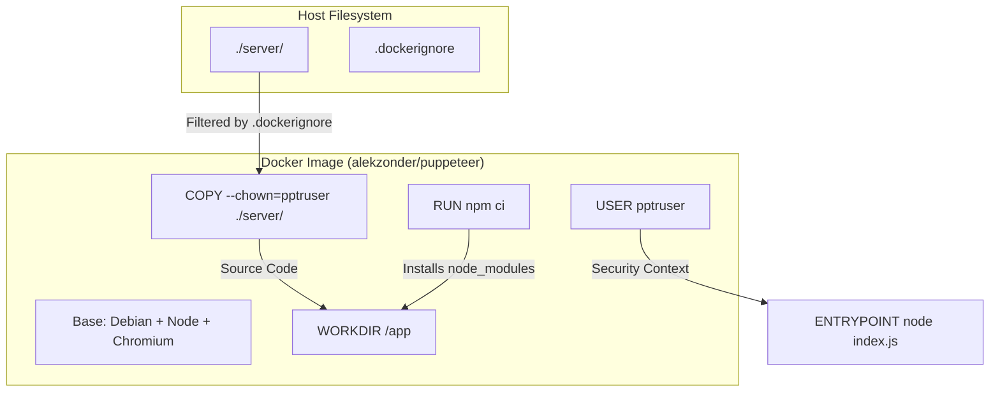

# Deployment and DevOps

Relevant source files

The following files were used as context for generating this wiki page:

- [.dockerignore](.dockerignore)
- [.gitignore](.gitignore)
- [Dockerfile](Dockerfile)
- [server/.eslintrc.json](server/.eslintrc.json)

The Ingenium Report Server is designed to be a portable, containerized microservice. The deployment strategy focuses on ensuring a consistent environment for PDF generation, which requires specific system-level dependencies (like Chromium), and maintaining code quality through standardized linting rules.

The infrastructure is defined primarily through a `Dockerfile` that leverages a specialized base image to support Puppeteer, and configuration files that manage dependency isolation and static analysis.

### Containerization Strategy

The service is containerized using Docker to package the Node.js runtime, the Chromium browser, and all necessary system libraries. This ensures that the PDF generation logic, which relies on `puppeteer`, behaves identically across development, staging, and production environments.

The build process utilizes `npm ci` [Dockerfile:5-5]() rather than `npm install` to ensure that the exact versions specified in the `package-lock.json` are installed, providing a deterministic build.

#### Docker Image Structure
The following diagram illustrates the relationship between the host filesystem and the containerized environment:

**Container Mapping and Build Flow**

Sources: [Dockerfile:1-6](), [.dockerignore:1-4]()

For details on the specific image layers and security boundaries, see [Docker Container](#7.1).

### Security and User Model

A key aspect of the deployment is the security model. The service does not run as `root`. Instead, it utilizes the `pptruser` [Dockerfile:4-4](), a non-privileged user bundled with the base image. All files copied into the container are explicitly owned by this user [Dockerfile:3-3]() to prevent permission issues during runtime while adhering to the principle of least privilege.

### Code Quality and Linting

To maintain a consistent codebase, the project employs ESLint. The configuration extends the Airbnb style guide, which is a standard in the JavaScript community for promoting best practices and readability.

| Feature | Configuration | Rationale |
| :--- | :--- | :--- |
| **Base Rules** | `airbnb` [server/.eslintrc.json:4-4]() | Enforces high-quality, idiomatic JavaScript patterns. |
| **Override** | `no-console: off` [server/.eslintrc.json:6-6]() | Allows the use of console logging for service monitoring. |
| **Exclusions** | `.eslintcache` [.gitignore:46-46]() | Prevents local linting artifacts from being committed. |

For details on the linting rules and static analysis workflow, see [Code Quality and Linting](#7.2).

### Dependency and Runtime Ignore Conventions

The project maintains strict control over which files enter the container and the version control system.

*   **.dockerignore**: Prevents local `node_modules` and runtime data (like PDF output) from being baked into the image [ .dockerignore:1-4](). This ensures the image is built from source and dependencies are resolved fresh within the container environment.
*   **.gitignore**: Excludes logs [ .gitignore:1-6](), environment secrets (`.env`) [ .gitignore:58-58](), and Python virtual environments used for testing [ .gitignore:65-65]().

Sources: [.dockerignore:1-4](), [.gitignore:1-73]()

***

## Child Pages
- [Docker Container](#7.1) — Detailed walkthrough of the Dockerfile: alekzonder/puppeteer base image, WORKDIR /app, COPY with --chown=pptruser, npm ci dependency installation, USER pptruser security boundary, and ENTRYPOINT node index.js.
- [Code Quality and Linting](#7.2) — ESLint configuration in server/.eslintrc.json: Airbnb style guide extension, the no-console override rationale, and how static analysis fits into the development workflow.
