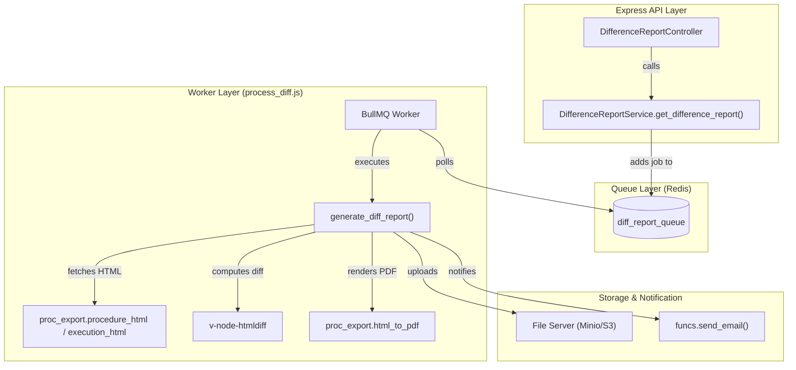
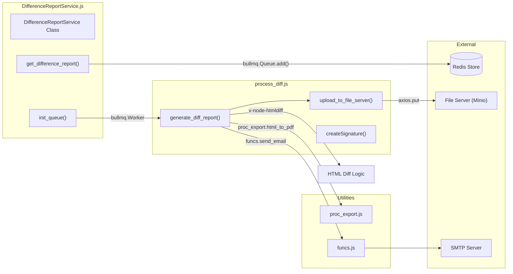

# Difference Report Service

Relevant source files

The following files were used as context for generating this wiki page:

- [server/funcs.js](server/funcs.js)
- [server/services/DifferenceReportService.js](server/services/DifferenceReportService.js)
- [server/services/diff_report/process_diff.js](server/services/diff_report/process_diff.js)

The **Difference Report Service** provides an asynchronous mechanism for generating visual HTML and PDF diffs between two versions of a procedure or two different executions. Due to the high computational cost of HTML diffing and PDF rendering, this service utilizes a distributed task queue architecture.

## Architecture and Data Flow

The service is split into a producer (the Express service) and a consumer (the background workers). They communicate via **Redis** using the **BullMQ** library.

### Asynchronous Workflow Diagram
The following diagram illustrates the flow from the initial REST request to the final email notification.

"Difference Report Flow: Request to Notification"

Sources: [server/services/DifferenceReportService.js:10-15](), [server/services/DifferenceReportService.js:105-129](), [server/services/diff_report/process_diff.js:85-110](), [server/services/diff_report/process_diff.js:197-205]()

---

## Service Implementation (`DifferenceReportService.js`)

The `DifferenceReportService` is responsible for initializing the BullMQ queue and handling incoming requests by placing them onto the queue.

### Queue Initialization
Upon module load, `init_queue()` is called. It performs the following:
1.  **Queue Reset**: Calls `reset_queue()` to clear any stale jobs (completed, failed, active, delayed, or paused) to ensure a clean state [server/services/DifferenceReportService.js:17-34]().
2.  **Event Listeners**: Registers listeners for `error`, `waiting`, `active`, `stalled`, `completed`, and `failed` events to log the status of the background jobs [server/services/DifferenceReportService.js:37-67]().
3.  **Worker Spawning**: Spawns a number of workers defined by `config.NUM_WORKERS`, each pointing to the processor file located at `server/services/diff_report/process_diff.js` [server/services/DifferenceReportService.js:70-85]().

### Request Handling
The `get_difference_report` method acts as the entry point for the REST API:
-   **Parameter Extraction**: It extracts `base` and `target` identifiers and versions, along with the `authorization_header` [server/services/DifferenceReportService.js:105-111]().
-   **Job Submission**: It adds a new job to `diff_report_queue` named `diff_report`. The job payload includes all parameters needed for comparison, as well as the current `active_count` and `waiting_count` to inform the user of potential delays [server/services/DifferenceReportService.js:113-125]().
-   **Immediate Response**: Returns an HTTP `202 Accepted` status with the `job.id` (mapped to `report_id`), allowing the client to track the request [server/services/DifferenceReportService.js:129]().

Sources: [server/services/DifferenceReportService.js:32-86](), [server/services/DifferenceReportService.js:105-138]()

---

## Worker Process (`process_diff.js`)

The worker logic is encapsulated in the `generate_diff_report(job)` function. It performs the heavy lifting of fetching data, comparing it, and distributing the result.

### 1. Content Acquisition
The worker uses `proc_export.procedure_html` or `proc_export.execution_html` to retrieve the raw HTML content for both the "base" and "target" entities [server/services/diff_report/process_diff.js:140-156]().

### 2. HTML Diffing
The core comparison is performed by the `v-node-htmldiff` library.
-   **Function**: `diff(base_html, target_html)` [server/services/diff_report/process_diff.js:5]().
-   **Logic**: It produces a combined HTML string where additions are typically wrapped in `<ins>` tags and deletions in `<del>` tags [server/services/diff_report/process_diff.js:191]().

### 3. PDF Generation
The resulting HTML diff is converted to a PDF using the shared PDF utility:
-   **Method**: `proc_export.html_to_pdf(html_diff, ...)` [server/services/diff_report/process_diff.js:197]().
-   **Configuration**: A custom header "Difference Report" is injected into the PDF [server/services/diff_report/process_diff.js:112-205]().

### 4. File Server Upload
Once the PDF buffer is generated, it is uploaded to the file server (Minio/S3 compatible).
-   **Signature**: Uses `crypto.createHmac('sha1', ...)` to generate an AWS Signature Version 2 for the `PUT` request [server/services/diff_report/process_diff.js:18-20]().
-   **Pathing**: Files are stored using a UUID-based folder structure: `reports/YYYY-MM-DD/<uuid>/<filename>` [server/services/diff_report/process_diff.js:23-26]().
-   **Upload**: Performed via `axios.put` with custom headers including `Content-Type: application/pdf` and the `Authorization` signature [server/services/diff_report/process_diff.js:58-75]().

### 5. Email Notification
The worker sends two emails via `funcs.send_email`:
1.  **Confirmation**: Sent immediately when the job starts, informing the user that the request is being processed [server/services/diff_report/process_diff.js:115-131]().
2.  **Completion/Failure**: Sent when the PDF is ready (including a link to the file server) or if an error occurred during processing [server/services/diff_report/process_diff.js:210-235]().

Sources: [server/services/diff_report/process_diff.js:18-83](), [server/services/diff_report/process_diff.js:140-235]()

---

## Code Entity Mapping

The following diagram maps the logical operations of the Difference Report Service to specific code entities and external dependencies.

"Code Entity Space: Difference Report Implementation"

Sources: [server/services/DifferenceReportService.js:10-15](), [server/services/DifferenceReportService.js:73-78](), [server/services/diff_report/process_diff.js:5-12](), [server/services/diff_report/process_diff.js:71-75](), [server/funcs.js:35-49]()

### Key Functions Reference

| Function | Location | Purpose |
| :--- | :--- | :--- |
| `init_queue` | `DifferenceReportService.js` | Configures Redis connection and initializes BullMQ workers. |
| `get_difference_report` | `DifferenceReportService.js` | API entry point; validates JWT and queues the job. |
| `generate_diff_report` | `process_diff.js` | Main worker loop: fetch, diff, render, upload, notify. |
| `upload_to_file_server` | `process_diff.js` | Handles AWS V2 signature generation and S3-compatible PUT. |
| `send_email` | `funcs.js` | Wraps `nodemailer` to send job status updates to users. |

Sources: [server/services/DifferenceReportService.js:32](), [server/services/DifferenceReportService.js:105](), [server/services/diff_report/process_diff.js:85](), [server/services/diff_report/process_diff.js:32](), [server/funcs.js:35]()
