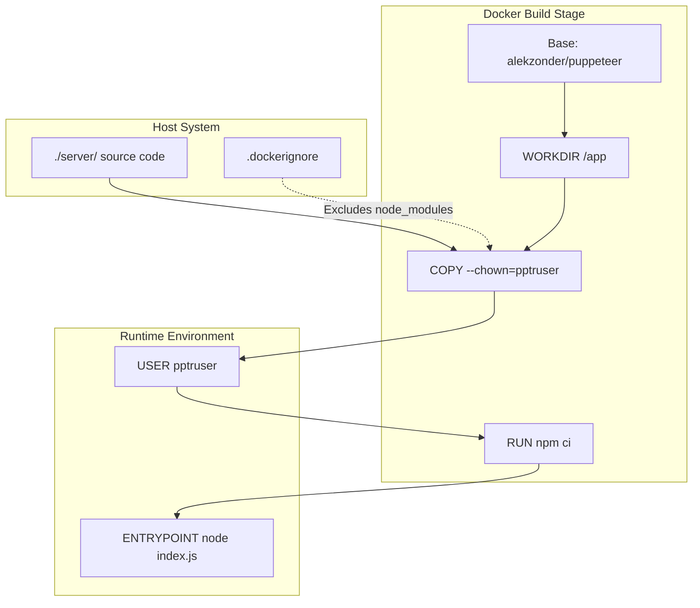
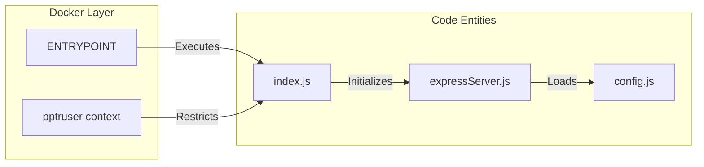

# Docker Container

Relevant source files

The following files were used as context for generating this wiki page:

- [.dockerignore](.dockerignore)
- [.gitignore](.gitignore)
- [Dockerfile](Dockerfile)

The Ingenium Report Service is containerized using Docker to ensure a consistent runtime environment, particularly for its PDF generation capabilities which rely on Chromium. The containerization strategy focuses on security, minimal image size through dependency locking, and the provision of a headless browser environment.

### Base Image and Environment

The service utilizes `alekzonder/puppeteer:1.20.0` as its base image [Dockerfile:1-1](). This specific image is chosen because it comes pre-configured with the necessary Debian dependencies to run headless Chromium, which is required by the `puppeteer` library used in the PDF generation logic.

The working directory within the container is set to `/app` [Dockerfile:2-2](), serving as the root for all application logic and configuration files.

### Security and User Permissions

A critical aspect of the deployment is the security boundary established by the `pptruser`. Puppeteer, by default, cannot be run as the `root` user without the `--no-sandbox` flag, which is a security risk. 

To mitigate this:
1.  **Ownership**: Files are copied from the host's `./server/` directory to the container's `/app/` directory using the `--chown=pptruser:pptruser` flag [Dockerfile:3-3](). This ensures the application files are owned by the non-privileged user.
2.  **Execution Context**: The `USER pptruser` command switches the execution context away from `root` before any application code or dependencies are installed [Dockerfile:4-4]().

### Dependency Management

The container uses `npm ci` (Clean Install) rather than `npm install` [Dockerfile:5-5](). 

| Feature | `npm ci` Behavior | Benefit for Docker |
| :--- | :--- | :--- |
| **Reproducibility** | Requires a `package-lock.json` to exist. | Guarantees identical dependency versions across builds. |
| **Cleanliness** | Deletes existing `node_modules` before installing. | Prevents layer pollution or cached artifact issues. |
| **Validation** | Fails if `package-lock.json` is out of sync with `package.json`. | Ensures the build environment matches the developer environment. |

### Build and Runtime Flow

The following diagram illustrates the transition from the local source code to the running containerized process.

**Container Build and Execution Flow**

Sources: [Dockerfile:1-6](), [.dockerignore:1-4]()

### Exclusions and Optimizations

The build process utilizes a `.dockerignore` file to prevent unnecessary files from being baked into the image layers. This significantly reduces image size and prevents local environment leaks.

Key exclusions include:
*   **Local Node Modules**: `server/node_modules` and `image/node_modules` are ignored to ensure that the container builds its own Linux-compatible binaries during `npm ci` [/.dockerignore:2-3]().
*   **Temporary Data**: The `image/data` directory is excluded to keep the image stateless [/.dockerignore:1-1]().
*   **Generated PDFs**: Any local test outputs in `server/services/pdf/node_modules` are ignored [/.dockerignore:4-4]().

Similarly, the `.gitignore` ensures that runtime artifacts like `logs`, `pids`, and coverage reports do not enter the version control system, keeping the repository clean for the Docker context [/.gitignore:1-21]().

### Entry Point

The container is configured with an `ENTRYPOINT` that executes `node index.js` [Dockerfile:6-6](). This makes the container act as an executable for the Ingenium Report Server. When the container starts, it immediately boots the Express server defined in the `index.js` of the server directory.

**Code Entity Mapping**

Sources: [Dockerfile:4-6]()

| Instruction | Value | Description |
| :--- | :--- | :--- |
| `FROM` | `alekzonder/puppeteer:1.20.0` | Provides Chromium and Node.js environment. |
| `WORKDIR` | `/app` | Sets the base path for subsequent commands. |
| `COPY` | `./server/` | Transfers application logic to the container. |
| `USER` | `pptruser` | Drops root privileges for security. |
| `RUN` | `npm ci` | Installs exact production dependencies. |
| `ENTRYPOINT` | `["node", "index.js"]` | Starts the report server. |

Sources: [Dockerfile:1-6](), [.dockerignore:1-4](), [.gitignore:1-73]()
