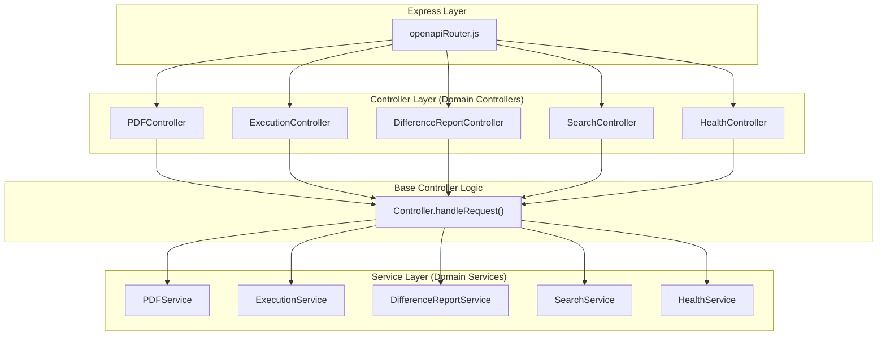
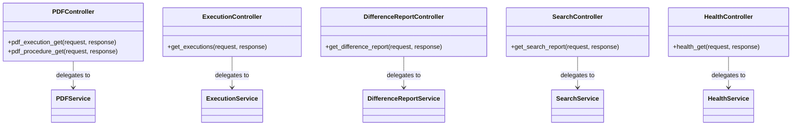

# Domain Controllers

Relevant source files

The following files were used as context for generating this wiki page:

- [server/controllers/DifferenceReportController.js](server/controllers/DifferenceReportController.js)
- [server/controllers/ExecutionController.js](server/controllers/ExecutionController.js)
- [server/controllers/HealthController.js](server/controllers/HealthController.js)
- [server/controllers/PDFController.js](server/controllers/PDFController.js)
- [server/controllers/SearchController.js](server/controllers/SearchController.js)

Domain Controllers in the Ingenium Report Server act as the entry point for business logic execution after a request has been routed by the Express server. They serve as thin adapters that translate HTTP-specific concerns—such as request timeouts and response handling—into service-layer calls.

Each controller follows a standardized pattern: they are initialized with a corresponding Service class and utilize the static `Controller.handleRequest` method to manage the execution lifecycle.

## Controller Architecture and Data Flow

The domain controllers are designed to be "thin." Their primary responsibilities are:
1.  **Setting Request Timeouts**: For long-running report generation tasks, controllers apply a timeout based on the `REPORT_TIMEOUT` configuration [server/config.js:13-13]().
2.  **Delegation**: They pass the request and response objects, along with the specific service method, to the `Base Controller` [server/controllers/Controller.js:13-13]().

### Request Handling Flow
The following diagram illustrates how an incoming request moves from the Express router through the Domain Controllers to the Service layer.

**Diagram: Request Delegation to Domain Services**

**Sources:** [server/controllers/PDFController.js:9-12](), [server/controllers/ExecutionController.js:9-12](), [server/controllers/DifferenceReportController.js:9-12](), [server/controllers/SearchController.js:9-12](), [server/controllers/HealthController.js:8-10]()

---

## PDFController

The `PDFController` manages requests for generating PDF documents of procedures and execution records. It interfaces with the `PDFService`.

*   **`pdf_execution_get(request, response)`**: Handles requests to generate a PDF for a specific execution ID. It sets the request timeout to `config.REPORT_TIMEOUT` before delegating to `this.service.pdf_execution_get` [server/controllers/PDFController.js:9-12]().
*   **`pdf_procedure_get(request, response)`**: Handles requests for procedure-based PDF exports. It applies the same timeout logic and delegates to `this.service.pdf_procedure_get` [server/controllers/PDFController.js:14-17]().

**Sources:** [server/controllers/PDFController.js:4-21]()

---

## ExecutionController

The `ExecutionController` handles the generation of Excel-based execution reports.

*   **`get_executions(request, response)`**: This method is invoked when a user requests an export of execution data (typically in Excel format). It sets the standard report timeout and delegates the data fetching and workbook creation to `this.service.get_executions` [server/controllers/ExecutionController.js:9-12]().

**Sources:** [server/controllers/ExecutionController.js:4-16]()

---

## DifferenceReportController

The `DifferenceReportController` facilitates the generation of reports that highlight changes between different versions of procedures or executions.

*   **`get_difference_report(request, response)`**: Manages the initiation of a difference report. Because these reports can involve complex HTML diffing, the `REPORT_TIMEOUT` is applied before delegating to `this.service.get_difference_report` [server/controllers/DifferenceReportController.js:9-12]().

**Sources:** [server/controllers/DifferenceReportController.js:4-16]()

---

## SearchController

The `SearchController` is responsible for exporting search results into downloadable formats (Excel).

*   **`get_search_report(request, response)`**: Takes search criteria from the request, applies the timeout, and delegates to `this.service.get_search_report` to process the results and generate the export buffer [server/controllers/SearchController.js:9-12]().

**Sources:** [server/controllers/SearchController.js:4-16]()

---

## HealthController

Unlike the other domain controllers, the `HealthController` does not deal with report generation and therefore does not apply a long `REPORT_TIMEOUT`.

*   **`health_get(request, response)`**: Provides a simple heartbeat/status check for the service. It immediately delegates to `this.service.health_get` via the base controller to return the system status [server/controllers/HealthController.js:8-10]().

**Sources:** [server/controllers/HealthController.js:3-14]()

---

## Implementation Summary

All domain controllers share a uniform structure for constructor injection and request handling.

| Controller | Service Method | Timeout Applied | Purpose |
| :--- | :--- | :--- | :--- |
| `PDFController` | `pdf_execution_get` | Yes | PDF export of execution results |
| `PDFController` | `pdf_procedure_get` | Yes | PDF export of procedure definitions |
| `ExecutionController` | `get_executions` | Yes | Excel export of execution lists |
| `DifferenceReportController` | `get_difference_report` | Yes | Async diff report generation |
| `SearchController` | `get_search_report` | Yes | Excel export of search queries |
| `HealthController` | `health_get` | No | Service health monitoring |

**Diagram: Controller-to-Service Mapping**

**Sources:** [server/controllers/PDFController.js:1-21](), [server/controllers/ExecutionController.js:1-16](), [server/controllers/DifferenceReportController.js:1-16](), [server/controllers/SearchController.js:1-16](), [server/controllers/HealthController.js:1-14]()
