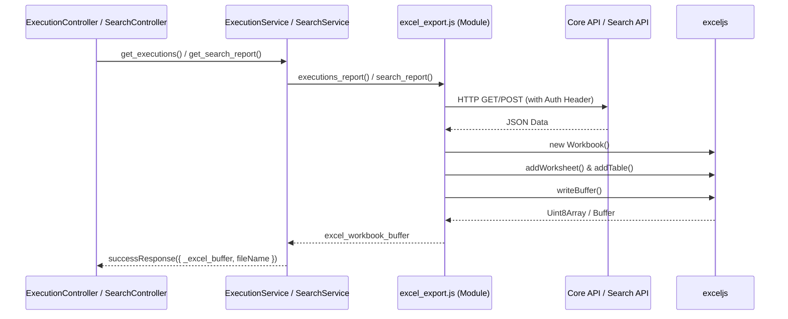

# Excel Export Services

<details>
<summary>Relevant source files</summary>

The following files were used as context for generating this wiki page:

- [server/services/ExecutionService.js](server/services/ExecutionService.js)
- [server/services/SearchService.js](server/services/SearchService.js)
- [server/services/executions/excel_export.js](server/services/executions/excel_export.js)
- [server/services/search_report/excel_export.js](server/services/search_report/excel_export.js)

</details>


The Ingenium Report Server provides Excel generation capabilities through two primary domains: **Execution Reporting** and **Search Result Reporting**. These services orchestrate data retrieval from upstream APIs (Core API and Search API), transform the raw JSON data into formatted workbooks using the `exceljs` library, and return a buffer that the controller layer transmits as a file download.

## Architecture and Data Flow

The export process follows a synchronous request-response pattern where the service layer acts as a transformer between the JSON-based REST APIs and the binary Excel format.

### Excel Export Sequence
The following diagram illustrates the flow from a client request to the final Excel buffer generation.

**Diagram: Excel Generation Data Flow**

**Sources:** [server/services/ExecutionService.js:54-55](), [server/services/SearchService.js:30-31](), [server/services/executions/excel_export.js:112-156](), [server/services/search_report/excel_export.js:142-196]()

---

## Execution Export Service

The `ExecutionService` handles requests to export lists of procedure executions. It supports a wide array of filters including status, time ranges, and venue details [server/services/ExecutionService.js:12-26]().

### Key Components
*   **ExecutionService.js**: Entry point that defines the `get_executions` method. It prepares options and calls the specialized export logic [server/services/ExecutionService.js:7-68]().
*   **executions/excel_export.js**: The implementation logic for fetching data from `CORE_API_URL` and building the workbook [server/services/executions/excel_export.js:112-156]().

### Implementation Details
1.  **Data Fetching**: The service calls `${core_api_url}executions` via `axios`. It passes the `authorization_header` to ensure the request is made on behalf of the authenticated user [server/services/executions/excel_export.js:122-124]().
2.  **Workbook Construction**:
    *   Creates a `Workbook` and a worksheet named "Execution Report" [server/services/executions/excel_export.js:24-26]().
    *   **Header Formatting**: Merges cells for a title row that includes the generation timestamp and the filters applied [server/services/executions/excel_export.js:36-39]().
    *   **Table Definition**: Uses `workSheet.addTable` to define a structured data region with columns like "Execution ID", "Status", and "Step Summary" [server/services/executions/excel_export.js:50-76]().
3.  **Data Mapping**: Iterates through the `executions` array, mapping nested JSON objects (like `test_conductors` and `used_procedures`) into newline-separated strings within the Excel cells [server/services/executions/excel_export.js:81-101]().

**Sources:** [server/services/ExecutionService.js:34-55](), [server/services/executions/excel_export.js:23-110]()

---

## Search Report Service

The `SearchService` provides exports for granular search results, typically targeting specific steps or elements within procedures and executions.

### Key Components
*   **SearchService.js**: Defines `get_search_report`, which extracts `queryBuilderParams` and `index` from the request body [server/services/SearchService.js:17-42]().
*   **search_report/excel_export.js**: Implementation logic for the Search API interaction [server/services/search_report/excel_export.js:142-196]().

### Implementation Details
1.  **Pagination Logic**: Unlike the execution export, the search export implements a `while(true)` loop to handle paginated results from the Search API. It continues fetching until `offset >= total` [server/services/search_report/excel_export.js:155-164]().
2.  **Formatting Helper Functions**: Uses specialized functions to extract deeply nested metadata for the report:
    *   `getStartTime()` and `getEndTime()`: Safely navigate `execution.meta_data` [server/services/search_report/excel_export.js:99-111]().
    *   `getTagNameStr()`: Maps tag IDs to human-readable names by searching the `procedureVersionDetails.tags` array [server/services/search_report/excel_export.js:130-140]().
3.  **Table Generation**: Generates a table named "SearchReportTable" with 12 columns covering step details, venue, and authorship [server/services/search_report/excel_export.js:46-67]().

**Sources:** [server/services/SearchService.js:23-31](), [server/services/search_report/excel_export.js:152-167]()

---

## Excel Workbook Configuration

Both services utilize the `exceljs` library to produce standard `.xlsx` files. The styling is consistent across reports to ensure a professional output.

| Feature | Implementation Detail | Source |
| :--- | :--- | :--- |
| **Column Width** | Default set to 35 for readability. | [excel_export.js:27]() |
| **Borders** | Thin borders on all sides for data cells. | [excel_export.js:33]() |
| **Alignment** | `wrapText: true` enabled for multi-line content (e.g., lists of conductors). | [excel_export.js:33]() |
| **Theme** | `TableStyleLight1` applied to Excel tables. | [excel_export.js:54]() |
| **Buffer Conversion** | `workbook.xlsx.writeBuffer()` used to generate the response payload. | [excel_export.js:149]() |

### Error Handling
If the upstream API call fails, the services use `funcs.transform_axios_error` to normalize the error before rejecting the promise [server/services/executions/excel_export.js:126](). If the Excel generation itself fails (e.g., due to memory limits or malformed data), a warning is logged, and the service returns the error to the controller [server/services/executions/excel_export.js:151-153]().

**Sources:** [server/services/executions/excel_export.js:23-55](), [server/services/search_report/excel_export.js:23-67]()

---

## Code Entity Mapping

The following diagram maps the logical export concepts to the specific JavaScript entities and external dependencies.

**Diagram: Service Entity Mapping**
```mermaid
graph DT
    subgraph "Natural Language Concepts"
        R1["Execution Export"]
        R2["Search Export"]
        F1["Excel Formatting"]
        D1["Data Retrieval"]
    end

    subgraph "Code Entity Space"
        S1["ExecutionService.js"]
        S2["SearchService.js"]
        M1["executions/excel_export.js"]
        M2["search_report/excel_export.js"]
        L1["exceljs (Library)"]
        U1["funcs.js"]
    end

    R1 --> S1
    R2 --> S2
    S1 --> M1
    S2 --> M2
    M1 --> L1
    M2 --> L1
    M1 --> U1
    M2 --> U1
    
    style R1 stroke-dasharray: 5 5
    style R2 stroke-dasharray: 5 5
```
**Sources:** [server/services/ExecutionService.js:5-7](), [server/services/SearchService.js:5-7](), [server/services/executions/excel_export.js:3-7](), [server/services/search_report/excel_export.js:3-7]()
