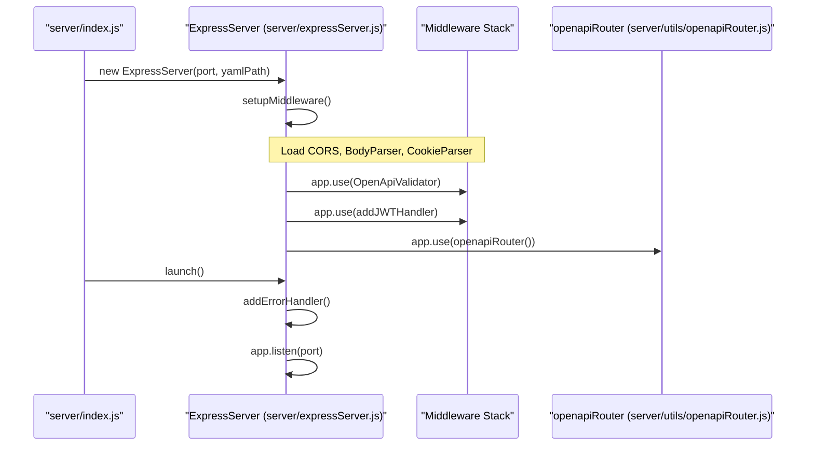
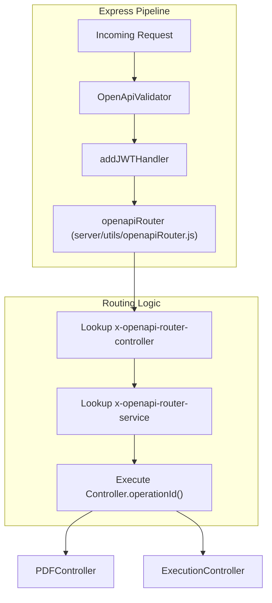

# Express Server and Middleware

Relevant source files

The following files were used as context for generating this wiki page:

- [server/expressServer.js](server/expressServer.js)
- [server/index.js](server/index.js)
- [server/utils/openapiRouter.js](server/utils/openapiRouter.js)

This section describes the bootstrapping process of the Ingenium Report Service via the `ExpressServer` class. It covers the initialization of the Express application, the configuration of the middleware stack, the integration of OpenAPI validation, and the custom JWT authentication logic.

The server is initialized in `server/index.js` [server/index.js:5-14](), which instantiates `ExpressServer` using the port and OpenAPI specification path defined in the global configuration [server/index.js:7-8]().

## ExpressServer Class

The `ExpressServer` class encapsulates the setup and lifecycle of the Node.js web server. Upon instantiation, it loads the OpenAPI YAML specification and triggers the `setupMiddleware()` method [server/expressServer.js:82-88]().

### Initialization Flow
The following diagram illustrates the sequence of operations when `launch()` is called.

**Server Bootstrapping Sequence**

**Sources:** [server/index.js:5-14](), [server/expressServer.js:82-120](), [server/expressServer.js:142-156]()

## Middleware Stack

The `setupMiddleware` function [server/expressServer.js:90-120]() configures the standard and custom middleware required for the application to process requests correctly.

| Middleware / Component | Implementation / Package | Purpose |
| :--- | :--- | :--- |
| **CORS** | `cors()` | Enables Cross-Origin Resource Sharing [server/expressServer.js:92](). |
| **Body Parser** | `bodyParser.json()`, `express.json()` | Parses incoming JSON request bodies [server/expressServer.js:93-94](). |
| **URL Encoding** | `express.urlencoded()` | Parses URL-encoded bodies with the `querystring` library [server/expressServer.js:95](). |
| **Cookie Parser** | `cookieParser()` | Parses Cookie headers and populates `req.cookies` [server/expressServer.js:96](). |
| **Static Specs** | `express.static()` | Serves the raw API specification files from the `/spec` directory [server/expressServer.js:97](). |
| **Swagger UI** | `swagger-ui-express` | Mounts the interactive API documentation at `/api-docs` [server/expressServer.js:100](). |
| **OpenApiValidator** | `express-openapi-validator` | Validates requests against the `openapi.yaml` schema [server/expressServer.js:109-111](). |
| **JWT Handler** | `addJWTHandler` | Custom logic for RS256 JWT verification and scope checking [server/expressServer.js:112](). |
| **OpenAPI Router** | `openapiRouter()` | Dynamic routing based on OpenAPI extensions [server/expressServer.js:114](). |

**Sources:** [server/expressServer.js:90-114]()

## JWT Authentication (addJWTHandler)

The `addJWTHandler` function [server/expressServer.js:19-79]() is a custom middleware that enforces security based on the `security` definitions in the OpenAPI specification.

1.  **Scope Identification**: It extracts the `bearerAuth` scopes required for the specific operation from `req.openapi.schema.security` [server/expressServer.js:20-31]().
2.  **Public Access**: If no scopes are required, the request proceeds [server/expressServer.js:35-38]().
3.  **Token Extraction**: It retrieves the Bearer token from the `Authorization` header [server/expressServer.js:41-44]().
4.  **Verification**: The token is verified using `jwt.verify` with the `RS256` algorithm and the `public_pem` provided in the config [server/expressServer.js:50-52]().
5.  **Authorization**: It compares the scopes present in the decoded JWT against the `required_scopes`. If there is an intersection, access is granted; otherwise, it returns a `403 Forbidden` [server/expressServer.js:61-72]().

**Sources:** [server/expressServer.js:19-79]()

## Routing and Validation Logic

The server uses `express-openapi-validator` to ensure that incoming requests adhere to the defined schemas before they reach the business logic [server/expressServer.js:109-111](). Once validated, requests are passed to the `openapiRouter` [server/expressServer.js:114]().

**Middleware to Controller Mapping**

**Sources:** [server/expressServer.js:109-114](), [server/utils/openapiRouter.js:49-58]()

## Error Handling

The server implements a two-tier error handling strategy in the `addErrorHandler()` method [server/expressServer.js:124-140]():

1.  **404 Handler**: A catch-all route `*` that returns a JSON response if no previous middleware or route handled the request [server/expressServer.js:125-128]().
2.  **Global Error Middleware**: A standard Express error-handling middleware that catches exceptions thrown during request processing. It extracts the error message (supporting both `error.errors` from the validator and standard `error.message`) and returns a JSON response with the appropriate status code (defaulting to 500) [server/expressServer.js:134-139]().

The `openapiRouter` also contains a local `handleError` function that logs errors via the system logger and formats them into a JSON string before passing them to the next error middleware [server/utils/openapiRouter.js:5-14]().

**Sources:** [server/expressServer.js:124-140](), [server/utils/openapiRouter.js:5-14]()
