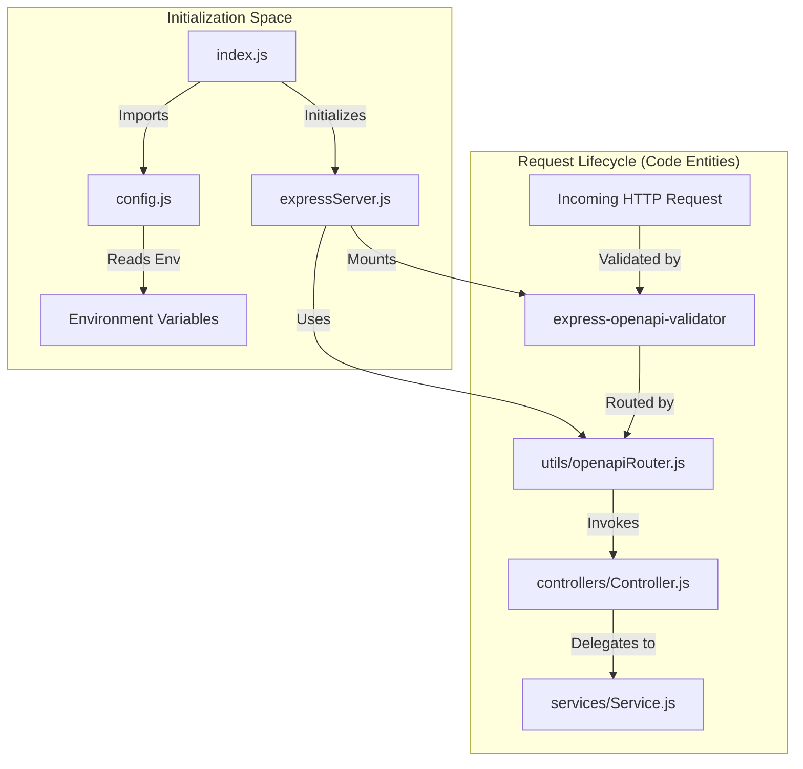
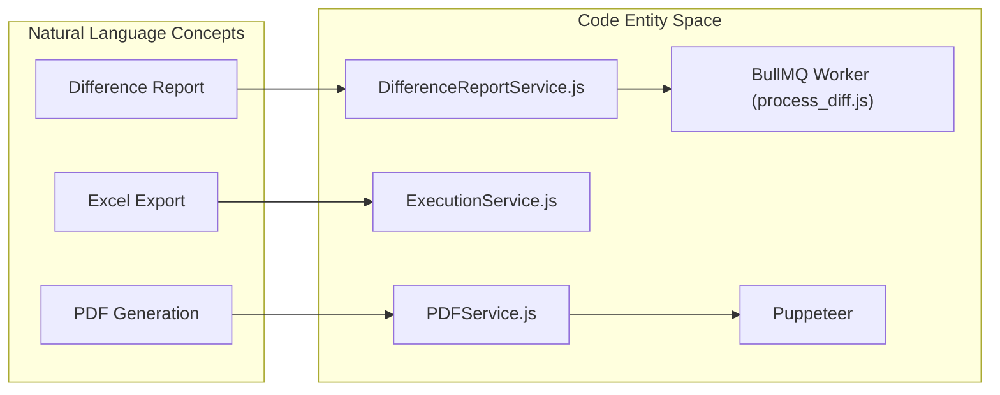

# Getting Started

<details>
<summary>Relevant source files</summary>

The following files were used as context for generating this wiki page:

- [.dockerignore](.dockerignore)
- [.gitignore](.gitignore)
- [Dockerfile](Dockerfile)
- [server/config.js](server/config.js)
- [server/package-lock.json](server/package-lock.json)
- [server/package.json](server/package.json)

</details>


This page provides a technical guide for setting up and installing the Ingenium Report Service. It covers prerequisites, environment configuration, local execution, and containerized deployment via Docker.

The Ingenium Report Service is a Node.js application designed to generate PDF and Excel reports for the Ingenium ecosystem. It leverages Puppeteer for HTML-to-PDF rendering and BullMQ for asynchronous processing of intensive tasks like difference reports.

## Prerequisites

To run the service, ensure the following components are installed and available:

*   **Node.js**: Version `>=14.0.0` is required [server/package.json:33-34]().
*   **Redis**: Required for the task queue used by `BullMQ` in asynchronous jobs (e.g., Difference Reports) [server/config.js:43-45]().
*   **Chrome/Chromium**: Required by Puppeteer for PDF generation.
*   **Upstream APIs**: The service depends on the Ingenium Core API and Search API [server/config.js:13-14]().

## Environment Configuration

The application is configured primarily through environment variables, which are consumed in `server/config.js`.

### Key Environment Variables

| Variable | Description | Default Value |
| :--- | :--- | :--- |
| `SEARCH_API_URL` | Endpoint for the Search API [server/config.js:13]() | `http://127.0.0.1:3025/api/v1/` |
| `CORE_API_URL` | Endpoint for the Core API [server/config.js:14]() | `http://127.0.0.1:8080/api/v5/` |
| `PUBLIC_PEM` | RSA Public Key for JWT verification [server/config.js:22]() | `''` |
| `REDIS_HOST` | Hostname for the Redis server [server/config.js:43]() | `127.0.0.1` |
| `REDIS_PORT` | Port for the Redis server [server/config.js:45]() | `6379` |
| `FILE_SERVER_API_HOST` | Host for the S3-compatible file server [server/config.js:16]() | `http://127.0.0.1:9000` |
| `NUM_WORKERS` | Number of concurrent workers for PDF/Diff tasks [server/config.js:32]() | `4` |
| `REPORT_TIMEOUT` | Max time (ms) for report generation [server/config.js:27]() | `600000` (10 min) |

**Sources:** [server/config.js:1-51]()

## Local Installation

To set up the development environment locally:

1.  **Clone the repository**:
    ```bash
    git clone https://github.com/JPL-Devin/ingenium_report_server.git
    cd ingenium_report_server/server
    ```

2.  **Install Dependencies**:
    The project uses `npm` for dependency management. Running `npm install` will fetch all required packages including `express`, `puppeteer`, `bullmq`, and `exceljs` [server/package.json:35-71]().
    ```bash
    npm install
    ```

3.  **Configure Environment**:
    Create a `.env` file in the `server/` directory (note: `.env` is ignored by git [ .gitignore:58 ]()) or export the variables listed in the configuration section.

4.  **Start the Service**:
    ```bash
    npm start
    ```
    This executes `node index.js` [server/package.json:8](), which initializes the Express server on the port defined in `config.URL_PORT` (default `3003`) [server/config.js:5]().

**Sources:** [server/package.json:1-78](), [server/config.js:1-51]()

## Docker Deployment

The service is containerized using a specialized Docker image that includes the necessary dependencies for Puppeteer to run in a Linux environment.

### Dockerfile Implementation
The `Dockerfile` uses `alekzonder/puppeteer:1.20.0` as the base image to ensure Chromium and its shared libraries are correctly installed [Dockerfile:1]().

**Docker Build and Run Logic:**
1.  **User Security**: The container runs as the `pptruser` to avoid running Chromium as root [Dockerfile:4]().
2.  **Dependency Installation**: It uses `npm ci` for clean, reproducible builds based on the `package-lock.json` [Dockerfile:5]().
3.  **Entrypoint**: The container starts with `node index.js` [Dockerfile:6]().

```bash
# Build the image
docker build -t ingenium-report-service .

# Run the container
docker run -p 3003:3003 \
  -e REDIS_HOST=redis_host \
  -e CORE_API_URL=http://core-api:8080/api/v5/ \
  ingenium-report-service
```

### Data Flow: Initialization to Request Handling
The following diagram illustrates how the system transitions from configuration and startup to handling an incoming report request.

**System Boot and Request Flow**

**Sources:** [server/config.js:1-51](), [server/package.json:49-50](), [Dockerfile:1-6]()

## First-Time Configuration

### JWT Authentication
The service expects a `RS256` signed JWT in the `Authorization` header. You must provide the public key in the `PUBLIC_PEM` environment variable [server/config.js:22](). This key is used by the `addJWTHandler` middleware to verify tokens before requests reach the controllers.

### Storage and Output
*   **Temporary Files**: The service generates temporary HTML and PDF files in the directory specified by `config.OUTPUT_DIR` (default: `output`) [server/config.js:24]().
*   **File Server**: For asynchronous jobs like Difference Reports, the resulting PDF is uploaded to an S3-compatible storage using the `FILE_SERVER_ACCESS_KEY` and `FILE_SERVER_SECRET_KEY` [server/config.js:39-41]().

### Architecture Overview
The following diagram bridges the logical report generation process to the specific classes and files responsible for execution.

**Report Generation Mapping**

**Sources:** [server/package.json:18,39,48](), [server/config.js:32,43]()
