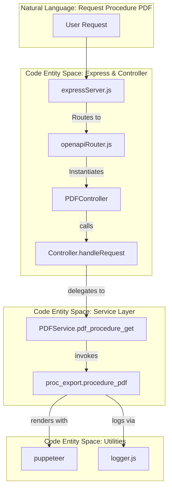
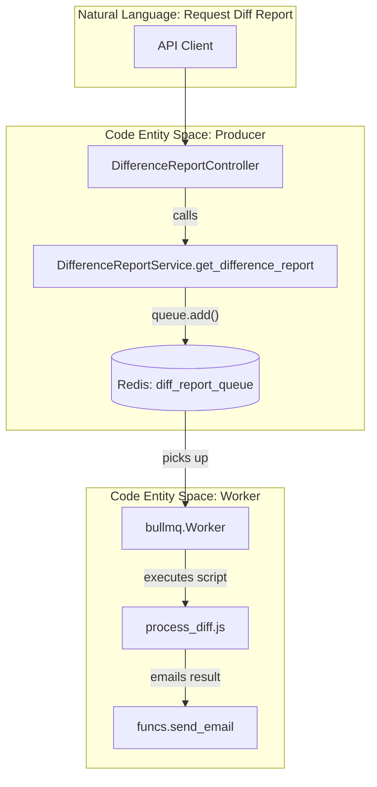

# Glossary

Relevant source files

The following files were used as context for generating this wiki page:

- [Dockerfile](Dockerfile)
- [README.md](README.md)
- [server/api/openapi.yaml](server/api/openapi.yaml)
- [server/config.js](server/config.js)
- [server/controllers/Controller.js](server/controllers/Controller.js)
- [server/funcs.js](server/funcs.js)
- [server/services/DifferenceReportService.js](server/services/DifferenceReportService.js)
- [server/services/pdf/proc_export.js](server/services/pdf/proc_export.js)

This page provides definitions for codebase-specific terms, domain concepts, and technical jargon used within the Ingenium Report Service. It serves as a reference for onboarding engineers to understand the implementation details and data flow of the system.

## Domain Concepts

| Term | Definition | Implementation Reference |
|:---|:---|:---|
| **Procedure** | A set of instructions or steps defined in the Ingenium system to be executed. | `PDFService.pdf_procedure_get` [server/services/pdf/PDFService.js:12-12]() |
| **Execution** | A specific instance of a procedure being run (also referred to as an "As-Run"). It contains telemetry, actual values, and completion status. | `PDFService.pdf_execution_get` [server/services/pdf/PDFService.js:25-25]() |
| **Difference Report** | A visual comparison between two procedures or two executions, highlighting changes in steps, logic, or metadata. | `DifferenceReportService.get_difference_report` [server/services/diff_report/DifferenceReportService.js:105-105]() |
| **Search Report** | An exportable Excel file containing results from a filtered query across procedures or executions. | `SearchService.post_search_report` [server/services/executions/SearchService.js:13-13]() |
| **TOC Level** | Table of Contents depth for PDF generation. `0` includes all levels, `-1` disables the TOC. | `openapi.yaml` [server/api/openapi.yaml:33-34]() |

Sources: [server/services/pdf/PDFService.js:1-35](), [server/api/openapi.yaml:13-147](), [server/services/diff_report/DifferenceReportService.js:91-140]()

## Technical Terms & Abbreviations

### PDF Generation Engine
The service uses **Puppeteer** (a headless Chrome instance) to render HTML templates into PDF documents.
*   **Mustache**: The logic-less templating engine used to inject data into HTML before rendering. [server/services/pdf/proc_export.js:6-6]()
*   **pptruser**: The non-privileged Linux user defined in the `Dockerfile` to run the Puppeteer process for security isolation. [Dockerfile:4-4]()

### Async Processing (BullMQ)
For long-running tasks like Difference Reports, the system uses a distributed task queue.
*   **Producer**: `DifferenceReportService` adds jobs to the `diff_report_queue`. [server/services/diff_report/DifferenceReportService.js:122-125]()
*   **Worker**: A background process (defined in `process_diff.js`) that consumes jobs from Redis and performs the heavy computation. [server/services/diff_report/DifferenceReportService.js:73-78]()
*   **Redis**: The backing store for BullMQ to manage job states (waiting, active, completed, failed). [server/config.js:43-45]()

### Authentication & Security
*   **JWT (JSON Web Token)**: Used for stateless authentication. The service verifies tokens using an **RS256** public key (`PUBLIC_PEM`). [server/funcs.js:29-29]()
*   **Bearer Auth**: The security scheme where the token is passed in the `Authorization` header as `Bearer <token>`. [server/api/openapi.yaml:10-11]()

Sources: [Dockerfile:1-6](), [server/services/diff_report/DifferenceReportService.js:10-89](), [server/config.js:22-22](), [server/funcs.js:1-33]()

## Code Entity Mapping

The following diagrams bridge the gap between high-level system operations and the specific code entities that handle them.

### Request-to-Code Mapping (Synchronous PDF Flow)
This diagram shows how a "Procedure PDF" request flows through the specific classes and functions.

Sources: [server/expressServer.js:1-100](), [server/utils/openapiRouter.js:1-50](), [server/controllers/PDFController.js:1-30](), [server/services/pdf/PDFService.js:12-23](), [server/services/pdf/proc_export.js:1-50]()

### Async Job Mapping (Difference Report Flow)
This diagram associates the asynchronous reporting process with its code components and Redis interactions.

Sources: [server/services/diff_report/DifferenceReportService.js:10-138](), [server/services/diff_report/process_diff.js:1-100](), [server/funcs.js:35-49]()

## Response Types Reference

The `Controller.js` base class handles polymorphic responses based on the keys present in the payload returned by services.

| Payload Key | Content-Type | Behavior |
|:---|:---|:---|
| `_pdf_buffer` | `application/pdf` | Sends raw binary buffer as a PDF file. [server/controllers/Controller.js:14-17]() |
| `_excel_buffer` | `application/vnd.openxml...` | Sends binary buffer with `Content-Disposition: attachment`. [server/controllers/Controller.js:18-23]() |
| (None / Object) | `application/json` | Standard JSON serialization via `response.json()`. [server/controllers/Controller.js:25-25]() |

Sources: [server/controllers/Controller.js:5-30]()
