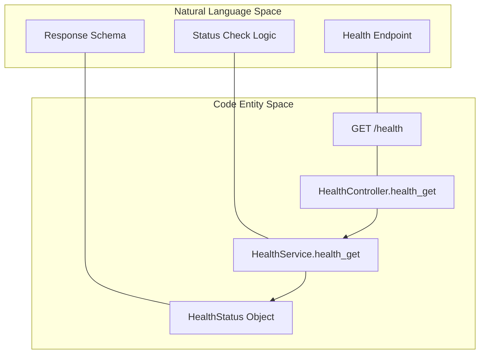
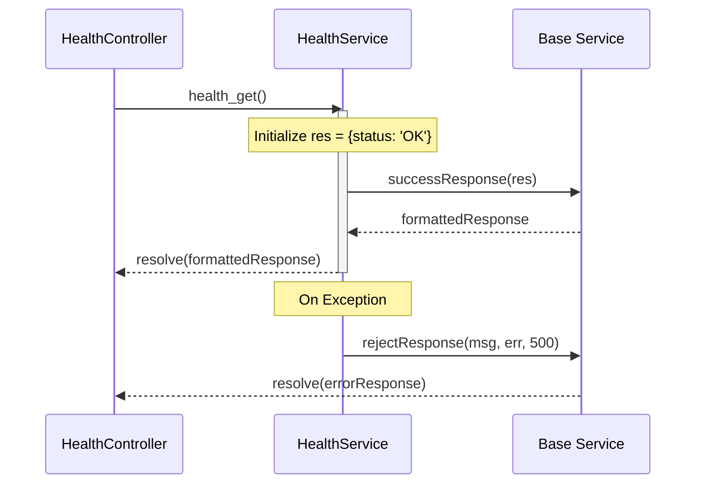

# Health Service

Relevant source files

The following files were used as context for generating this wiki page:

- [server/controllers/HealthController.js](server/controllers/HealthController.js)
- [server/services/HealthService.js](server/services/HealthService.js)

The **Health Service** provides a standard diagnostic endpoint used to verify the operational status of the Ingenium Report Server. It is primarily utilized by container orchestrators, load balancers, and CI/CD pipelines to ensure the service is responsive and ready to handle traffic.

## Implementation Overview

The health check logic is implemented through a standard Controller-Service pattern. The `HealthController` acts as the entry point for HTTP requests, while `HealthService` encapsulates the logic for determining the system's state.

### Code Entity Mapping

The following diagram illustrates how the logical "Health Check" process maps to specific code entities within the repository.

**Health Check Component Mapping**

Sources: [server/controllers/HealthController.js:8-10](), [server/services/HealthService.js:10-25]()

## Request Handling

The `HealthController` is a thin wrapper that inherits from the base `Controller` class. Its sole responsibility is to delegate the incoming GET request to the service layer using the static `handleRequest` method.

| Component | Responsibility |
| :--- | :--- |
| **Route** | `GET /health` |
| **Controller** | `HealthController.health_get(request, response)` |
| **Service Method** | `HealthService.health_get()` |

The controller utilizes `Controller.handleRequest` to manage the asynchronous execution and standard response formatting.

Sources: [server/controllers/HealthController.js:8-10](), [server/controllers/HealthController.js:1-5]()

## Health Logic and Status Values

The `HealthService` implements the core diagnostic logic. Currently, the service performs a basic availability check to confirm the Node.js event loop is responsive and the Express server is routing requests correctly.

### Response Schema
The service returns a `HealthStatus` object wrapped in a `Service.successResponse`. The schema consists of a single `status` field.

| Status Value | Description | HTTP Code |
| :--- | :--- | :--- |
| `OK` | The service is running and healthy. | 200 |
| `ERROR` | An unexpected error occurred during the check. | 500 |
| `UNKNOWN` | The state of the service could not be determined. | 500 |

### Implementation Detail
The `health_get` method returns a Promise that resolves to a success response containing `{'status': 'OK'}`. If an unhandled exception occurs within the service logic, it catches the error and returns a rejected response via `Service.rejectResponse`.

**Health Service Data Flow**

Sources: [server/services/HealthService.js:10-25](), [server/services/HealthService.js:1-4]()

## Error Handling

While the current implementation primarily returns `OK`, the service is structured to handle "Unexpected error for health check" scenarios. If the `try-catch` block inside `HealthService.health_get` captures an error, the response is downgraded to an HTTP 500 status with the error details included in the payload.

Sources: [server/services/HealthService.js:16-22]()
