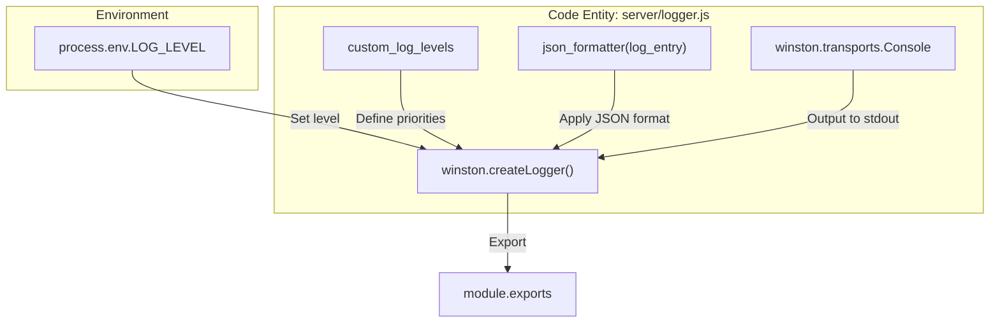
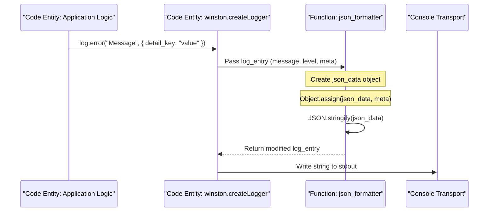

# Logger

<details>
<summary>Relevant source files</summary>

The following files were used as context for generating this wiki page:

- [server/logger.js](server/logger.js)

</details>


The Ingenium Report Server utilizes a centralized logging system built on the `winston` library. It provides structured, JSON-formatted output designed for compatibility with log aggregation systems and containerized environments. The logger is configured to support custom severity levels, dynamic log level control via environment variables, and flexible metadata handling.

## Logger Configuration

The logger is initialized in `server/logger.js` and exported as a singleton instance [server/logger.js:53-53](). It uses a `Console` transport, ensuring that all logs are directed to `stdout` for capture by the container runtime [server/logger.js:43-43]().

### Custom Log Levels
The system overrides the default Winston levels with a custom hierarchy tailored for the service's operational needs [server/logger.js:37-41]().

| Level | Priority | Description |
| :--- | :--- | :--- |
| `critical` | 0 | System-wide failures requiring immediate attention. |
| `error` | 1 | Runtime errors that prevent specific operations. |
| `warning` | 2 | Non-critical anomalies or potential issues. |
| `info` | 3 | General operational messages (default for production). |
| `debug` | 4 | Detailed information for development and troubleshooting. |
| `trace` | 5 | Highly granular execution flow data. |

The active logging threshold is determined by the `LOG_LEVEL` environment variable. If the variable is not set, the system defaults to `debug` [server/logger.js:48-48]().

**Sources:**
- [server/logger.js:37-41]()
- [server/logger.js:46-51]()

---

## Log Formatting and Structure

The logger employs a custom formatter, `json_formatter`, to ensure every log entry is a valid JSON object [server/logger.js:5-35](). This formatter intercepts the Winston `log_entry` and transforms it before it is written to the transport.

### The `json_formatter` Logic
The formatter constructs a `json_data` object with the following standard keys:
1.  **`timestamp`**: Automatically generated using `new Date()` [server/logger.js:6-6]().
2.  **`level`**: The log level converted to uppercase (e.g., "INFO", "ERROR") [server/logger.js:7-7]().
3.  **`message`**: The primary descriptive string of the log [server/logger.js:8-8]().

### Metadata Handling
The logger handles additional context passed via the `meta` argument in logging calls. The behavior varies based on the type of data provided in the `meta` property [server/logger.js:14-30]():

*   **Strings**: Added to a `details` array [server/logger.js:17-18]().
*   **Arrays**: Each item is processed via `util.inspect` and stored in the `details` array [server/logger.js:19-23]().
*   **Objects**: 
    *   If the object is empty, it is inspected and added to `details` [server/logger.js:24-25]().
    *   If the object has properties, it is merged directly into the root of the `json_data` object using `Object.assign` [server/logger.js:26-28]().

**Logger Initialization Flow**
The following diagram illustrates how the `winston.createLogger` call integrates the formatter and environment configuration.

Title: Logger Initialization and Configuration


**Sources:**
- [server/logger.js:5-35]()
- [server/logger.js:46-51]()

---

## Data Flow: Logging a Message

When a service or controller calls a logging method (e.g., `log.info()`), the data flows through the Winston pipeline, where the `json_formatter` serializes the final output.

Title: Log Entry Processing Flow


### Example Output
If the application calls:
`log.error('Database connection failed', { host: 'localhost', port: 5432 });`

The resulting output on `stdout` will be:
```json
{
  "timestamp": "2023-10-27T10:00:00.000Z",
  "level": "ERROR",
  "message": "Database connection failed",
  "host": "localhost",
  "port": 5432
}
```

**Sources:**
- [server/logger.js:5-35]()
- [server/logger.js:49-49]()
