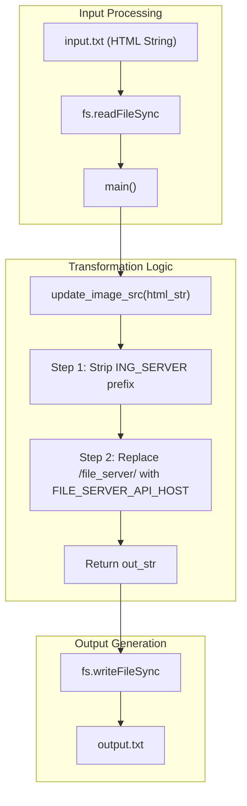
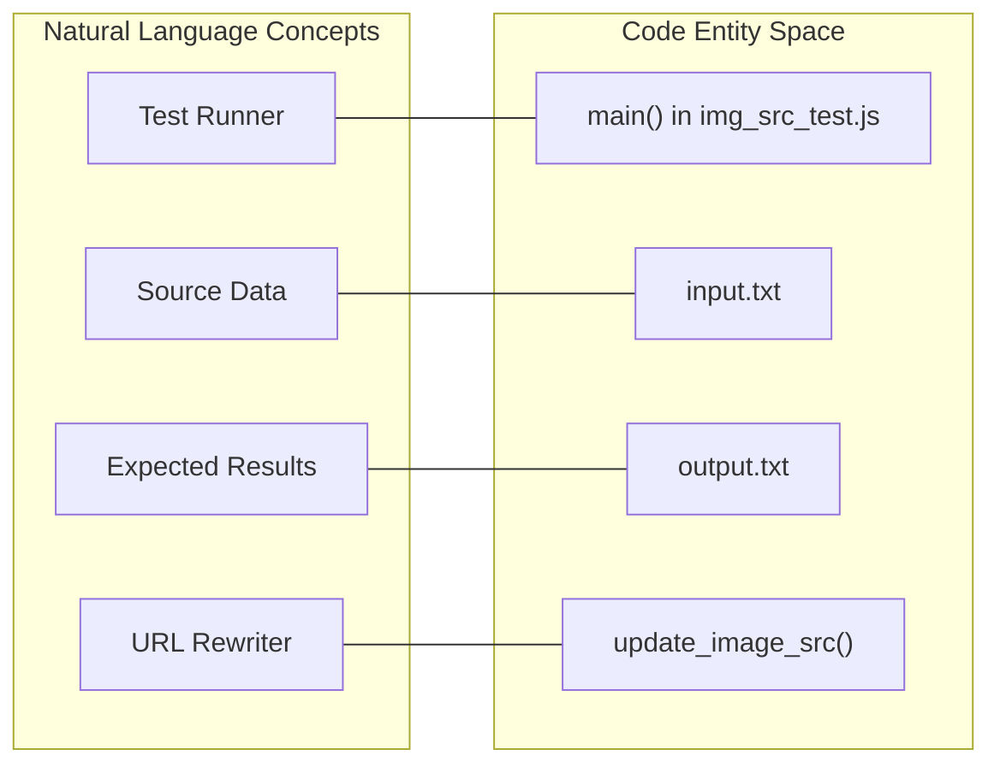

# Node.js Server Tests

<details>
<summary>Relevant source files</summary>

The following files were used as context for generating this wiki page:

- [server/tests/img_src_test.js](server/tests/img_src_test.js)
- [server/tests/input.txt](server/tests/input.txt)
- [server/tests/output.txt](server/tests/output.txt)

</details>


This section covers the unit testing and utility scripts located within the `server/tests/` directory. These tests primarily focus on validating the HTML processing logic used to transform image source URLs, ensuring that reports generated by the service correctly reference assets stored on the file server.

## Overview

The Node.js testing suite in this repository is designed for localized validation of string manipulation logic. Specifically, it tests the transformation of HTML `` tags from local or environment-specific paths to absolute URLs pointing to the S3-backed file server. This is critical for PDF generation, as the rendering engine (Puppeteer) requires valid, reachable URLs to embed images into the final document.

## Image Source Transformation

The core logic under test resides in `server/tests/img_src_test.js`. This script demonstrates how the server handles two types of image paths:
1.  **Relative Paths**: Paths starting with `/file_server/`.
2.  **Absolute Paths**: Paths pointing to a specific Ingenium server instance.

### Implementation Details

The transformation is performed by the `update_image_src` function [server/tests/img_src_test.js:9-13]().

| Variable | Value | Description |
| :--- | :--- | :--- |
| `ING_SERVER` | `https://ingenium-open.com` | The base URL of the Ingenium application server [server/tests/img_src_test.js:6](). |
| `FILE_SERVER_API_HOST` | `https://s3-us-gov-west-1.amazonaws.com` | The destination host for static assets (S3) [server/tests/img_src_test.js:7](). |

The function executes a two-step replacement:
1.  It strips the `ING_SERVER` prefix from any image source that includes the file server path [server/tests/img_src_test.js:10]().
2.  It replaces the local `/file_server/` route with the absolute `FILE_SERVER_API_HOST` URL [server/tests/img_src_test.js:11]().

**Data Flow for Image Source Transformation**

The following diagram illustrates the transformation of an HTML string containing various image source formats.



Sources: [server/tests/img_src_test.js:1-25]()

## Test Fixtures

The test suite uses text fixtures to provide reproducible input and verify the correctness of the output.

### Input Fixture (`input.txt`)
The `input.txt` file contains raw HTML fragments as they might appear in the database or be returned by the Core API. It includes:
*   **Relative images**: `` [server/tests/input.txt:4-5]().
*   **Absolute images**: `` [server/tests/input.txt:9-10]().

### Output Fixture (`output.txt`)
The `output.txt` file represents the expected state after transformation. Every image source is converted to point directly to the AWS S3 bucket:
*   **Transformed Result**: `` [server/tests/output.txt:4-10]().

### Mapping Natural Language to Code Entities

This diagram maps the conceptual test components to the actual file entities in the `server/tests/` directory.



Sources: [server/tests/img_src_test.js:9-25](), [server/tests/input.txt:1-13](), [server/tests/output.txt:1-13]()

## Execution

To run the image source transformation test, execute the script directly using Node.js from the server directory:

```bash
node tests/img_src_test.js
```

The script reads from `server/tests/input.txt` [server/tests/img_src_test.js:17]() and overwrites `server/tests/output.txt` [server/tests/img_src_test.js:21](). Verification is typically performed by checking the diff between the generated `output.txt` and the version-controlled expected output.

Sources: [server/tests/img_src_test.js:15-23]()
