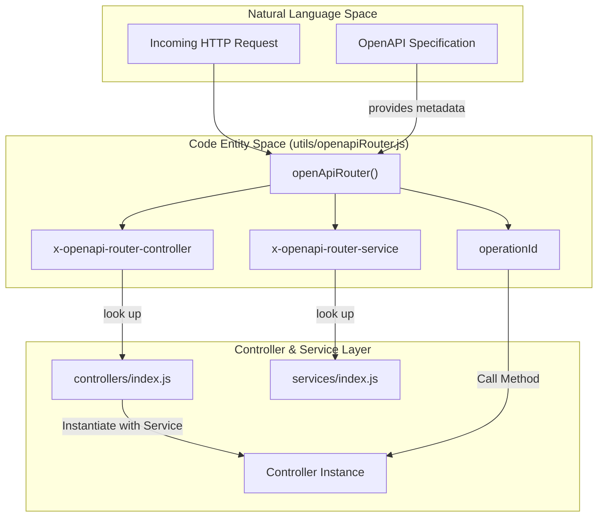
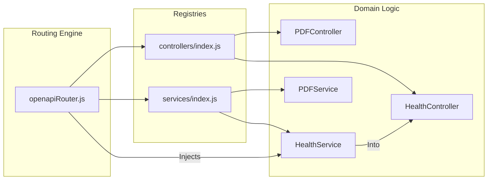

# OpenAPI Router

Relevant source files

The following files were used as context for generating this wiki page:

- [server/controllers/index.js](server/controllers/index.js)
- [server/services/index.js](server/services/index.js)
- [server/utils/openapiRouter.js](server/utils/openapiRouter.js)

The `openapiRouter.js` utility serves as the dynamic dispatch engine of the Ingenium Report Server. It acts as an Express middleware that bridges the gap between the OpenAPI specification and the application's business logic. By utilizing custom OpenAPI extensions, it automatically instantiates the required controllers and services, then invokes the appropriate operation based on the incoming request.

## Core Logic and Dynamic Mapping

The router relies on the `request.openapi` object, which is populated by the `express-openapi-validator` middleware prior to reaching this router [server/utils/openapiRouter.js:31-44](). It specifically looks for three keys within the OpenAPI schema to determine the execution path:

1.  **`x-openapi-router-controller`**: The name of the controller class to instantiate [server/utils/openapiRouter.js:49]().
2.  **`x-openapi-router-service`**: The name of the service class to inject into the controller [server/utils/openapiRouter.js:50]().
3.  **`operationId`**: The specific method on the controller to execute [server/utils/openapiRouter.js:56]().

### Request Flow Diagram
The following diagram illustrates how a request moves from the network through the dynamic router to the specific code entities.

**Request to Code Entity Mapping**

Sources: [server/utils/openapiRouter.js:30-58](), [server/controllers/index.js:1-13](), [server/services/index.js:1-13]()

## Implementation Details

The router is implemented as a higher-order function that returns an asynchronous Express middleware [server/utils/openapiRouter.js:30-31]().

### Controller Instantiation
When a request is received, the router performs the following steps:
1.  **Validation**: It checks if `request.openapi.schema` exists. If not, it assumes the path is not covered by the OpenAPI spec and calls `next()` to allow other middleware to handle it [server/utils/openapiRouter.js:39-44]().
2.  **Lookup**: It extracts the controller and service names. It verifies that the requested controller exists in the exported `controllers` object [server/utils/openapiRouter.js:49-51]().
3.  **Dependency Injection**: It creates a new instance of the controller, passing the corresponding Service class into the constructor: `new controllers[controllerName](Services[serviceName])` [server/utils/openapiRouter.js:55]().
4.  **Execution**: It calls the method named by `operationId` on the new controller instance, passing the standard Express `request`, `response`, and `next` arguments [server/utils/openapiRouter.js:56-57]().

### Error Handling
The router includes a localized `handleError` function to manage failures during the dispatch process [server/utils/openapiRouter.js:5-14](). If a controller is referenced in the schema but not defined in the code, or if an execution error occurs, the router logs the error via the `logger.js` utility and returns a formatted JSON error response [server/utils/openapiRouter.js:51-53](), [server/utils/openapiRouter.js:59-63]().

### Data Flow and Dependency Graph
This diagram shows the relationship between the router and the registry files that export the application's domain logic.

**Router Dependency Graph**

Sources: [server/utils/openapiRouter.js:1-3](), [server/controllers/index.js:1-13](), [server/services/index.js:1-13]()

## Key Functions

| Function | Description | Location |
| :--- | :--- | :--- |
| `openApiRouter()` | Main middleware factory that performs dynamic dispatch based on OpenAPI extensions. | [server/utils/openapiRouter.js:30-65]() |
| `handleError()` | Internal helper to log errors and format the HTTP error response. | [server/utils/openapiRouter.js:5-14]() |

Sources: [server/utils/openapiRouter.js:5-65]()
