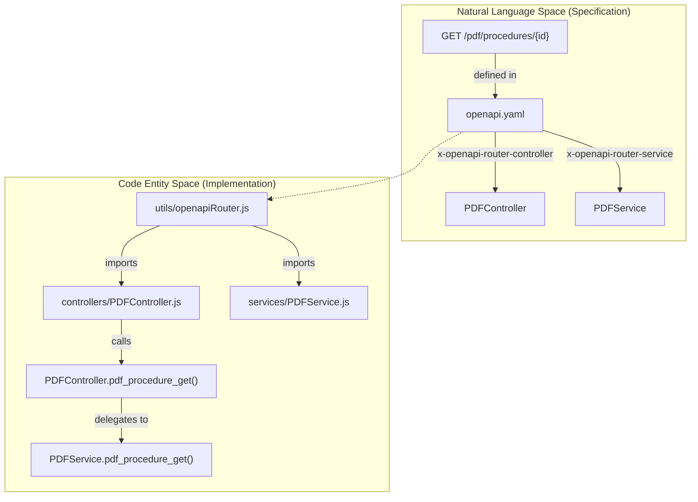
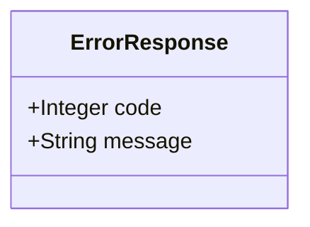
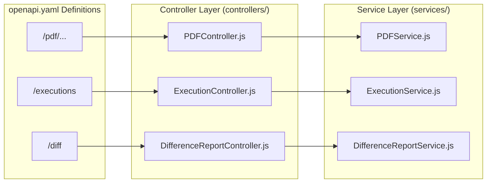

# OpenAPI Specification

Relevant source files

The following files were used as context for generating this wiki page:

- [server/.openapi-generator-ignore](server/.openapi-generator-ignore)
- [server/.openapi-generator/VERSION](server/.openapi-generator/VERSION)
- [server/api/openapi.yaml](server/api/openapi.yaml)

The Ingenium Report Service API is defined using the **OpenAPI 3.0.0** specification. This specification serves as the single source of truth for the REST interface, defining the available endpoints, expected parameters, security requirements, and the internal routing logic used to bridge the HTTP layer with the application's controller and service layers.

## Specification Overview

The specification is located at `server/api/openapi.yaml` [server/api/openapi.yaml:1-6](). It defines a base URL of `/api/v1` [server/api/openapi.yaml:8-8]() and enforces Bearer Authentication across all operational endpoints [server/api/openapi.yaml:9-11]().

### Security Definitions
The service utilizes JSON Web Tokens (JWT) for authentication, specifically implementing the `bearerAuth` scheme with `RS256` (RSA Signature with SHA-256) [server/api/openapi.yaml:313-317]().

| Security Scheme | Type | Format | Description |
| :--- | :--- | :--- | :--- |
| `bearerAuth` | http | JWT | Requires a valid JWT in the Authorization header. |

Sources: [server/api/openapi.yaml:313-317]()

## Routing Extensions

A key feature of this specification is the use of custom OpenAPI extensions to facilitate dynamic routing. The `expressServer.js` and `openapiRouter.js` use these fields to map incoming requests to the appropriate code entities.

*   **`x-openapi-router-controller`**: Specifies the name of the class in the `controllers/` directory that handles the request [server/api/openapi.yaml:70-70]().
*   **`x-openapi-router-service`**: Specifies the name of the class in the `services/` directory that contains the business logic [server/api/openapi.yaml:71-71]().

### Data Flow: Spec to Code
The following diagram illustrates how a request for a PDF procedure is routed based on the OpenAPI definitions.

**Request Routing Architecture**

Sources: [server/api/openapi.yaml:70-71](), [server/utils/openapiRouter.js:1-30]()

## Endpoints and Operations

The API is divided into functional tags: `PDF`, `Execution`, `Difference Report`, `Search`, and `Health`.

### 1. PDF Generation
These endpoints generate binary PDF files from procedures or execution records.

| Path | Method | Controller | Service | Description |
| :--- | :--- | :--- | :--- | :--- |
| `/pdf/procedures/{procedure_id}/versions/{version}` | GET | `PDFController` | `PDFService` | Downloads a PDF copy of a specific procedure version [server/api/openapi.yaml:13-71](). |
| `/pdf/executions/{execution_id}` | GET | `PDFController` | `PDFService` | Downloads a PDF copy of an "As Run" execution [server/api/openapi.yaml:72-147](). |

**Key Parameters:**
*   `toc_level`: Integer. Controls Table of Contents depth (0 for all, -1 for none) [server/api/openapi.yaml:33-41]().
*   `comment`: Boolean. Includes general comments [server/api/openapi.yaml:42-49]().
*   `all_steps`: Boolean. For executions, includes all steps regardless of comments [server/api/openapi.yaml:117-125]().

### 2. Execution and Search (Excel Export)
These endpoints retrieve data in Excel format.

| Path | Method | Controller | Service | Description |
| :--- | :--- | :--- | :--- | :--- |
| `/executions` | GET | `ExecutionController` | `ExecutionService` | Filter and export execution data to Excel [server/api/openapi.yaml:148-251](). |
| `/search` | GET | `SearchController` | `SearchService` | Search across procedures and export results to Excel [server/api/openapi.yaml:275-285](). |

**Constraint:** The `format` query parameter must be set to `EXCEL` [server/api/openapi.yaml:158-159]().

### 3. Difference Reports
Asynchronous generation of differences between two procedure versions.

| Path | Method | Controller | Service | Description |
| :--- | :--- | :--- | :--- | :--- |
| `/diff` | POST | `DifferenceReportController` | `DifferenceReportService` | Queues a background job to compare two procedures [server/api/openapi.yaml:252-274](). |

### 4. System Health
| Path | Method | Controller | Service | Description |
| :--- | :--- | :--- | :--- | :--- |
| `/health` | GET | `HealthController` | `HealthService` | Returns service status [server/api/openapi.yaml:286-302](). |

Sources: [server/api/openapi.yaml:13-302]()

## Response Schemas

### Successful Binary Response
For PDF and Excel exports, the API returns a `200 OK` with binary content.
*   **PDF**: `application/pdf` [server/api/openapi.yaml:52-56]().
*   **Excel**: `application/vnd.openxmlformats-officedocument.spreadsheetml.sheet` (handled via `Controller.sendResponse`).

### Error Schema
All errors follow a standardized `ErrorResponse` schema [server/api/openapi.yaml:305-311]().

**ErrorResponse Structure**

Sources: [server/api/openapi.yaml:305-311]()

## Implementation Mapping

The following diagram maps the OpenAPI components to the specific files and classes that implement them within the `server/` directory.

**OpenAPI to Implementation Map**

Sources: [server/api/openapi.yaml:70-71](), [server/api/openapi.yaml:146-147](), [server/controllers/PDFController.js:1-10](), [server/services/PDFService.js:1-10]()
